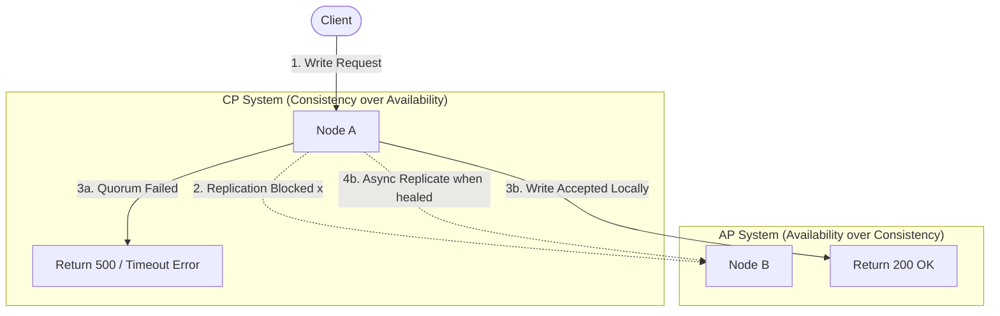

# Anatomy of the Partition: Engineering AP vs. CP Decisions in Distributed Systems

---

## 1. 💡 The "Big Picture" (Plain English)

### What is this in simple terms?
Imagine you and a coworker run a distributed customer support service. You work in the **New York office**, and your coworker works in the **London office**. Both of you have a notepad where you write down customer addresses. 

Normally, when a customer calls New York to update their address, you update your notepad and immediately call London to update theirs. 

Suddenly, the transatlantic telephone lines go dead. This is a **Network Partition ($P$)**. 

Now, a customer calls you in New York and says, *"I want to update my address to 123 Broadway."* You have two choices:

*   **Choice A (CP - Consistency):** You tell the customer, *"I'm sorry, our connection to London is down. I cannot accept your update right now because our databases will get out of sync."* You choose **Consistency** over Availability.
*   **Choice B (AP - Availability):** You say, *"Sure, I've updated it!"* You accept the change. Meanwhile, London is still reading the old address to other callers. You choose **Availability** over Consistency.

### Why should I care?
In a single-node database, life is easy. If the database is up, it works. In modern cloud architectures, systems are spread across multiple servers, availability zones, or global regions to scale. 

**Networks will fail.** fiber cables get cut, switches fail, and routers drop packets. The CAP Theorem proves that when these failures happen, you *must* choose between keeping your system online but slightly out of sync (AP), or taking the system down to ensure perfect accuracy (CP). Designing this incorrectly leads to catastrophic bank balance mismatches, double-booked flights, or system-wide cascading outages.

---

## 2. 🛠️ How it Works (Step-by-Step)

Let's look at how a write request flows through a distributed cluster during a network partition.

### The Lifecycle of a Write Under Partition



### Code Implementation: CP vs. AP Node Simulation

Here is a clean Python simulation demonstrating how nodes process writes differently based on their CAP strategy when a partition is active.

```python
class ClusterNode:
    def __init__(self, name: str):
        self.name = name
        self.data = {}
        self.peers = []
        self.network_connected = True

    def write_local(self, key: str, value: str) -> bool:
        self.data[key] = value
        return True

# --- CP Node Implementation (Prioritizes Consistency) ---
class CPNode(ClusterNode):
    def handle_write(self, key: str, value: str) -> str:
        # CP systems require confirmation from peers (Quorum/Consensus)
        successful_replications = 1  # Self
        total_peers = len(self.peers)
        required_quorum = (total_peers + 1) // 2 + 1
        
        for peer in self.peers:
            # If network partition exists between these nodes
            if self.network_connected and peer.network_connected:
                peer.write_local(key, value)
                successful_replications += 1
        
        # If we cannot reach a majority quorum, fail the write
        if successful_replications < required_quorum:
            raise RuntimeError(f"CP Node [{self.name}]: Write failed. Cannot achieve quorum due to network partition.")
        
        self.write_local(key, value)
        return f"CP Node [{self.name}]: Write successful & replicated consistently."

# --- AP Node Implementation (Prioritizes Availability) ---
class APNode(ClusterNode):
    def __init__(self, name: str):
        super().__init__(name)
        self.dirty_log = [] # Holds updates to sync later

    def handle_write(self, key: str, value: str) -> str:
        # AP systems write locally immediately to remain available
        self.write_local(key, value)
        
        unreachable_peers = []
        for peer in self.peers:
            if self.network_connected and peer.network_connected:
                peer.write_local(key, value)
            else:
                unreachable_peers.append(peer.name)
        
        if unreachable_peers:
            # Queue for asynchronous reconciliation when partition heals
            self.dirty_log.append((key, value))
            return f"AP Node [{self.name}]: Write accepted locally. Queued sync for offline peers: {unreachable_peers}."
        
        return f"AP Node [{self.name}]: Write successful and replicated instantly."

# --- Execution Simulation ---
if __name__ == "__main__":
    print("--- Simulating Network Partition ---")
    
    # Setup CP Cluster
    cp_node_a = CPNode("NY-CP-01")
    cp_node_b = CPNode("LDN-CP-02")
    cp_node_a.peers = [cp_node_b]
    cp_node_b.peers = [cp_node_a]
    
    # Setup AP Cluster
    ap_node_a = APNode("NY-AP-01")
    ap_node_b = APNode("LDN-AP-02")
    ap_node_a.peers = [ap_node_b]
    ap_node_b.peers = [ap_node_a]
    
    # Introduce Network Partition (cut the connection)
    cp_node_a.network_connected = False
    ap_node_a.network_connected = False
    
    # 1. Try to write to CP System during partition
    try:
        print(cp_node_a.handle_write("user_1", "Alice"))
    except RuntimeError as e:
        print(f"Result: {e}")
        
    # 2. Try to write to AP System during partition
    print(ap_node_a.handle_write("user_1", "Bob"))
```

---

## 3. 🧠 The "Deep Dive" (For the Interview)

### The Technical Mechanics

#### 1. Under the Hood of CP Systems (e.g., Etcd, Consul, CockroachDB)
CP systems rely on **Consensus Algorithms** (like **Raft** or **Paxos**) to maintain a single, linearizable history of state.
*   **The Quorum Rule:** To commit any state transition, a CP system must obtain acknowledgement from a strict majority ($N/2 + 1$) of nodes.
*   **Heartbeats & Term Limits:** Nodes monitor each other via periodic heartbeats. If a leader node gets isolated on the minority side of a partition, it will fail to receive heartbeats from the majority. It voluntarily steps down as leader.
*   **Fail-Closed State:** The minority partition cannot achieve quorum, meaning all write and strongly consistent read requests to this side are systematically rejected with errors, maintaining absolute consistency across the survivable part of the system.

#### 2. Under the Hood of AP Systems (e.g., Apache Cassandra, DynamoDB)
AP systems leverage **Optimistic Replication** and **Eventual Consistency** to prioritize liveness.
*   **Gossip Protocols:** Nodes peer-to-peer share metadata continuously to learn about cluster membership and state changes without requiring a central coordinator.
*   **Conflict Resolution:** Because multiple nodes can accept divergent writes during a partition, AP systems must resolve conflicts after the partition heals. This is accomplished via:
    *   **Last-Write-Wins (LWW):** Uses physical wall-clock timestamps. It is simple but vulnerable to clock drift, which can silently delete newer data.
    *   **Vector Clocks / Version Vectors:** Logical clocks that track causal history to detect concurrent writes.
    *   **Conflict-Free Replicated Data Types (CRDTs):** Mathematically structured data types (like grow-only sets) that merge automatically without coordination.

---

### The Trade-offs

| Engineering Dimension | CP (Consistency + Partition Tolerance) | AP (Availability + Partition Tolerance) |
| :--- | :--- | :--- |
| **Write Latency** | **High**: Must wait for network round-trips to achieve consensus across multiple nodes. | **Low**: Returns success as soon as local node writes to disk/memory. |
| **Availability** | **Partial**: If a network split occurs, part of the cluster becomes completely unusable. | **High**: Any healthy node can accept reads and writes, regardless of network state. |
| **Data Correctness** | **Strict**: Guarantees Linearizability (reads always return the most recent write). | **Weak**: Temporary stale reads and write divergence (Eventual Consistency). |

---

### Interviewer Probe Questions

#### Probe 1: "Is it possible to build a 'CA' (Consistent & Available) system?"
*   **The Trap:** Candidates often say *"Yes, if we use highly reliable hardware."*
*   **The Senior Answer:** *"No. In a single-node system, yes. But in a distributed system, network partitions are an unavoidable physical reality due to hardware, routing, and fiber cuts. Therefore, you cannot choose 'CA'. You must assume Partition Tolerance (P) is a given, and your architectural choice is strictly binary when a partition occurs: do you prioritize Consistency (CP) or Availability (AP)?"*

#### Probe 2: "If we configure Apache Cassandra with `ConsistencyLevel.QUORUM` for both reads and writes, does it turn Cassandra into a CP system?"
*   **The Trap:** This is a classic test of deep system internals. 
*   **The Senior Answer:** *"No, it behaves like a CP system under normal operations, but it lacks the safety guarantees of a true CP system. Cassandra is fundamentally an AP-first database. While setting $W + R > N$ (where write quorum + read quorum > total nodes) guarantees a read-your-writes consistency under normal conditions, Cassandra does not use a consensus engine like Raft to lock keys. If a partition occurs, concurrent writes can still bypass safety barriers, leading to data divergence and silent overwrite issues resolved by Last-Write-Wins (LWW) post-heal. It simulates consistency but does not guarantee strict transactional serializability."*

#### Probe 3: "How does the PACELC theorem extend the CAP theorem?"
*   **The Senior Answer:** *"CAP only describes system behavior during a network partition ($P$). PACELC extends this by stating: If there is a Partition ($P$), choose Availability ($A$) or Consistency ($C$); Else ($E$), choose Latency ($L$) or Consistency ($C$). It highlights that even under normal operating conditions, maintaining strong consistency requires synchronization overhead, costing us Latency ($L$)."*

---

## 4. ✅ Summary Cheat Sheet

### 3 Key Takeaways
1.  **Safety vs. Liveness:** CP is about **Safety** (never returning bad or wrong data, even if it means crashing). AP is about **Liveness** (always returning a response, even if the data is temporarily stale or out of order).
2.  **Partitions are Mandatory:** You do not design a system to be "CA". You design a system to be AP or CP *when* (not *if*) a network partition occurs.
3.  **Tunability is a Spectrum:** Many modern databases (like CosmosDB or DynamoDB) allow you to tune these parameters on a per-request basis depending on the business context.

### 1 "Golden Rule"
> **Choose CP when a stale read or divergent write causes financial or physical harm (e.g., money transfers, medical records). Choose AP when a system outage costs more than the complexity of healing temporary data conflicts (e.g., social media feeds, shopping carts).**