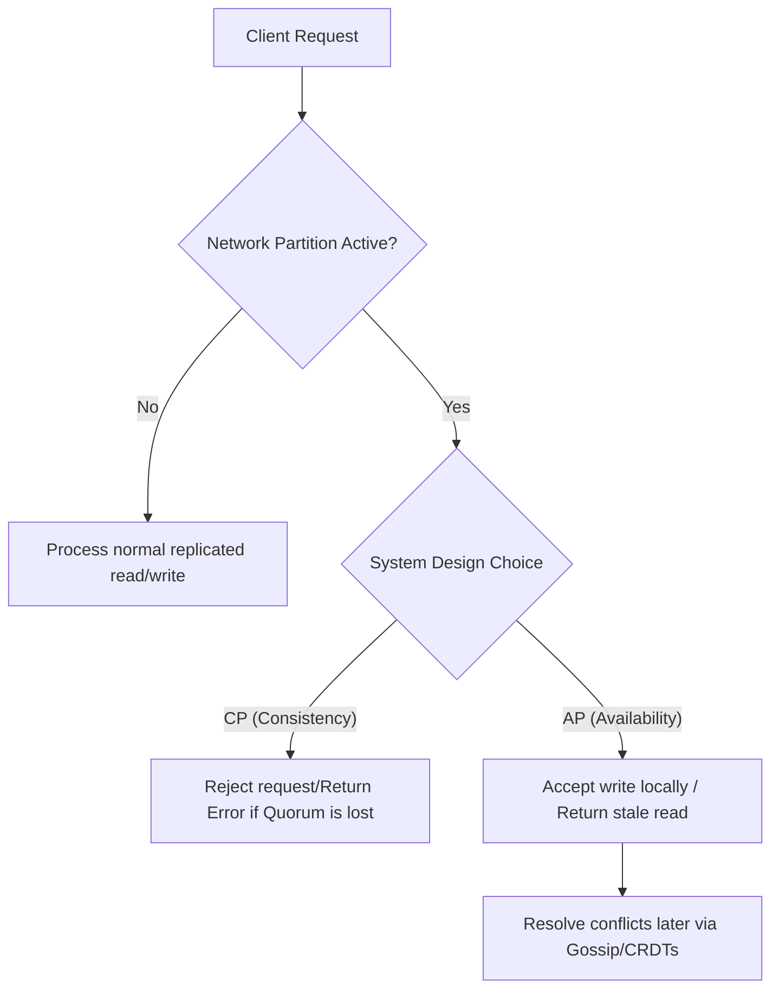

# CAP Theorem: Fault Isolation and Protocol Selection in CP vs. AP Architectures

---

### 💡 The "Big Picture" (Plain English)

Imagine you and a business partner run a distributed phone-in directory service. You both sit in different offices, each with a copy of the phone book. 

One day, the phone line connecting your two offices is accidentally cut (this is a **Network Partition**). 

```
               [ Phone Line Cut! ]
  [Office A] --------X-------- [Office B]
```

A customer calls your office to update their address. A minute later, another customer calls your partner's office to ask for that same person's address. You now face a choice:

1. **Choose Consistency (CP):** You refuse to update the address or answer the query because you cannot sync with your partner. You choose to preserve the absolute truth, even if it means telling the customer, *"Sorry, our system is down."*
2. **Choose Availability (AP):** You accept the update, and your partner answers the query with the old address. Your system stays fully operational, but your data is temporarily out of sync.

#### Why should you care?
Every distributed system you build or use (PostgreSQL, Cassandra, MongoDB, DynamoDB) has to make this choice when hardware fails. If you do not understand this trade-off, you will face silent data corruption (choosing AP when you needed CP) or unexpected system outages (choosing CP when you needed AP).

---

### 🛠️ How it Works (Step-by-Step)

When a network partition occurs, a system must isolate the fault and route traffic based on its architectural design.



#### Code Implementation: AP vs. CP Router Sim

This Python implementation demonstrates how a database coordinator routes writes during a network partition based on whether it is configured for **CP** (relying on majority consensus) or **AP** (local availability).

```python
class Node:
    def __init__(self, node_id: str):
        self.node_id = node_id
        self.storage = {}
        self.alive = True

class DistributedCluster:
    def __init__(self, nodes: list[str], mode: str):
        # mode can be 'CP' (Consistency/Partition-Tolerant) or 'AP' (Availability/Partition-Tolerant)
        self.nodes = {node_id: Node(node_id) for node_id in nodes}
        self.mode = mode
        self.partitions = set() # Represents broken network links

    def create_partition(self, node_a: str, node_b: str):
        """Simulates a network cut between two nodes."""
        self.partitions.add(tuple(sorted((node_a, node_b))))

    def is_connected(self, node_a: str, node_b: str) -> bool:
        return tuple(sorted((node_a, node_b))) not in self.partitions

    def get_reachable_nodes(self, coordinator_id: str) -> list[str]:
        """Returns all nodes reachable from the coordinator node."""
        return [nid for nid in self.nodes if self.is_connected(coordinator_id, nid)]

    def write(self, coordinator_id: str, key: str, value: str) -> str:
        reachable = self.get_reachable_nodes(coordinator_id)
        total_nodes = len(self.nodes)
        quorum_size = (total_nodes // 2) + 1

        if self.mode == "CP":
            # CP requires a strict majority (Quorum) to accept writes
            if len(reachable) >= quorum_size:
                # Write to all reachable nodes to maintain strong consistency
                for nid in reachable:
                    self.nodes[nid].storage[key] = value
                return f"Success (CP): Write replicated to quorum ({len(reachable)}/{total_nodes} nodes)"
                
            raise RuntimeError("Error (CP): Write Rejected. Network partition prevented quorum.")

        elif self.mode == "AP":
            # AP accepts writes locally to stay available, accepting eventual consistency
            for nid in reachable:
                self.nodes[nid].storage[key] = value
            return f"Success (AP): Write accepted by reachable partition ({len(reachable)}/{total_nodes} nodes). Stale states possible."

# --- Dry Run ---
# 3-Node Cluster: Node A, B, and C
cluster_cp = DistributedCluster(["A", "B", "C"], mode="CP")

# Simulate partition isolating Node C: [A - B]  |  [C]
cluster_cp.create_partition("A", "C")
cluster_cp.create_partition("B", "C")

# Write to Node A (which can still talk to Node B -> Quorum of 2/3 achieved)
print(cluster_cp.write("A", "user_1", "Alice")) 

# Write to Node C (Isolated -> Only 1/3 nodes reachable -> Quorum fails)
try:
    cluster_cp.write("C", "user_1", "Charlie")
except RuntimeError as e:
    print(e) # Output: Error (CP): Write Rejected...
```

---

### 🧠 The "Deep Dive" (For the Interview)

To stand out in system design interviews, you must go beyond the basic definitions of "C", "A", and "P".

#### 1. The Mathematical Engine of CP: Consensus Protocols
A true CP system relies on consensus protocols like **Raft** or **Paxos** to maintain a single, linearized history of state.
* **Quorum Mathematics:** For a cluster of size $N$, any write operation must be acknowledged by a majority quorum ($Q_w$) and any read must query a quorum ($Q_r$) such that:
  $$Q_w + Q_r > N$$
* **Under a Partition:** If a partition splits a 5-node cluster into a group of 3 and a group of 2, only the 3-node partition can form a majority. The 2-node partition will immediately stop accepting writes and fail read operations that demand linearizability, choosing consistency over availability.

#### 2. The Engine of AP: Eventual Consistency and Conflict Resolution
AP systems (like Apache Cassandra or Amazon DynamoDB) prioritize write availability. They drop consensus in favor of peer-to-peer **Gossip Protocols**.
* **CRDTs (Conflict-free Replicated Data Types):** To resolve conflicting writes across partitions when the network heals, AP systems use mathematically sound data structures (like G-Counters or LWW-Element-Set) that merge deterministically without requiring a coordinator.
* **Vector Clocks:** Instead of relying on unreliable system wall clocks (which suffer from clock skew), AP systems use logical vector clocks to establish a causal history of updates and detect concurrent modifications.

#### 3. The Modern Pragmatist's Expansion: PACELC
The CAP theorem only applies when there is a **P**artition. The **PACELC** theorem extends this to normal operations:
* If there is a **P**artition, how does the system choose between **A**vailability and **C**onsistency?
* **E**lse (during normal operation), how does the system choose between **L**atency and **C**onsistency?
> *Example:* MongoDB is **PC/EC** (chooses consistency in both scenarios), while Cassandra is **PA/EL** (chooses availability under partition, and latency during normal operations).

---

### ❓ Interviewer Probe Questions

#### Probe 1: "Is it possible to build a 'CA' system in the cloud?"
* **Junior Answer:** "No, CAP says you can only pick two, and we must always support partitions."
* **Senior Answer:** "Practically, no. A 'CA' system implies a network that never drops a packet or delays a message. In physical cloud infrastructure, network partitions (routers failing, optical fiber degradation, transient packet loss) are an absolute certainty. Therefore, we must always design for **P** (Partition Tolerance). The architectural choice is strictly binary: **CP** or **AP** when a partition occurs."

#### Probe 2: "Can Cassandra be configured to behave as a CP system?"
* **Answer:** "Yes. Cassandra is AP by design, but it features **tunable consistency**. By setting your write consistency level to `QUORUM` and your read consistency level to `QUORUM` (or `ALL`), you ensure that $R + W > N$. If a partition occurs and a quorum cannot be reached, Cassandra will fail the read or write request, sacrificing availability to guarantee strong consistency—effectively acting as a CP system."

---

### ✅ Summary Cheat Sheet

#### 3 Key Takeaways
1. **The CAP Choice is Conditional:** CAP does not mean you choose 2 out of 3 arbitrarily. It means **if** a network partition occurs (P), you must choose either to shut down/reject requests (**C**) or serve potentially stale data (**A**).
2. **CP is for Financial/Critical State:** Systems requiring strict transactional integrity (e.g., banking ledgers, lock managers like ZooKeeper) must use CP.
3. **AP is for High-Throughput/Collaborative Systems:** Systems that need to be globally responsive and can tolerate eventual consistency (e.g., shopping carts, social media feeds, real-time analytics) should use AP.

#### ⚖️ The Golden Rule
> **"In a distributed system, network partitions are not an option; they are a physical reality. Architect your database engine around how your business metrics tolerate stale data versus system downtime."**