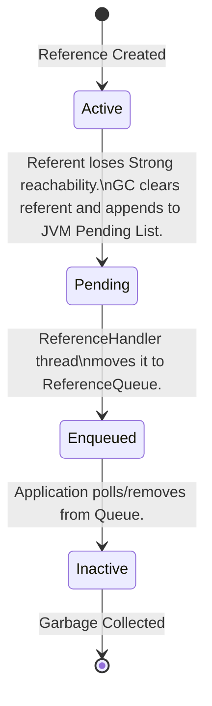

# JVM Reference Processing: The Mechanics of Soft, Weak, Phantom, and Final References

---

### 1. 💡 The "Big Picture" (Plain English)

#### What is this in simple terms?
In Java, we are taught that the Garbage Collector (GC) is an all-knowing deity that automatically deletes objects when they are no longer needed. Normally, this is binary: either you have a hard grip on an object (a **Strong Reference**), or you don't. If you don't, it gets destroyed.

However, sometimes you want a **negotiable relationship** with the GC. 

**Reference Objects** (`SoftReference`, `WeakReference`, `PhantomReference`, and the legacy `FinalReference`) are special wrappers that allow you to customize how and when the GC is allowed to reclaim your memory. They act as specialized instructions to the JVM's memory management engine.

#### A Real-World Analogy: The Luxury Hotel
Think of your JVM heap as a **Luxury Hotel** with limited rooms (Memory):

*   **Strong Reference (Registered Guests):** These are guests actively staying in their suites. Housekeeping cannot clear their rooms or evict them. As long as they are checked in, they stay.
*   **Soft Reference (VIP Reservation Members):** These are VIP guests who checked out but left their luggage in the room just in case they decide to return later today. If the hotel has plenty of vacant suites, housekeeping leaves their stuff alone. But if the hotel hits **99% occupancy** and new guests arrive, housekeeping summarily tosses their luggage to make room. 
*   **Weak Reference (Valet Parking Guests):** These are guests who checked out, but their cars are still in the valet lot. The moment the GC "security guard" does a routine patrol sweep, if there is no registered guest associated with that car, the car is towed immediately—regardless of whether the hotel is full or empty.
*   **Phantom Reference (The Checkout Notification):** The guest is gone, their room is vacant, and their car is towed. However, the hotel needs to run a specialized cleaning protocol (like sanitizing a hot tub) *after* they leave. The Phantom Reference is the post-checkout alert sent to the cleaning crew.

#### Why should I care?
If you build high-performance caches, write custom connection pools, or work with off-heap memory (like Netty or DirectByteBuffers), ignoring Reference Processing will eventually lead to catastrophic `OutOfMemoryError` (OOME) crashes, silent memory leaks, or erratic GC pauses. Understanding this allows you to build self-tuning, memory-sensitive applications.

---

### 2. 🛠️ How it Works (Step-by-Step)

The JVM manages these references through a complex state machine that bridges low-level C++ GC code with high-level Java threads.

#### The Lifecycle Step-by-Step

1.  **Creation:** You wrap a target object (the **Referent**) inside a Reference object, optionally registering it with a `ReferenceQueue`.
2.  **Reachability Assessment:** During the GC's "Mark" phase, the GC determines how objects can be reached. If an object is *only* reachable via a `WeakReference`, it is marked as "weakly reachable."
3.  **The Sweep & Clear:** The GC clears the referent (sets the internal `referent` pointer inside the reference object to `null`).
4.  **Pending List Enqueuing:** The GC links this cleared Reference object into an internal JVM-managed C++ linked list called the **Pending List**.
5.  **Java-Land Handshake:** A dedicated, high-priority JVM thread called the `ReferenceHandler` wakes up, pulls references from the C++ Pending List, and pushes them into your Java-land `ReferenceQueue`.
6.  **Cleanup Execution:** Your application polls this queue and executes cleanups (e.g., releasing native resources).

#### The Reference State Machine



#### Code Snippet: Safe Resource Cleanup with Phantom References
Here is how to use `PhantomReference` and `ReferenceQueue` to clean up native resources (avoiding the toxic, deprecated `finalize()` method).

```java
import java.lang.ref.PhantomReference;
import java.lang.ref.ReferenceQueue;
import java.util.Set;
import java.util.concurrent.ConcurrentHashMap;

public class NativeResourceManager {

    // 1. The Queue where the JVM will drop our PhantomReferences when objects die
    private final ReferenceQueue<Object> referenceQueue = new ReferenceQueue<>();
    
    // 2. Keep hard references to our wrappers so they don't get collected prematurely
    private final Set<CleanableResource> resources = ConcurrentHashMap.newKeySet();

    public NativeResourceManager() {
        // Start a background thread to poll the queue and clean up
        Thread cleanupThread = new Thread(this::cleanupLoop);
        cleanupThread.setDaemon(true);
        cleanupThread.setName("Native-Cleanup-Daemon");
        cleanupThread.start();
    }

    public void register(Object apiObject, long nativeHandle) {
        CleanableResource resource = new CleanableResource(apiObject, nativeHandle, referenceQueue);
        resources.add(resource);
    }

    private void cleanupLoop() {
        try {
            while (true) {
                // This blocks until a PhantomReference is ready for cleanup
                CleanableResource resource = (CleanableResource) referenceQueue.remove();
                resource.clean();
                resources.remove(resource); // Allow the wrapper to be GC'd now
            }
        } catch (InterruptedException e) {
            Thread.currentThread().interrupt();
        }
    }

    // 3. Our custom PhantomReference containing metadata needed for cleanup
    private static class CleanableResource extends PhantomReference<Object> {
        private final long nativeHandle;

        public CleanableResource(Object referent, long nativeHandle, ReferenceQueue<Object> q) {
            super(referent, q);
            this.nativeHandle = nativeHandle;
        }

        public void clean() {
            System.out.println("Executing native cleanup for memory address: 0x" + Long.toHexString(nativeHandle));
            // Actual JNI call to release C/C++ memory: NativeLib.free(nativeHandle);
        }
    }
}
```

---

### 3. 🧠 The "Deep Dive" (For the Interview)

#### The Under-the-Hood JVM Mechanics
How does the JVM handle these references without killing GC performance?

At the JVM hot-spot execution layer, the class `java.lang.ref.Reference` is treated with extreme care. The JVM C++ code knows the exact layout of this class. It contains two critical fields:
1.  `private T referent;` — The object we are tracking.
2.  `volatile Reference queueNext;` (and an internal `discovered` pointer).

During the **Concurrent Mark** phase of modern GCs (like G1 or ZGC), the collector traces object graphs. When it encounters a `java.lang.ref.Reference` subclass, it does *not* immediately trace the `referent` field as a strong root. Instead, it adds the Reference object to an internal, thread-local discovery list.

At the end of the marking cycle, the GC enters the **Reference Processing** phase. This phase is divided into stages:

```
[Mark Phase Ends] 
       │
       ▼
[Stage 1: Soft References] ──► (Cleared if memory is low, based on -XX:SoftRefLRUPolicyMSPerMB)
       │
       ▼
[Stage 2: Weak References] ──► (Always cleared immediately)
       │
       ▼
[Stage 3: Phantom References] ─► (Referent is cleared, but object remains allocatable temporarily)
       │
       ▼
[Enqueue to Pending List] ──► (JVM wakes up High-Priority ReferenceHandler Thread)
```

#### The Real Cost & Trade-offs
*   **Throughput Killer (GC Pause Overhead):** Reference processing is notoriously expensive. While modern GCs like ZGC perform reference processing concurrently, G1 historically executed parts of it during Stop-The-World (STW) pauses. If you have millions of `WeakReference` objects (common in massive cache frameworks), your STW pause times can balloon by dozens of milliseconds just to process these references.
*   **The Soft Reference Trap:** Soft references are cleared based on free memory and a formula: 
    $$\text{Free Memory (MB)} \times \text{SoftRefLRUPolicyMSPerMB}$$
    If you have a large heap with high allocation rates, the JVM might thrash, spending significant CPU cycles constantly clearing and re-allocating Softly referenced objects, drastically dropping application throughput.

#### The Nightmare of Finalizers (`java.lang.ref.Finalizer`)
Why did Java deprecate Finalizers? 
When a class overrides `finalize()`, the JVM wraps it in a `Finalizer` (a subclass of `FinalReference`). 
*   **Double GC Cost:** An object with a finalizer cannot be claimed in one GC cycle. It must be discovered, queued, run by a low-priority thread, and only *then* can it be reclaimed in the *next* GC cycle.
*   **Thread Starvation:** The system-wide `Finalizer` thread runs at low priority. If your application allocates finalized objects faster than this single thread can run their `finalize()` methods, your heap will fill up, causing a guaranteed `OutOfMemoryError`.

---

#### Interviewer Probe Questions

##### Probe 1: "If I call `PhantomReference.get()`, what does it return? How does this differ from `WeakReference.get()`?"
*   **The Answer:** `PhantomReference.get()` *always* returns `null`. Even if the referent is still fully alive and allocated in memory, the API explicitly intercepts the call and returns `null` to prevent you from "resurrecting" the object. On the contrary, `WeakReference.get()` will return the strong pointer to the referent as long as the GC has not cleared it.

##### Probe 2: "How can a WeakReference cause a memory leak if the GC is supposed to clear it automatically?"
*   **The Answer:** While the *referent* (the target object) is cleared, the `WeakReference` *wrapper container* itself is a standard Java object. If you register millions of `WeakReference` objects with a `ReferenceQueue`, but your application code fails to poll/remove them from that queue, the `WeakReference` wrapper objects themselves will leak, eventually filling up the heap. 

##### Probe 3: "If we have high allocation pressures, how does the JVM decide which SoftReferences to evict?"
*   **The Answer:** The JVM calculates the survival time of a Soft Reference using the formula: `ms_since_last_access > free_heap_in_mb * SoftRefLRUPolicyMSPerMB`. If this evaluates to true, the reference is cleared. 
*   *Follow-up optimization:* If we are experiencing premature eviction of critical caches, we should tune `-XX:SoftRefLRUPolicyMSPerMB` (default is 1000ms per free MB) to a higher value to keep them alive longer under memory pressure.

---

### 4. ✅ Summary Cheat Sheet

#### 3 Key Takeaways
1.  **Reference Processing is NOT Free:** Do not use `WeakReference` or `SoftReference` blindly. They add metadata tracking overhead to the GC and can degrade pause times.
2.  **Avoid Soft References for High-Performance Caching:** They are too blunt an instrument. Use purpose-built libraries like L caffeine cache with explicit size bounds instead.
3.  **The Phantom Queue Clean-up Rule:** When using `PhantomReference`, you must always keep a strong reference to the phantom wrapper itself until you dequeue it, otherwise the wrapper gets GC'd before it can perform its cleanup work!

#### 1 Golden Rule
> **"Never implement finalize(). Use java.lang.ref.Cleaner (Java 9+) or PhantomReference + ReferenceQueue to decouple native cleanup tasks from your core object lifecycle."**