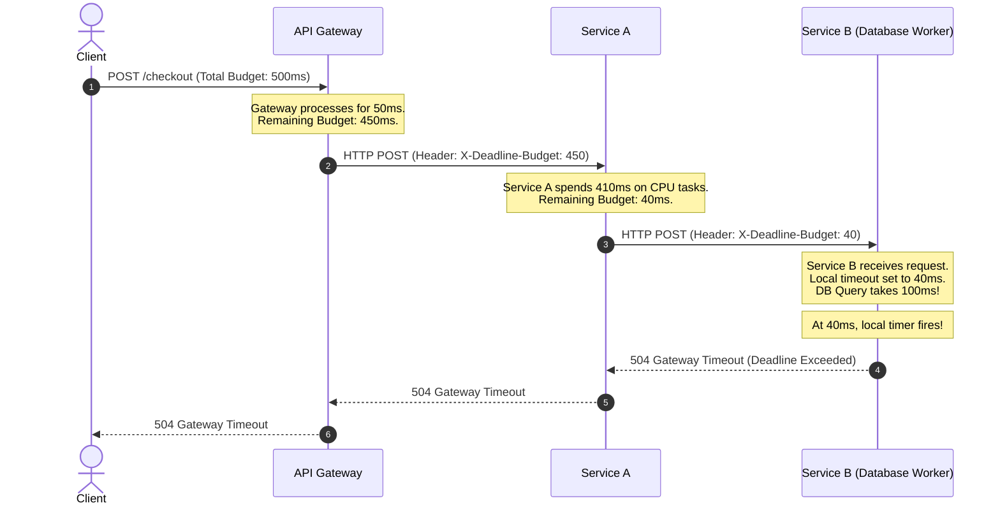

# Distributed Deadline Propagation: Managing Timeout Budgets across Microservice Chains

## 1. 💡 The "Big Picture" (Plain English)

### What is this in simple terms?
Imagine you are building a chain of services. When a user clicks a button, Service A calls Service B, which calls Service C, which queries a Database. 

Usually, we set a static timeout (e.g., "every HTTP request times out in 5 seconds"). But what happens if Service A takes 4.9 seconds just to talk to Service B? Service B now has only 0.1 seconds left before the user's browser gives up and closes the connection. If Service B blindly spends another 4 seconds processing the request and calling Service C, it is executing a **"zombie request"**—performing expensive work for a client that has already hung up and left.

**Distributed Deadline Propagation** (also known as **Timeout Budgeting**) solves this. Instead of static timeouts, each service calculates how much time is *actually left* in the request's lifespan and passes this remaining "budget" down the line. If a downstream service realizes its budget is already blown, it stops immediately and throws an exception, saving precious CPU, memory, and database connections.

---

### A Real-World Analogy
Imagine you have exactly **30 minutes** to get to the airport before your flight gates close. 
1. You order a rideshare taxi. Because of traffic, the taxi takes **28 minutes** just to arrive at your house.
2. If the driver blindly starts the **25-minute drive** to the airport, they are wasting gas. You are guaranteed to miss the flight anyway.
3. A smart driver looks at the remaining budget (**2 minutes**), realizes the goal is impossible, and says: *"We can't make it. Let's cancel the trip."* 

That is **Deadline Propagation**. You abort the journey the moment you realize the time budget is busted.

---

### Why should I care?
Without deadline propagation, your system is vulnerable to **Cascading Resource Starvation**. During high traffic or partial outages, downstream services get clogged up processing requests that have already timed out at the user level. This causes thread pools to fill up, databases to choke, and eventually, your entire system to crash. 

Implementing deadline propagation keeps your services healthy under load by ensuring they only work on requests that have a realistic chance of succeeding.

---

## 2. 🛠️ How it Works (Step-by-Step)

### The Step-by-Step Flow
1. **The Edge Gate:** The API Gateway or Client starts the request and assigns a total **Time Budget** (e.g., 500ms).
2. **Context Creation:** The gateway records the absolute deadline (Current Time + 500ms).
3. **Propagation:** When Service A calls Service B, it calculates the remaining time left (e.g., 500ms minus the 100ms Service A spent processing) and passes this remaining budget in the outgoing request headers.
4. **Enforcement:** Service B receives the request, sets its local timeout to match this incoming budget, and executes. If the budget hits zero at any point, the local framework automatically throws a `DeadlineExceeded` exception.

### The Flow Visualized



---

### Code Implementation (TypeScript / Express & Axios)

Here is a practical implementation showing how to extract, decrement, and propagate a deadline budget using HTTP headers and middleware.

#### 1. The Middleware (Receiving End)
This middleware runs on every incoming request. It extracts the budget header, sets up a local abort timer, and attaches a cancellation signal to the request context.

```typescript
import { Request, Response, NextFunction } from 'express';

export interface BudgetedRequest extends Request {
  deadlineSignal?: AbortSignal;
  getRemainingBudgetMs?: () => number;
}

export function deadlinePropagationMiddleware(req: BudgetedRequest, res: Response, next: NextFunction) {
  // 1. Extract incoming budget (default to 5000ms if not provided)
  const incomingBudgetHeader = req.headers['x-deadline-budget-ms'];
  const budgetMs = incomingBudgetHeader ? parseInt(incomingBudgetHeader as string, 10) : 5000;
  
  const startTime = Date.now();
  const deadlineTime = startTime + budgetMs;

  // 2. Create an AbortController to cancel local downstream operations
  const controller = new AbortController();
  req.deadlineSignal = controller.signal;

  // Helper to calculate remaining time dynamically
  req.getRemainingBudgetMs = () => Math.max(0, deadlineTime - Date.now());

  // 3. Set a local timeout to abort the controller if we exceed our budget
  const timer = setTimeout(() => {
    controller.abort();
  }, budgetMs);

  // Clean up timer when the response finishes
  res.on('finish', () => clearTimeout(timer));

  // 4. Handle client-side disconnection or timeout
  req.deadlineSignal.addEventListener('abort', () => {
    if (!res.headersSent) {
      res.status(504).json({ error: 'Deadline Exceeded: Time budget blown!' });
    }
  });

  next();
}
```

#### 2. The Client Call (Outgoing End)
When Service A calls Service B, it uses the helper to calculate the remaining budget and forwards it in the headers.

```typescript
import axios from 'axios';
import { BudgetedRequest } from './middleware';

async function callServiceB(req: BudgetedRequest) {
  const remainingBudget = req.getRemainingBudgetMs ? req.getRemainingBudgetMs() : 2000;

  // Fast-fail before making the network call if budget is already gone
  if (remainingBudget <= 0) {
    throw new Error('DeadlineExceeded: No time budget left to call Service B');
  }

  try {
    const response = await axios.get('http://service-b/data', {
      headers: {
        // Propagate the remaining budget to Service B
        'x-deadline-budget-ms': remainingBudget.toString()
      },
      // Ensure the HTTP client times out if the local budget is exceeded
      signal: req.deadlineSignal, 
      timeout: remainingBudget
    });
    return response.data;
  } catch (error: any) {
    if (axios.isCancel(error) || error.code === 'ECONNABORTED') {
      console.error('Request cancelled: Deadline exceeded!');
    }
    throw error;
  }
}
```

---

## 3. 🧠 The "Deep Dive" (For the Interview)

### The Technical Magic: How it works under the hood

To make Deadline Propagation work seamlessly, frameworks like **gRPC** build this directly into their core protocol using metadata (e.g., the `grpc-timeout` header). 

1. **Relative Durations vs. Absolute Timestamps:** 
   You must **never** transmit absolute timestamps (like `2026-10-24T12:00:05.123Z`) over the network. Why? **Clock Drift**. In a distributed system, physical servers synchronized via NTP (Network Time Protocol) can still have clocks that differ by tens or hundreds of milliseconds. If Service A's clock is 200ms ahead of Service B's, Service B might immediately throw a fake timeout error. Instead, always propagate *relative remaining durations* (e.g., `450ms`) which are measured locally on each node using a monotonic clock.
   
2. **Context & Thread-Local Storage:**
   In thread-per-request systems (like standard Java Spring applications), the remaining deadline is stored in a `ThreadLocal` variable. In asynchronous, single-threaded runtimes (like Node.js), it uses `AsyncLocalStorage`. Whenever a database driver or HTTP client is invoked, it checks this context to set its local socket connection/read timeouts dynamically.

---

### Trade-offs: What's the Catch?

| Pros | Cons |
| :--- | :--- |
| **Prevents Zombie Work:** Frees up resources instantly by terminating doomed threads/tasks. | **Increased Complexity:** Every single internal HTTP/gRPC client and database driver must be configured to respect the dynamic budget. |
| **Shorter Tail Latencies:** Prunes requests early, preventing queuing delays from cascading. | **Slight CPU Overhead:** Constant calculations of remaining deltas and setting up/tearing down timers. |
| **Fail-Fast Semantics:** Failures occur at the edge of services rather than deep inside database connection pools. | **Premature Aborts:** A fast-executing database might have finished a query in 2ms, but if our budget calculator estimated 0ms and aborted, we lose a potentially successful write. |

---

### Interviewer Probes (Tricky Questions & How to Answer)

#### **Probe 1: "What happens if a service aborts a database write transaction mid-way because its deadline expired? Doesn't this cause data inconsistency?"**
*   **The Answer:** "Deadline propagation only controls the *execution lifetime* of the request. It does not replace transaction safety. If a deadline expires while a database write is occurring, the connection is severed, throwing a query exception. The database must rollback the transaction as it would with any standard failure. Furthermore, for non-transactional dual-writes, we must combine deadline propagation with **Idempotent Receivers** and **Saga Compensations** to reconcile any partial state changes."

#### **Probe 2: "How do you handle third-party APIs that do not accept our custom dynamic deadline headers?"**
*   **The Answer:** "When interacting with external APIs, we enforce the deadline **locally**. We calculate our remaining budget before firing the request. If the budget is 100ms, we configure our local HTTP client (e.g., Axios or HttpClient) to timeout at exactly 100ms. While we cannot stop the third-party server from doing zombie work if we abort, we successfully protect *our* system from blocking on them indefinitely."

---

## 4. ✅ Summary Cheat Sheet

### 3 Key Takeaways
1. **Time Budgets are Relative:** Always propagate the remaining time duration (e.g., `350ms`) rather than absolute timestamps to dodge clock-drift bugs.
2. **Fail Fast, Fail Cheap:** Stopping a request the millisecond its budget expires preserves system resources (threads, memory, sockets) for requests that can actually succeed.
3. **End-to-End Alignment:** For this pattern to be effective, every layer—from the API Gateway down to the database query drivers—must actively extract, calculate, and apply the dynamic timeout.

### 1 Golden Rule to Remember
> *"If you don't have enough time left to finish the whole job, don't waste energy starting it."*