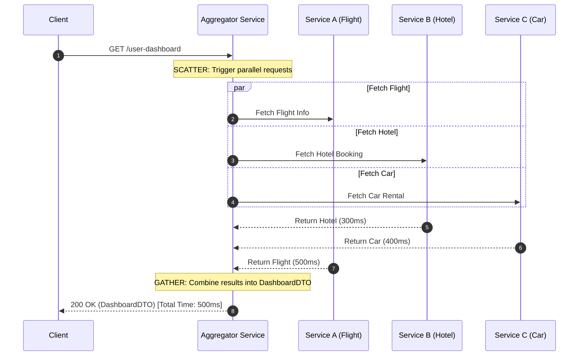

# Scatter-Gather Aggregation: CompletableFuture Pipelines vs. Virtual Thread Parallel Streams

---

### 1. 💡 The "Big Picture" (Plain English)

#### What is this in simple terms?
**Scatter-Gather** is an architecture pattern where a single service receives a request, **scatters** (dispatches) sub-tasks to multiple external services simultaneously, and **gathers** (combines) all the responses into a single combined answer before sending it back.

#### Real-World Analogy
Imagine you are planning a last-minute trip. You need a **Flight**, a **Hotel**, and a **Car Rental**. 
* **Sequential approach (Bad):** You call the airline, wait on hold for 5 minutes. Then you call the hotel, wait on hold for 5 minutes. Then you call the car agency, wait on hold for 5 minutes. Total time: **15 minutes**.
* **Scatter-Gather approach (Good):** You put three phones on speaker and dial all three businesses at the same time. You wait for whoever takes the longest (say, 5 minutes). Total time: **5 minutes**.

```
Sequential:      |-- Flight (5m) --|-- Hotel (5m) --|-- Car (5m) --|  = 15 min
Scatter-Gather:  |-- Flight (5m) --|                                 =  5 min
                 |-- Hotel (3m)  --|
                 |-- Car (4m)    --|
```

#### Why should I care?
Modern web backends rarely operate in isolation; an API gateway or backend-for-frontend (BFF) must fetch data from multiple microservices or third-party APIs (e.g., pricing, user recommendations, inventory, payment flags). 

Without Scatter-Gather, your latency is $T_1 + T_2 + T_3 + ... + T_n$. With Scatter-Gather, your latency drops to $\max(T_1, T_2, ... T_n)$.

---

### 2. 🛠️ How it Works (Step-by-Step)

#### The Process Flow
1. **Scatter:** Send non-blocking, parallel execution requests to $N$ downstream tasks.
2. **Execute:** Run all tasks concurrently using either asynchronous completion callbacks (`CompletableFuture`) or lightweight platform-unbound threads (`Virtual Threads`).
3. **Gather & Join:** Block or await until all futures settle (or fail fast if a critical dependency fails).
4. **Transform:** Aggregate the individual payload results into a single Unified Data Transfer Object (DTO).

#### Visual Representation



#### Implementation Comparison: `CompletableFuture` vs. `Virtual Threads`

Here is how you write Scatter-Gather using both modern Java concurrency approaches:

```java
import java.time.Duration;
import java.util.concurrent.*;

public class ScatterGatherDemo {

    record Flight(String details) {}
    record Hotel(String details) {}
    record Car(String details) {}
    record TravelPackage(Flight flight, Hotel hotel, Car car) {}

    // Mock API Client Methods (Blocking I/O simulate network calls)
    static Flight fetchFlight() { sleep(500); return new Flight("Flight #101"); }
    static Hotel fetchHotel()   { sleep(300); return new Hotel("Grand Hyatt"); }
    static Car fetchCar()       { sleep(400); return new Car("Tesla Model 3"); }

    // ------------------------------------------------------------------
    // Approach A: CompletableFuture (Reactive Async Composition)
    // ------------------------------------------------------------------
    public static TravelPackage scatterGatherCompletableFuture() {
        CompletableFuture<Flight> flightFuture = CompletableFuture.supplyAsync(ScatterGatherDemo::fetchFlight);
        CompletableFuture<Hotel> hotelFuture   = CompletableFuture.supplyAsync(ScatterGatherDemo::fetchHotel);
        CompletableFuture<Car> carFuture       = CompletableFuture.supplyAsync(ScatterGatherDemo::fetchCar);

        // Wait for all tasks to finish
        CompletableFuture<Void> allOf = CompletableFuture.allOf(flightFuture, hotelFuture, carFuture);

        // Join when all complete and stitch results together
        return allOf.thenApply(v -> new TravelPackage(
                flightFuture.join(),
                hotelFuture.join(),
                carFuture.join()
        )).join(); // Block calling thread until entire graph settles
    }

    // ------------------------------------------------------------------
    // Approach B: Virtual Threads (JDK 21+ Imperative Concurrency)
    // ------------------------------------------------------------------
    public static TravelPackage scatterGatherVirtualThreads() throws InterruptedException, ExecutionException {
        // AutoCloseable ExecutorService joins all sub-tasks automatically on close!
        try (var executor = Executors.newVirtualThreadPerTaskExecutor()) {
            Future<Flight> flightFuture = executor.submit(ScatterGatherDemo::fetchFlight);
            Future<Hotel> hotelFuture   = executor.submit(ScatterGatherDemo::fetchHotel);
            Future<Car> carFuture       = executor.submit(ScatterGatherDemo::fetchCar);

            // Straightforward imperative blocking code (No callbacks!)
            return new TravelPackage(
                flightFuture.get(),
                hotelFuture.get(),
                carFuture.get()
            );
        } // Blocked here implicitly until all 3 Virtual Threads complete
    }

    private static void sleep(long ms) {
        try { Thread.sleep(ms); } catch (InterruptedException e) { Thread.currentThread().interrupt(); }
    }
}
```

---

### 3. 🧠 The "Deep Dive" (For the Interview)

#### Internal JVM Mechanics & Execution Differences

| Metric / Mechanism | `CompletableFuture.allOf()` | Virtual Threads (`Executors.newVirtualThreadPerTaskExecutor()`) |
| :--- | :--- | :--- |
| **Thread Context** | Tasks run on the `ForkJoinPool.commonPool()` (unless explicit executor passed). | Tasks run on dynamic `VirtualThread` instances mounted on `ForkJoinPool` worker threads (Carriers). |
| **Blocking Behavior** | Reactive chain mechanics. Uncaught exceptions do not block unrelated branches; nodes are driven by stage completion graphs (`UniCompletion`). | Simple imperative execution. When calling `.get()`, the calling thread halts until target task finishes. The JVM unmounts the Virtual Thread stack frame from the Carrier thread during block states. |
| **Memory Allocations** | Allocates completion node objects (`UniRelay`, `BiRelay`) per pipeline step on the heap. Stack frames remain shallow. | Allocates light task continuation state (`Continuation`) on the heap per virtual thread stack. Very cheap (~1KB starting memory), but holds full call stack trace context. |
| **Cancellation on Error** | **Silent background leaks!** If task $A$ fails in `allOf()`, `allOf` aborts immediately, but tasks $B$ and $C$ continue running silently in the background unless explicitly cancelled! | **Deterministic Cleanup via Scope:** Using `try-with-resources` forces all sibling Virtual Threads to be safely joined or terminated before exiting the block scope. |

#### JVM Internals: How `CompletableFuture.allOf` Aggregates Under the Hood
`CompletableFuture.allOf()` creates a composite tree node in memory (`BiRelay`). Every child future points back to this parent tree. As each child future completes, it decrements an internal completion counter atomically using CAS (Compare-And-Swap) operations. Only when the atomic counter hits zero does the aggregated root future change its state to `DONE` and unblock downstream listeners.

#### Trade-offs
* **CompletableFuture:** Best for reactive event loops or non-blocking framework integrations (e.g., Netty). However, code readability degrades quickly ("callback hell"), stack traces are fragmented across threads, and propagating timeouts requires tedious explicit chaining (`orTimeout`).
* **Virtual Threads:** Enables simple, readable, step-by-step imperative Java code (`try/catch`, standard loops). Native thread dumps record standard call stacks. However, spawning millions of unbound scatter threads against weak downstream services can accidentally cause Denial of Service (DDoS) on internal microservices if strict rate-limiting primitives (like `Semaphore`) are omitted.

---

#### 💡 Interviewer Probe Questions

##### Q1: "In `CompletableFuture.allOf(f1, f2, f3)`, what happens if `f1` throws a `RuntimeException` instantly while `f2` and `f3` are taking 10 seconds each?"
* **Candidate Answer:** "`CompletableFuture.allOf()` immediately returns a new `CompletableFuture` completed exceptionally with `CompletionException`. However, **`f2` and `f3` will NOT be automatically cancelled**; they will continue executing in the background pool, burning CPU and network I/O unless you manually attach failure handlers that invoke `.cancel(true)` on all sibling futures."

##### Q2: "Why can Virtual Threads make Scatter-Gather patterns dangerous for downstream microservices, and how do you protect them?"
* **Candidate Answer:** "With platform threads, connection pool size (e.g., 200 threads) provided a natural physical safety cap on outgoing parallel calls. Virtual Threads remove this boundary—you can easily scatter 100,000 requests per second across external APIs. If an upstream service slows down, you risk firing an unbounded surge of parallel requests that can collapse downstream systems. You must introduce rate-limiting boundaries like a `java.util.concurrent.Semaphore` or custom bulkhead logic to bound concurrency."

##### Q3: "How does exception propagation and stack traces differ between `CompletableFuture` and Virtual Threads during a scatter failure?"
* **Candidate Answer:** "`CompletableFuture` execution jumps between background pool threads during stage callbacks, which strips away original thread stack context; debugging requires reading chained `CompletionException` wrappers or using trace correlation IDs. Virtual Threads maintain standard imperative execution semantics: stack traces remain unbroken and continuous, allowing standard debugger points and traditional logging libraries to capture full context seamlessly."

---

### 4. ✅ Summary Cheat Sheet

#### 3 Key Takeaways
1. **Scatter-Gather collapses system latency** from total sequential sum ($T_1 + T_2 + T_3$) down to maximum tail latency ($\max(T_1, T_2, T_3)$).
2. **`CompletableFuture.allOf()` is non-blocking but leaks un-cancelled tasks** by default when individual sub-tasks throw exceptions.
3. **Virtual Threads deliver clean imperative Scatter-Gather code** inside standard `try-with-resources` blocks without losing native stack traces or sacrificing throughput.

#### 1 Golden Rule to Remember
> *"Scatter with concurrency, gather with boundaries: always enforce explicit timeouts and rate-limits, regardless of how cheap your threads are."*