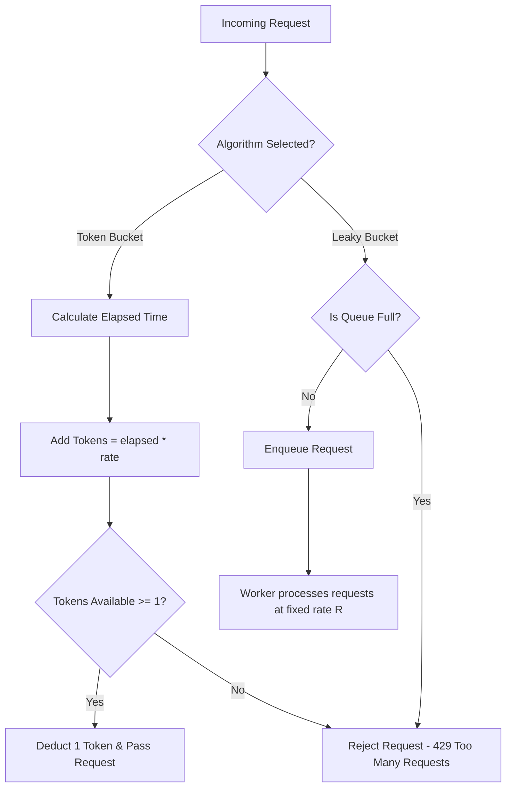

# Systems Design Strategy: Token Bucket vs Leaky Bucket Rate Limiters

---

### 1. 💡 The "Big Picture" (Plain English)

#### What is this in simple terms?
A **Rate Limiter** is a digital traffic cop. It controls how many requests a user or client can make to your server within a set time frame. If someone tries to flood your system with too many requests, the rate limiter steps in and says, *"Slow down, try again later"* (returning an `HTTP 429 Too Many Requests` error).

#### Real-World Analogy
*   **Token Bucket (The Nightclub Arcade):** 
    Imagine an arcade machine that requires tokens. Every second, an employee drops a new token into a bucket. The bucket can only hold up to 10 tokens. If you arrive after a quiet hour, the bucket is full (10 tokens). You can grab all 10 tokens instantly and play 10 games back-to-back (**burst capacity**). But once the bucket is empty, you must wait for the employee to drop in tokens one by one at the fixed refill rate.
*   **Leaky Bucket (The Funnel Bar):** 
    Imagine a funnel held over a small glass. No matter how violently or fast you pour a pitcher of water into the top of the funnel (**incoming burst of requests**), the water drips out of the bottom hole at a steady, perfectly constant rate (**smooth egress rate**). If you pour water faster than the funnel can store it, the water overflows off the top and spills onto the floor (**dropped requests**).

```
Token Bucket: Allows bursts, refills at steady rate.
Leaky Bucket: Absorbs bursts, outputs at steady rate.
```

#### Why should I care? What problem does it solve today?
1.  **Prevents Cascading Failures & Overload:** Prevents malicious actors (DDoS) or buggy client loops from crashing your backend databases and microservices.
2.  **Saves Money:** Controls infrastructure costs when calling expensive third-party APIs (e.g., OpenAI API, Stripe, AWS) that charge per request.
3.  **Ensures Multi-tenant Fairness:** Prevents a single "noisy neighbor" user from consuming 99% of your system resources and starving other users.

---

### 2. 🛠️ How it Works (Step-by-Step)

#### Token Bucket Flow
1. **Refill Logic (Lazy Evaluation):** Instead of running a background thread every second to add tokens, calculate how many tokens *should* have been added since the last request arrived.
2. **Capacity Check:** Add the calculated tokens to the current supply without exceeding `max_capacity`.
3. **Request Evaluation:**
   * If `current_tokens >= requested_tokens`: Deduct tokens and **ALLOW** the request.
   * If `current_tokens < requested_tokens`: **REJECT** the request (`429`).

#### Leaky Bucket Flow
1. Incoming requests enter a First-In-First-Out (FIFO) queue of fixed size `C`.
2. If the queue is **full**, the incoming request is immediately **REJECTED**.
3. A background worker pops requests off the queue and processes them at a strict, uniform rate `R` (e.g., exactly 5 requests/sec).

#### Production-Ready Implementation: Lazy Token Bucket (Python)

To avoid thread management and cron-like background jobs, senior engineers use **Lazy Evaluation**: token counts are recalculated dynamic-on-demand whenever a request hits the system.

```python
import time

class TokenBucketRateLimiter:
    def __init__(self, capacity: int, refill_rate: float):
        """
        :param capacity: Maximum tokens the bucket can hold (Burst limit)
        :param refill_rate: Tokens added per second (Sustained limit)
        """
        self.capacity = float(capacity)
        self.refill_rate = float(refill_rate)
        self.tokens = float(capacity)
        self.last_refill_timestamp = time.time()

    def allow_request(self, tokens_requested: int = 1) -> bool:
        now = time.time()
        
        # 1. LAZY REFILL: Calculate tokens accumulated since last call
        elapsed_time = now - self.last_refill_timestamp
        tokens_to_add = elapsed_time * self.refill_rate
        
        # 2. Update token count, capped at maximum capacity
        self.tokens = min(self.capacity, self.tokens + tokens_to_add)
        self.last_refill_timestamp = now

        # 3. Consume token if available
        if self.tokens >= tokens_requested:
            self.tokens -= tokens_requested
            return True  # Request Allowed
            
        return False  # Request Throttled (HTTP 429)

# Usage Example
limiter = TokenBucketRateLimiter(capacity=5, refill_rate=1.0) # Cap: 5, Refill: 1 token/sec

# Simulate 5 fast requests (Allowed due to burst capacity)
for i in range(5):
    print(f"Request {i+1}: {'Allowed' if limiter.allow_request() else 'Throttled'}")

# 6th request immediately after -> Throttled
print(f"Request 6: {'Allowed' if limiter.allow_request() else 'Throttled'}")
```

#### Architecture Flow Diagram



---

### 3. 🧠 The "Deep Dive" (For the Interview)

#### 1. Concurrency & High-Throughput Internals
In a multi-threaded web application running on a single instance, naive mutation of shared state (`self.tokens`) creates race conditions. 

* **In-Memory Thread Safety:** Must be backed by atomic operations or locks (e.g., `Java's AtomicReference` + CAS loop, or Python's `threading.Lock`).
* **Distributed Rate Limiting (Redis + Lua Script):** In a distributed architecture with 50 API Gateway nodes, local memory rate limiting fails because user state is fragmented across nodes.
  * *Solution:* Centralize state in Redis using a **Lua Script**. 
  * *Why Lua?* Redis executes Lua scripts **atomically** in a single thread. The "read-tokens, calculate-refill, deduct-token, write-back" sequence occurs completely isolated on the Redis instance, preventing "check-then-act" race conditions without heavy distributed locks (like Redlock).

```lua
-- Atomic Token Bucket Lua Script for Redis
local key = KEYS[1]
local capacity = tonumber(ARGV[1])
local refill_rate = tonumber(ARGV[2])
local now = tonumber(ARGV[3])
local requested = tonumber(ARGV[4])

local data = redis.call("HMGET", key, "tokens", "last_refill")
local tokens = tonumber(data[1])
local last_refill = tonumber(data[2])

if not tokens then
    tokens = capacity
    last_refill = now
else
    local elapsed = now - last_refill
    tokens = math.min(capacity, tokens + (elapsed * refill_rate))
end

if tokens >= requested then
    tokens = tokens - requested
    redis.call("HMSET", key, "tokens", tokens, "last_refill", now)
    return 1 -- Allowed
else
    redis.call("HMSET", key, "tokens", tokens, "last_refill", now)
    return 0 -- Rejected
end
```

#### 2. Key Architectural Trade-offs

| Metric / Dimension | Token Bucket | Leaky Bucket |
| :--- | :--- | :--- |
| **Traffic Profile** | Supports **bursts** up to capacity $C$. | Forces a **smooth, uniform rate** downstream. |
| **Queue Overhead** | No request queueing. Requests pass instantly or fail instantly. | Enqueues requests. Adds **queuing latency** to incoming requests. |
| **Memory Footprint** | Extremely low ($O(1)$ memory: key, token count, timestamp). | Higher memory usage ($O(C)$ to store pending requests in a queue). |
| **Primary Use Cases** | User-facing REST APIs, General API Gateways (AWS API Gateway, Kong). | Egress traffic shaping, rate-limiting outbound calls to fragile legacy DBs/Third parties. |

---

#### 3. Interviewer Probe Questions (And How to Answer)

##### 🎯 Probe 1: *"How do you handle clock drift between your API servers in a distributed rate limiting environment?"*
* **Answer:** Relying on client or app-server local clocks (`System.currentTimeMillis()`) leads to inconsistency across nodes due to NTP drift. To solve this:
  1. Use the central Redis cluster clock via the `redis.call('TIME')` command inside the Lua script so all servers share a single source of time truth.
  2. If using local timestamps, allow a small time skew window and regularly enforce synchronization with NTP daemons (e.g., `chrony`).

##### 🎯 Probe 2: *"What happens if your centralized Redis rate-limiter goes down? How do you prevent bringing down the entire API ecosystem?"*
* **Answer:** Implement a **Fail-Open strategy with Local Shadow Buckets**:
  * Wrap the Redis rate-limiter call in a circuit breaker with a tight timeout (e.g., 10-20ms).
  * If Redis times out or crashes, fallback to a local in-memory token bucket on each gateway node, or **fail-open** (allow requests through) while alerting DevOps.
  * *Trade-off:* Temporary loss of strict rate-limit guarantees is generally preferable to total availability loss (DoS'ing yourself).

##### 🎯 Probe 3: *"Why would you ever choose Leaky Bucket over Token Bucket in production?"*
* **Answer:** When downstream consumers cannot tolerate sudden bursts. Token Bucket allows a bucket of size 1,000 to send 1,000 requests *at the exact same millisecond*. If your downstream database pool maxes out at 50 connections, a Token Bucket burst will crash your DB. A Leaky Bucket smoothes out that spike, queuing the requests and executing them strictly at 50 req/sec.

---

### 4. ✅ Summary Cheat Sheet

```
+-------------------------------------------------------------------------+
|                              CHEAT SHEET                                |
+-----------------------+-------------------------------------------------+
| Token Bucket          | Great for general public APIs.                  |
|                       | Allows short bursts of traffic.                 |
+-----------------------+-------------------------------------------------+
| Leaky Bucket          | Great for background jobs, Webhooks, & DBs.    |
|                       | Forces traffic into a predictable smooth stream. |
+-----------------------+-------------------------------------------------+
| Optimization Secret   | Lazy Evaluation (timestamp diff) removes background|
|                       | refill threads entirely!                        |
+-----------------------+-------------------------------------------------+
| Scale Secret          | Redis + Atomic Lua Scripts prevents Distributed |
|                       | Race Conditions.                                |
+-----------------------+-------------------------------------------------+
```

#### 3 Key Takeaways
1. **Traffic Shaping Goal:** Token Bucket allows bursts while capping the long-term rate; Leaky Bucket eliminates bursts completely to protect sensitive consumers.
2. **Implementation Efficiency:** Always prefer **Lazy Evaluation** (computing tokens dynamically on request arrival via timestamp delta) over background ticker threads.
3. **Distributed Scalability:** Distributed rate limiting requires atomic state execution using **Redis + Lua** scripts to avoid concurrency lock contention.

#### 🏆 The Golden Rule
> **Use Token Bucket at your API Gateway to protect your platform while allowing legitimate user bursts. Use Leaky Bucket at your system's egress points to smooth out traffic before calling fragile, burst-intolerant dependencies.**