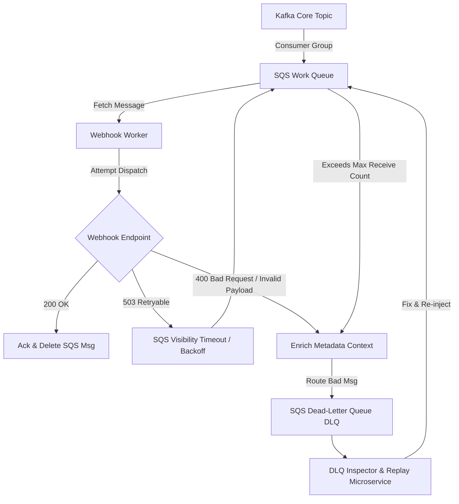

# Dead-Letter Queue (DLQ) Remediation and Poison Pill Isolation in Kafka-SQS Systems

1. 💡 The "Big Picture" (Plain English)

### What is this in simple terms?
Imagine sending millions of webhook notifications every hour. Most go through without a hitch, but a small percentage fail permanently because of malformed JSON payloads, invalid target URLs, or hard authorization errors (401/403). A **Poison Pill** is an event payload so broken that no amount of retrying will ever make it succeed. 

A **Dead-Letter Queue (DLQ)** is a specialized isolation chamber. When a notification fails repeatedly or encounters a unrecoverable error, the system stops attempting delivery, extracts the broken message from the main processing highway, and places it into the DLQ. This keeps the primary pipeline running at full speed without getting stuck in infinite failure loops.

### Real-World Analogy
Think of an **automated airport baggage system**. 

Thousands of suitcases travel down high-speed conveyor belts. If a bag has a torn, unreadable barcode, the automated system doesn't stop the entire conveyor belt or try scanning the broken barcode 10,000 times. Instead, a mechanical arm pushes the broken bag onto a dedicated side-track (the DLQ). The main conveyor keeps moving thousands of valid bags per minute, while a airport staff member manually inspects and fixes the single bad bag on the side-track.

```
Main Belt (High Speed)   --->  [ Valid Bag ]  ---> [ Valid Bag ] ---> Flight
                                     |
                             (Unreadable Barcode)
                                     v
Side Track (DLQ)         --->  [ Bad Bag ]    ---> Manual Inspection
```

### Why Should You Care?
Without a DLQ strategy and poison pill isolation:
* **Head-of-Line Blocking:** A single corrupted notification payload will block an entire Kafka partition or SQS processing worker indefinitely.
* **Resource Exhaustion:** Infinite retry loops burn CPU, network bandwidth, and cloud compute budgets trying to send webhooks to non-existent domains.
* **Cascading Outages:** Downstream worker pools lock up waiting on timeouts, causing backpressure that degrades the entire infrastructure.

---

2. 🛠️ How it Works (Step-by-Step)

### Step-by-Step Execution Flow

1. **Ingress (Kafka):** Events enter high-throughput Kafka topics.
2. **Buffering & Fan-Out (SQS):** Kafka consumers dispatch events into worker-specific SQS queues.
3. **Execution & Classification:** The Webhook Worker attempts delivery and classifies the HTTP response:
   * **Transient Failure (e.g., 503, 429):** Retried via SQS Visibility Timeout with exponential backoff.
   * **Permanent Poison Pill (e.g., 400 Bad Request, Malformed Payload):** Intercepted immediately.
4. **Context Enrichment:** The application attaches metadata to the message (`X-Original-Queue`, `X-Error-Reason`, `X-Failure-Timestamp`, `X-Attempt-Count`).
5. **DLQ Offloading:** Message is written to the SQS Dead-Letter Queue; Kafka offset/SQS message is acknowledged so processing moves forward.
6. **Remediation & Replay:** An administrative replay service (or human-in-the-loop) inspects the DLQ, fixes underlying bugs/data, and re-injects messages safely into the main stream.

### Architecture Diagram



### Code Implementation (Node.js/TypeScript Worker with DLQ Offloading)

```typescript
import { SQSClient, SendMessageCommand, DeleteMessageCommand } from "@aws-sdk/client-sqs";
import axios, { AxiosError } from "axios";

const sqs = new SQSClient({ region: "us-east-1" });
const DLQ_URL = process.env.SQS_DLQ_URL!;

interface NotificationMessage {
  id: string;
  targetUrl: string;
  payload: Record<string, any>;
  attemptCount: number;
}

export async function processWebhookMessage(
  rawMessage: any,
  receiptHandle: string,
  queueUrl: string
): Promise<void> {
  const notification: NotificationMessage = JSON.parse(rawMessage.Body);

  try {
    // Attempt webhook HTTP POST
    await axios.post(notification.targetUrl, notification.payload, { timeout: 3000 });
    
    // Success: Remove message from active processing queue
    await deleteFromQueue(queueUrl, receiptHandle);
  } catch (error: any) {
    const isPoisonPill = determineIfPoisonPill(error);

    if (isPoisonPill) {
      console.error(`[Poison Pill Detected] Routing msg ${notification.id} to DLQ.`);
      
      // 1. Offload to DLQ with detailed failure context
      await sendToDLQ(notification, error);
      
      // 2. Delete from primary queue to unblock worker stream
      await deleteFromQueue(queueUrl, receiptHandle);
    } else {
      // Allow SQS native visibility timeout to handle retry
      console.warn(`[Transient Failure] Retrying msg ${notification.id} later.`);
      throw error; // Throwing forces SQS non-acknowledgement (NACK)
    }
  }
}

function determineIfPoisonPill(error: AxiosError): boolean {
  // Parsing/Syntax errors or permanent HTTP status codes (4xx except Rate-Limit 429)
  if (!error.response) return false; // Network/timeout -> Transient
  const status = error.response.status;
  if (status === 429) return false;  // Rate limited -> Transient
  return status >= 400 && status < 500; // Client errors -> Permanent / Poison Pill
}

async function sendToDLQ(msg: NotificationMessage, err: AxiosError): Promise<void> {
  const dlqPayload = {
    originalMessage: msg,
    errorContext: {
      message: err.message,
      statusCode: err.response?.status,
      responseData: err.response?.data,
      failedAt: new Date().toISOString(),
    },
  };

  await sqs.send(new SendMessageCommand({
    QueueUrl: DLQ_URL,
    MessageBody: JSON.stringify(dlqPayload),
    MessageAttributes: {
      "ErrorType": { DataType: "String", StringValue: "PoisonPill" }
    }
  }));
}

async function deleteFromQueue(queueUrl: string, receiptHandle: string): Promise<void> {
  await sqs.send(new DeleteMessageCommand({
    QueueUrl: queueUrl,
    ReceiptHandle: receiptHandle
  }));
}
```

---

3. 🧠 The "Deep Dive" (For the Interview)

### The Technical "Magic" & Internals

#### 1. SQS Native Redrive Policy vs. Custom Kafka Application-Level DLQ
* **SQS Native Mechanics:** SQS tracks message delivery via the `ApproximateReceiveCount` attribute. When `ApproximateReceiveCount > maxReceiveCount`, SQS automatically shifts the message into the configured SQS DLQ without code intervention.
* **Kafka Partition Conundrum:** Kafka has no native broker-level DLQ concept. Kafka manages logs, not item-level state. Offloading a poison pill in Kafka requires application-level handling: consuming the record, committing the offset to advance the partition index, and explicitly producing the bad record to a separate `notification-dlq` topic or SQS DLQ.

```
Kafka Partition Logs (Strictly Sequenced):
[Offset 101: OK] -> [Offset 102: POISON PILL] -> [Offset 103: OK]
                          |
             (Application Commits Offset 102)
                          |
                          v
               Published to External DLQ
```

#### 2. Envelope Pattern for Diagnostic Context
Never store *just* the failed payload in a DLQ. Always wrap it inside an **Enriched Diagnostics Envelope**:
* **Tracking Identifiers:** Correlation ID, Trace Parent header (OpenTelemetry context).
* **Metadata Snapshot:** Failure cause stack trace, target HTTP endpoint, original partition/offset details, attempt timestamps.
Without this envelope, debugging millions of DLQ entries becomes impossible.

#### 3. Replay Engines & Dual-Write Hazard
Replaying messages from a DLQ back into production systems introduces the **Dual-Write Hazard** and potential out-of-order execution. 
If customer updates their notification settings while a message sits in the DLQ, replaying that old message could send outdated state or trigger duplicate actions. 

**Solution:** The Replay Engine must run payloads through an **Idempotency Evaluator** or re-fetch state from the source database before re-emitting.

### System Trade-offs

| Strategy | Advantages | Trade-offs |
| :--- | :--- | :--- |
| **Instant Quarantine (4xx -> Immediate DLQ)** | Zero wasted compute cycles; zero impact on non-faulty webhooks. | High risk of false positives if downstream returns misconfigured 4xx status codes. |
| **In-place Retry Loop until Max Timeout** | Preserves original execution order per tenant. | Causes Head-of-Line blocking; starves downstream workers during extended outages. |
| **Automated Background DLQ Replay** | Hands-off self-healing system recovery. | Can trigger cascading failure loops if the root bug hasn't been deployed/patched. |

---

### Interviewer Probes & Elite Answers

#### Probe 1: *"How do you handle poison pills in Kafka when strict strict message ordering within a partition is mandatory?"*
> **Answer:** "If absolute ordering within a partition is strictly non-negotiable (e.g., account balance state updates), offloading a poison pill to a DLQ breaks ordering guarantees for that specific entity. In this scenario, we use a **Partition-Pausing Strategy**: the consumer thread stops processing that partition, alerts operations, and triggers a circuit breaker, while allowing other parallel partitions to continue processing. However, for a *notification system*, strict ordering is usually secondary to high availability. Thus, we isolate the specific bad payload to the DLQ, publish a gap-sequence event, and allow subsequent notifications to proceed."

#### Probe 2: *"What happens if your DLQ itself becomes backed up or full?"*
> **Answer:** "SQS DLQs support standard SQS scaling (virtually unlimited size and throughput). However, an exploding DLQ signals a system-wide bug (e.g., a broken deployment emitting invalid JSON to all clients). To handle this, we implement **Alerting Threshold Rules** based on `ApproximateNumberOfMessagesVisible` CloudWatch metrics. If the DLQ ingestion rate spikes above a pre-defined threshold, automated alarms halt automated replay engines and page on-call engineers via PagerDuty to block runaway write cascades."

#### Probe 3: *"How do you test and execute DLQ replays safely without DDoS'ing downstream customer endpoints?"*
> **Answer:** "We use a dedicated **Replay Service** equipped with a Token Bucket rate-limiter. The service reads DLQ messages in controlled micro-batches, updates payload schema definitions if necessary, and re-injects them into the SQS processing queue under strict rate constraints (e.g., max 50 req/sec per target domain) rather than dumping all DLQ messages back into production at once."

---

4. ✅ Summary Cheat Sheet

### 3 Key Takeaways
1. **Differentiate Error Types Immediately:** Fast-path 4xx/client errors straight to the DLQ; reserve retries for transient 5xx/network errors.
2. **Never Store Un-Enriched Payloads in DLQs:** Always wrap failed messages with stack traces, target identifiers, and failure timestamps.
3. **Kafka Requires Manual Offset Advancement:** Unlike SQS native redrive policies, Kafka offset progression requires manual commit handling after writing bad records to an external DLQ.

### 1 Golden Rule
> **"Never let a single bad payload block a shared processing pipe: isolate the bad message, commit the position, and keep the main stream moving."**