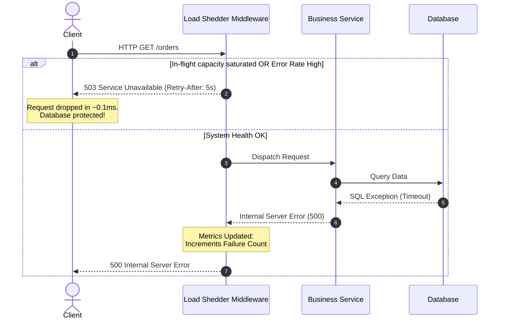

# Server-Driven Load Shedding & Adaptive Throttling: Defending Against Exception-Induced Retry Storms

### 💡 The "Big Picture" (Plain English)

#### What is this in simple terms?
When a microservice encounters a transient error (like a temporary database latency spike), upstream callers often start throwing exceptions and retrying their requests immediately. If hundreds of callers do this simultaneously, they create a **Retry Storm**. 

**Server-Driven Load Shedding and Adaptive Throttling** is a strategy where a server actively senses its own degradation and aggressively drops incoming traffic *at the very edge of the application* before it consumes CPU, memory, or thread pools. Instead of attempting to process every request and dying under the load, the server deliberately throws fast, lightweight exceptions (like HTTP `429 Too Many Requests` or `503 Service Unavailable`) to shed load and survive.

#### Real-World Analogy
Imagine a busy Emergency Room (ER). If a multi-car accident happens, dozens of injured patients arrive at once. If doctors spend all their time talking to every patient at the front desk asking "Am I next?", no one gets treated, and the ER collapses. 

To prevent this, the ER assigns a **Triage Nurse** at the front door. The nurse spends 2 seconds evaluating each person: critical cases go straight to the back, while non-critical cases are immediately told, *"We cannot treat you right now. Come back in 3 hours."* By rejecting non-urgent work at the door, the ER protects its doctors so they can actually clear the backlog.

```
       [ Client Retry Storm ]
          │  │  │  │  │
          ▼  ▼  ▼  ▼  ▼
   ┌──────────────────────────┐
   │    Triage / Load Shed    │ ──(Fast 429 Error)──► Dropped instantly (0 CPU cost)
   └──────────────────────────┘
                │
         (Admitted Traffic)
                ▼
   ┌──────────────────────────┐
   │   Database / Heavy Biz   │ ──► Processed Safely
   └──────────────────────────┘
```

#### Why should I care?
Without load shedding, a 1-second spike in database latency can trigger a cascading failure that brings down your entire ecosystem. Upstream services flood you with retries, filling your thread pools and memory queues. Your service goes completely dark (0% success rate) instead of operating gracefully at reduced capacity (say, 70% success rate).

---

### 🛠️ How it Works (Step-by-Step)

#### The Process
1. **Track In-Flight Work and Health Metrics:** The application monitors active worker threads, CPU load, or system latency continuously.
2. **Evaluate Adaptive Thresholds:** Using a algorithm (e.g., Google’s Adaptive Throttling formula), the system dynamically calculates the probability of rejecting incoming requests based on the ratio of succeeded requests vs. total requests over a rolling window.
3. **Shed at the Gate:** Incoming requests hit an interceptor/filter before touching any business logic or database connections.
4. **Fast-Fail with Backoff Directives:** If overloaded, return a lightweight exception payload immediately, accompanied by a `Retry-After` header telling clients how long to wait.
5. **Auto-Recovery:** As the downstream dependency recovers, the success ratio improves, the rejection threshold automatically drops, and normal traffic flow resumes.

#### Code Example (Java / Spring Security Interceptor style)

Here is a practical implementation of an **Adaptive Throttling Interceptor**:

```java
import java.time.Instant;
import java.util.concurrent.atomic.AtomicInteger;
import java.util.concurrent.atomic.LongAdder;

public class AdaptiveLoadShedder {

    // K factor: Controls how aggressively we reject traffic when errors spike.
    // Lower K = More aggressive rejection. (Standard range: 1.5 - 2.0)
    private static final double K = 2.0;
    
    private final LongAdder totalRequests = new LongAdder();
    private final LongAdder successfulRequests = new LongAdder();
    private final AtomicInteger inFlightRequests = new AtomicInteger(0);
    private final int maxConcurrentConcurrency;

    public AdaptiveLoadShedder(int maxConcurrentConcurrency) {
        this.maxConcurrentConcurrency = maxConcurrentConcurrency;
    }

    public boolean shouldAllowRequest() {
        // 1. Hard Concurrency Ceiling Check (Shed based on queue/thread exhaustion)
        if (inFlightRequests.get() >= maxConcurrentConcurrency) {
            return false; // Shed immediately: No available worker capacity
        }

        // 2. Adaptive Probability Check based on recent error ratios
        double total = totalRequests.doubleValue();
        double accepts = successfulRequests.doubleValue();

        // Formula: P(reject) = max(0, (total - K * accepts) / (total + 1))
        double rejectionProbability = Math.max(0.0, (total - (K * accepts)) / (total + 1.0));

        // If probability > 0, randomly drop requests proportionally to the failure rate
        if (rejectionProbability > 0 && Math.random() < rejectionProbability) {
            return false; // Shed based on downstream failure propagation
        }

        inFlightRequests.incrementAndGet();
        totalRequests.increment();
        return true;
    }

    public void onRequestCompleted(boolean isSuccess) {
        inFlightRequests.decrementAndGet();
        if (isSuccess) {
            successfulRequests.increment();
        }
    }
}
```

#### Request Flow Diagram



---

### 🧠 The "Deep Dive" (For the Interview)

#### The Engineering Internals

To understand Load Shedding deeply, you must understand **Little’s Law** from queueing theory:

$$L = \lambda W$$

Where:
* $L$ = Number of requests in the system (Concurrency)
* $\lambda$ = Arrival rate (Requests Per Second)
* $W$ = Average processing time (Latency)

When an exception occurs downstream (e.g., a database query slows from 10ms to 5000ms), $W$ increases by **500x**. If the arrival rate ($\lambda$) stays constant, the required system concurrency ($L$) must grow by 500x to keep up. 

Because application thread pools and memory are finite, queue depth inflates. This causes **Bufferbloat**. Requests sit in memory queues waiting for an available thread, accruing latency before they are even processed. By the time a thread picks up a request, the client has already timed out and sent a retry!

```
[Normal State]  ──► [Slow Dependency Exception] ──► [Queue Inflates] ──► [Thread Exhaustion] ──► [Cascading OOM Crash]
```

**Adaptive Load Shedding breaks this cycle by enforcing concurrency limits at the transport boundary:**
* **Queue-Limit Shedding:** If queue depth exceeds a critical threshold, reject at the network layer (`Tail-Drop` or `CoDel` algorithm).
* **Cost of Exception:** Returning a `429/503` early consumes negligible CPU (just serialization and TCP write). Processing a request that will ultimately fail or time out burns database connections, thread allocation, context switching, and memory.

#### Trade-offs

| Strategy | Pros | Cons |
| :--- | :--- | :--- |
| **Static Rate Limiting (Fixed RPS)** | Simple to implement; protects against naive DDoS. | Inflexible. Doesn't adapt if latency increases while RPS remains constant. |
| **Concurrency Limiting (In-Flight Max)** | Directly prevents thread pool starvation. | Doesn't account for downstream partial failures if threads aren't fully saturated yet. |
| **Google Adaptive Throttling (Probabilistic)** | Dynamic; automatically scales rejection rate up/down based on real error ratios. | Requires rolling statistical windows; can briefly drop legitimate traffic during sudden traffic spikes. |

---

### 💡 Interviewer Probes & Counter-Strategies

#### Question 1: *"How do you differentiate between a legitimate flash sale traffic spike and an exception-driven retry storm when deciding to shed load?"*
* **Candidate Answer:** "We rely on client metadata and entry-layer telemetry. Retry storms typically carry specific headers (like `X-Request-Attempt: >1`) or trace headers that share a parent Span ID. Additionally, a legitimate flash-sale spike increases overall arrival rate ($\lambda$) with normal latency, whereas a retry storm is accompanied by a sharp degradation in P99 latency and high downstream exception rates. Adaptive load shedding uses success ratios rather than pure RPS counters, so high-volume traffic that succeeds is allowed, whereas high-volume traffic failing downstream triggers immediate load shedding."

#### Question 2: *"If your load shedder drops requests with an HTTP 503, isn't there a risk that aggressive clients will just ignore the header and retry even harder, worsening the storm?"*
* **Candidate Answer:** "Yes, this is known as client-side amplification. To counter this:
  1. We append `Retry-After: <seconds>` headers with randomized jitter.
  2. At the API Gateway layer, we implement **Client Reputation / Token Bucket** mechanics: if a specific IP or Client-ID retries faster than the `Retry-After` window commands, we drop their packets at the network transport layer (e.g., via eBPF or IPTables) with zero response payload, preventing them from consuming application worker resources."

#### Question 3: *"Where exactly in the architecture stack should Load Shedding logic live?"*
* **Candidate Answer:** "In a defense-in-depth layout:
  * **Layer 7 API Gateway / Service Mesh Sidecar (Envoy/Nginx):** Handles global load shedding based on system-wide metrics (CPU, overall memory) so bad traffic never enters the JVM/CLR runtime.
  * **Application Middleware Filter:** Handles domain-specific adaptive load shedding based on pool saturation for specific resource routes (e.g., `/checkout` vs `/health`). Dropping traffic at the gateway is cheapest, but the application middleware has finer context on *which* dependencies are failing."

---

### ✅ Summary Cheat Sheet

#### 3 Key Takeaways
1. **Queues kill systems, not load:** Latency spikes cause queues to fill. Processing expired queued requests under load is wasted work that leads to complete system outages.
2. **Fail Fast & Cheap:** A rejected request (`429/503`) costs microsecond-level CPU time. A timed-out request costs seconds of blocked threads and connection pools.
3. **Adapt, Don't Static-Limit:** Static RPS limits fail because system capacity changes based on downstream health. Adaptive load shedding adjusts rejection rates based on current health and success ratios.

#### 1 Golden Rule to Remember
> *"In a distributed system under distress, it is infinitely better to serve 70% of your users successfully and shed the remaining 30%, than to attempt to serve 100% and crash for everyone."*