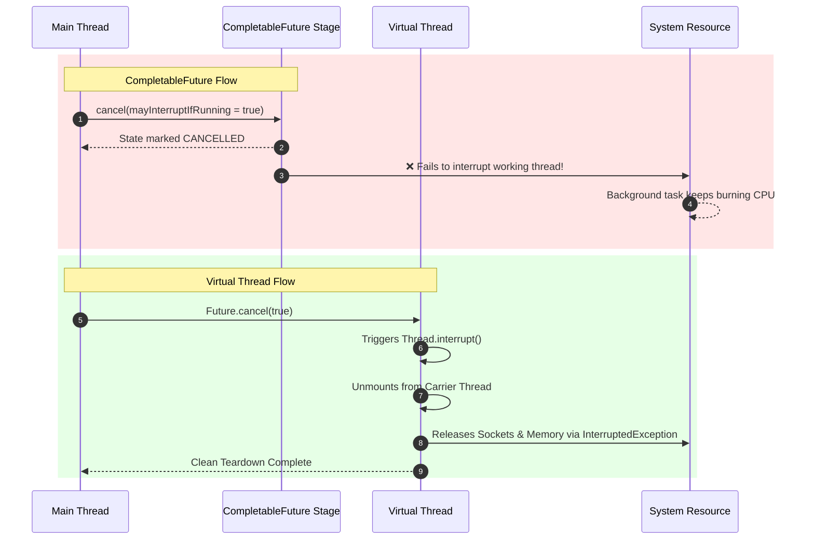

# Task Cancellation Mechanics: Clean Teardowns across Virtual Threads and CompletableFuture

## 1. 💡 The "Big Picture" (Plain English)

### What is this in simple terms?
Imagine you launch a long-running background task—like downloading a massive file or searching through millions of database records—and suddenly the user hits "Cancel" or navigates to another page. 

**Task Cancellation** is the mechanism Java provides to pull the emergency brake on unwanted work. However, stopping code in execution is surprisingly tricky: you can't just forcefully kill a running thread without risking corrupted data, orphaned database connections, or memory leaks.

### Real-World Analogy
Imagine ordering a custom coffee at a busy cafe:
* **CompletableFuture Cancellation:** You inform the cashier, *"I don't want the coffee anymore, refund me."* The cashier marks your receipt as canceled and gives you money back, but **nobody tells the barista**. The barista keeps making your coffee, wasting beans and milk, only to throw it away at the end.
* **Virtual Thread Interruption:** You walk up to the barista while they are waiting for the espresso machine to drip and tap them on the shoulder: *"Stop making that order!"* The barista immediately turns off the machine, dumps the half-filled cup, cleans the portafilter, and moves on to the next customer.

```
CompletableFuture.cancel()  --->  Cancels the wrapper/result, work often continues in background!
VirtualThread.interrupt()  --->  Signals the worker directly, stopping I/O and unmounting execution!
```

### Why should I care?
If you don't handle cancellation correctly:
1. **Resource Bleed:** Unwanted tasks continue running silently in background thread pools, consuming CPU and memory.
2. **Database Exhaustion:** "Abandoned" queries keep open connections, exhausting your database connection pool.
3. **Ghost Side Effects:** A canceled request might still write data to your system long after the API call responded with an error!

---

## 2. 🛠️ How it Works (Step-by-Step)

### Step-by-Step Flow

#### CompletableFuture Cancellation Behavior:
1. Call `.cancel(true)` on a `CompletableFuture`.
2. The state of the Future transitions to `CANCELLED`.
3. Any attached downstream stages (`thenApply`, `thenAccept`) immediately fail with a `CancellationException`.
4. **Crucial Catch:** The worker thread executing the original logic **keeps running** unless you manually injected interruption logic!

#### Virtual Thread Interruption Behavior:
1. Call `.cancel(true)` on a `Future` backed by a Virtual Thread (e.g., from `Executors.newVirtualThreadPerTaskExecutor()`).
2. Java sends a standard signal: `Thread.interrupt()`.
3. If the Virtual Thread is currently blocked on I/O (e.g., `Thread.sleep()`, `Socket.read()`), it unmounts from its carrier thread instantly and throws an `InterruptedException`.
4. The Virtual Thread executes its `try-finally` cleanup blocks and exits smoothly.

---

### Clean Code Example

```java
import java.util.concurrent.*;

public class CancellationDemo {

    public static void main(String[] args) throws InterruptedException {
        System.out.println("=== 1. CompletableFuture Cancellation Traps ===");
        CompletableFuture<Void> cf = CompletableFuture.runAsync(() -> {
            try {
                System.out.println("[CF Worker] Starting heavy work...");
                Thread.sleep(2000); // Simulating work
                System.out.println("[CF Worker] STILL RUNNING! (Resource Leak)");
            } catch (InterruptedException e) {
                System.out.println("[CF Worker] Interrupted successfully!");
            }
        });

        Thread.sleep(500);
        // Param boolean 'mayInterruptIfRunning' is IGNORED in CompletableFuture!
        cf.cancel(true); 
        System.out.println("[Main] CompletableFuture.cancel(true) called.");

        Thread.sleep(2000); // Wait to observe background behavior

        System.out.println("\n=== 2. Virtual Thread Cancellation Cleanliness ===");
        try (var executor = Executors.newVirtualThreadPerTaskExecutor()) {
            Future<?> vtFuture = executor.submit(() -> {
                try {
                    System.out.println("[VT Worker] Starting blocking network call...");
                    Thread.sleep(2000); // Simulating blocking I/O
                    System.out.println("[VT Worker] Finished (Won't reach here)");
                } catch (InterruptedException e) {
                    System.out.println("[VT Worker] Interrupted cleanly during blocking wait! Cleaning up resources...");
                } finally {
                    System.out.println("[VT Worker] Cleanup code executed.");
                }
            });

            Thread.sleep(500);
            // On Virtual Threads, this issues a real Thread.interrupt()
            vtFuture.cancel(true); 
            System.out.println("[Main] Virtual Thread Future.cancel(true) called.");
        }
    }
}
```

---

### Process Flow Diagram



---

## 3. 🧠 The "Deep Dive" (For the Interview)

### The Technical Magic (JVM Internals)

#### 1. Why CompletableFuture Ignores `mayInterruptIfRunning`
In traditional `FutureTask`, passing `mayInterruptIfRunning = true` actively calls `Thread.interrupt()` on the worker thread. However, `CompletableFuture` was designed as a lightweight promise pipeline detached from execution threads. A single `CompletableFuture` stage can be completed by *any* thread (via `.complete()`). Therefore, `CompletableFuture` has no direct internal reference to the physical thread currently processing the pipeline. 

Calling `cf.cancel(true)` is functionally identical to calling `cf.cancel(false)`—it simply marks the result holder object as canceled and propagates failure down the consumer chain.

```java
// Inside JDK's CompletableFuture.java:
public boolean cancel(boolean mayInterruptIfRunning) {
    // Note: mayInterruptIfRunning parameter is completely unused!
    boolean cancelled = (result == null) &&
        internalComplete(new AltResult(new CancellationException()));
    postComplete();
    return cancelled || isCancelled();
}
```

#### 2. Virtual Thread Interruption & Pinning Traps
Virtual Threads map millions of lightweight instances (`Continuation`) to a small pool of platform OS threads (Carrier Threads). 
* When `Thread.interrupt()` is called on a Virtual Thread:
  1. The JVM sets the virtual thread's internal interrupt status flag.
  2. If the Virtual Thread is currently parked on a blocking call (like `LockSupport.park()`, socket IO, or `Thread.sleep()`), the JVM unparks the continuation.
  3. The virtual thread **unmounts** from its Carrier Thread immediately.
  4. The continuation yields back control, and an `InterruptedException` is thrown inside the Virtual Thread's call stack.

#### The Synchronized Trap:
If a Virtual Thread is interrupted while waiting inside a traditional **`synchronized` block**, or performing I/O inside a native JNI call:
* The Virtual Thread becomes **pinned** to its Carrier Thread.
* The interrupt flag is set, but the thread **cannot unmount or yield** until it exits the monitor block. 

> **Senior Dev Note:** To build fully cancellable Virtual Thread tasks, always replace `synchronized` with `java.util.concurrent.locks.ReentrantLock`, which uses `LockSupport` and fully supports cooperative unmounting on interrupt!

---

### Trade-Off Matrix

| Feature | CompletableFuture Cancellation | Virtual Thread (`Future.cancel(true)`) |
| :--- | :--- | :--- |
| **Interrupts Running Thread?** | ❌ No (Requires manual polling) | ✅ Yes (Sends `Thread.interrupt()`) |
| **Unblocks Waiting I/O?** | ❌ No | ✅ Yes (Triggers `InterruptedException`) |
| **Carrier/Pool Impact** | Leaves thread running silently in background | Instantly frees the Carrier Thread for other VTs |
| **Primary Use Case** | Pipeline-style asynchronous event composition | Simple, linear thread-per-task model with clean aborts |

---

### Interviewer Probes (Tricky Questions & Answers)

#### Q1: "I called `completableFuture.cancel(true)` on a task running an expensive database query, but the database load didn't decrease. Why?"
**Answer:** 
`CompletableFuture` ignores the `mayInterruptIfRunning` boolean parameter. Calling `.cancel()` only changes the internal state of the `CompletableFuture` object to completed exceptionally so that downstream stages stop receiving data. The actual background task continues running on its thread until completion. To cancel the actual DB query, you must pass the `Statement` or `Connection` object and explicitly execute `statement.cancel()`, or switch to Virtual Threads managed by an `ExecutorService` where `Future.cancel(true)` fires a true `Thread.interrupt()`.

#### Q2: "What happens if a Virtual Thread is interrupted while waiting to acquire a `ReentrantLock` vs a `synchronized` block?"
**Answer:**
If waiting inside `ReentrantLock.lockInterruptibly()`, the Virtual Thread unmounts from its Carrier Thread, handles the interrupt immediately, and throws `InterruptedException`. 

If blocked on a `synchronized` keyword, the Virtual Thread cannot unmount because the underlying JVM monitor binds it to the Carrier Thread. The interruption flag is stored, but the thread will remain stuck on the Carrier Thread until it acquires the lock, delaying the cancellation cleanup.

#### Q3: "How do you correctly handle cancellation when running pure CPU-bound loops in Virtual Threads?"
**Answer:**
Because CPU-bound work does not invoke blocking I/O calls (which automatically trigger unmounting via `InterruptedException`), the Virtual Thread won't automatically yield control. You must explicitly insert cooperative checks inside the loop body using `Thread.currentThread().isInterrupted()` or `Thread.checkAccess()`. If interrupted, break out of the loop cleanly:

```java
while (processingData) {
    if (Thread.currentThread().isInterrupted()) {
        // Perform manual cleanup
        break; 
    }
    // Perform chunk of CPU work...
}
```

---

## 4. ✅ Summary Cheat Sheet

```
+-----------------------------------------------------------------------+
|                       CANCELLATION MECHANICS                          |
+-----------------------------------------------------------------------+
| CompletableFuture.cancel()  -->  Cancels downstream listeners ONLY.   |
| VirtualThread.cancel(true)   -->  Interrupts execution & unmounts.    |
| Synchronized Blocks          -->  Pin threads & delay cancellation.   |
| ReentrantLock                -->  Enables immediate cancel on I/O.   |
+-----------------------------------------------------------------------+
```

### 3 Key Takeaways
1. **CompletableFuture does NOT stop running threads:** `mayInterruptIfRunning` is ignored in standard `CompletableFuture`.
2. **Virtual Threads restore classical `Thread.interrupt()`:** Canceling a Virtual Thread's `Future` unmounts the thread during I/O and throws `InterruptedException`.
3. **Avoid `synchronized` in cancellable tasks:** Use `ReentrantLock` so Virtual Threads can yield and clean up immediately when interrupted.

### 1 Golden Rule to Remember
> **"CompletableFuture cancels the result subscriber, but Virtual Threads cancel the underlying work."**