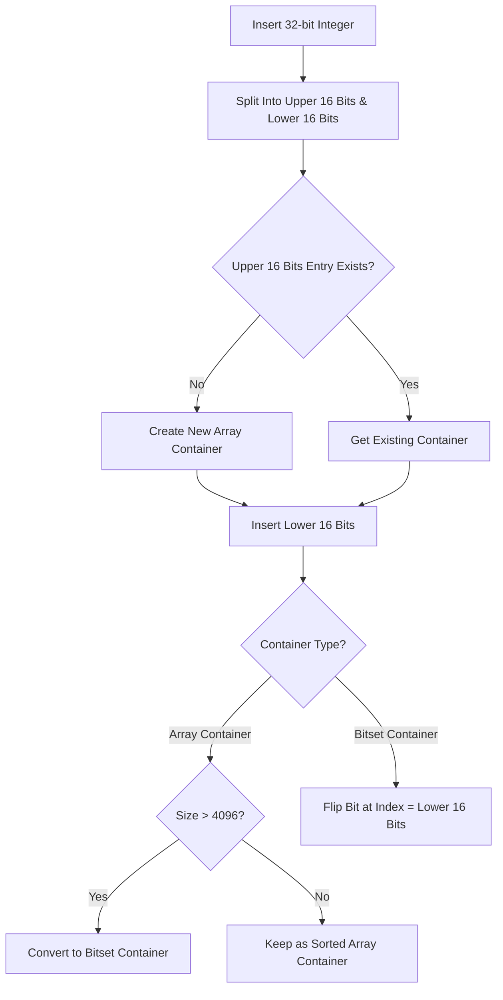

# The Roaring Bitmap: Custom Compressed Sets for Massive Integer Collections

## 1. 💡 The "Big Picture" (Plain English)

### What is this in simple terms?
A **Roaring Bitmap** is a specialized, compressed set collection designed to store millions (or billions) of non-negative integers—like user IDs, document IDs, or transaction numbers. It acts like a hyper-optimized `Set<Integer>`, but consumes up to **100x less memory** and performs set operations (`AND`, `OR`, `XOR`) at blistering speed.

### Real-World Analogy
Imagine a massive library tracking which of its 1,000,000 books are currently checked out:
*   **`HashSet<Integer>`**: Writing every checked-out book ID on a separate index card. Flexible, but burns tons of paper and storage boxes (JVM heap overhead).
*   **Standard `java.util.BitSet`**: Printing a static 1,000,000-checkbox sheet. If only 5 books are checked out, you still printed a massive sheet filled almost entirely with blank boxes (memory waste for sparse data).
*   **Roaring Bitmap**: Dividing the library into sections of 65,536 books each. 
    *   If a section has **few** checked-out books, write down a small list of IDs.
    *   If a section is **mostly** checked out, print a tiny 65,536-checkbox sheet just for that section.
    *   If a section has a **continuous run** of checked-out books (e.g., books 100 through 5,000), write a simple range note: `[100 to 5000]`.

### Why should I care?
If you store 10,000,000 integer IDs in a Java `HashSet<Integer>`, object wrapping (`java.lang.Integer`), Node references, and dynamic resizing will eat roughly **320 MB of RAM**. A Roaring Bitmap storing the same data can easily compress down to **under 2–5 MB** while executing bitwise operations (`AND`/`OR`) across sets in microsecond timeframes. It powers production systems like Elasticsearch, Apache Lucene, Spark, and Metabase.

---

## 2. 🛠️ How it Works (Step-by-Step)

### Step-by-Step Mechanism
1. **16-bit Partitioning**: Every 32-bit integer is split into two parts:
   * **Top 16 bits (Most Significant Bits)**: Serves as the key to locate the **Container** index.
   * **Bottom 16 bits (Least Significant Bits)**: Stored inside the chosen Container.
2. **Container Selection**: High 16 bits route the integer to an entry in a sorted array of containers.
3. **Adaptive Container Mutation**:
   * **Array Container**: If a container holds **$\le$ 4,096 elements**, store the bottom 16 bits as primitive `short` values in a sorted `short[]`.
   * **Bitset Container**: Once cardinality exceeds **4,096 elements**, automatically convert the array into a fixed 65,536-bit bitset (words array).
   * **Run Container (RLE)**: If consecutive sequences exist (e.g., 100, 1001, 1002... 5000), compress them into Start-Length pairs.

```
       32-bit Integer Value: 0x001F0042 (2,031,682)
       [ Top 16 Bits: 0x001F ]  |  [ Bottom 16 Bits: 0x0042 ]
                 │                             │
                 ▼                             ▼
       ┌──────────────────┐           ┌──────────────────┐
       │ Container Key    │──────────►│ Container Data   │
       │     0x001F       │           └──────────────────┘
       └──────────────────┘                     │
                                                ▼
                        ┌───────────────────────────────────────────────┐
                        │ Dynamic Type Based on Cardinality             │
                        ├───────────────────────────────────────────────┤
                        │ N <= 4096   ➔ Array Container (short[])       │
                        │ N >  4096   ➔ Bitset Container (long[1024])   │
                        │ Consecutive ➔ Run-Length Container (RLE pairs)│
                        └───────────────────────────────────────────────┘
```

### Mermaid Flow Diagram



### Clean Custom Implementation (Simplified Roaring Bitmap Concept)

```java
import java.util.Arrays;

/**
 * A simplified, educational implementation of a Roaring Bitmap concept.
 * Demonstrates 16-bit integer splitting and dynamic container promotion.
 */
public class MicroRoaringBitmap {

    private static final int MAX_ARRAY_SIZE = 4096;
    private static final int CHUNK_LIMIT = 65536;

    private int[] keys = new int[0]; // Top 16 bits
    private Container[] containers = new Container[0]; // Matching containers

    public void add(int value) {
        int high = value >>> 16;       // Top 16 bits (Unsigned)
        short low = (short) (value & 0xFFFF); // Lower 16 bits

        int index = Arrays.binarySearch(keys, high);

        if (index >= 0) {
            // Container exists; insert value and check for promotion
            containers[index] = containers[index].add(low);
        } else {
            // Container key missing; insert new container at insertion point
            int insertionPoint = -index - 1;
            insertContainer(insertionPoint, high, new ArrayContainer().add(low));
        }
    }

    public boolean contains(int value) {
        int high = value >>> 16;
        short low = (short) (value & 0xFFFF);
        int index = Arrays.binarySearch(keys, high);
        return index >= 0 && containers[index].contains(low);
    }

    private void insertContainer(int index, int key, Container container) {
        int[] newKeys = new int[keys.length + 1];
        Container[] newContainers = new Container[containers.length + 1];

        System.arraycopy(keys, 0, newKeys, 0, index);
        System.arraycopy(containers, 0, newContainers, 0, index);

        newKeys[index] = key;
        newContainers[index] = container;

        System.arraycopy(keys, index, newKeys, index + 1, keys.length - index);
        System.arraycopy(containers, index, newContainers, index + 1, containers.length - index);

        this.keys = newKeys;
        this.containers = newContainers;
    }

    // --- Container Hierarchy ---

    interface Container {
        Container add(short value);
        boolean contains(short value);
        int cardinality();
    }

    // 1. Array Container (Sparse Data)
    static class ArrayContainer implements Container {
        private short[] content = new short[0];

        @Override
        public Container add(short value) {
            int idx = Arrays.binarySearch(content, value);
            if (idx < 0) {
                int insertPos = -idx - 1;
                short[] newContent = new short[content.length + 1];
                System.arraycopy(content, 0, newContent, 0, insertPos);
                newContent[insertPos] = value;
                System.arraycopy(content, insertPos, newContent, insertPos + 1, content.length - insertPos);
                content = newContent;
            }

            // Threshold Reached: Promote to Bitset Container!
            if (content.length > MAX_ARRAY_SIZE) {
                return promoteToBitset();
            }
            return this;
        }

        @Override
        public boolean contains(short value) {
            return Arrays.binarySearch(content, value) >= 0;
        }

        @Override
        public int cardinality() {
            return content.length;
        }

        private BitsetContainer promoteToBitset() {
            BitsetContainer bitset = new BitsetContainer();
            for (short val : content) {
                bitset.add(val);
            }
            return bitset;
        }
    }

    // 2. Bitset Container (Dense Data)
    static class BitsetContainer implements Container {
        // 65536 bits require 1024 long words (1024 * 64 bits = 65536 bits)
        private final long[] words = new long[1024];
        private int cardinality = 0;

        @Override
        public Container add(short value) {
            int bitIndex = value & 0xFFFF;
            int wordIdx = bitIndex >> 6; // bitIndex / 64
            long mask = 1L << bitIndex;

            if ((words[wordIdx] & mask) == 0) {
                words[wordIdx] |= mask;
                cardinality++;
            }
            return this;
        }

        @Override
        public boolean contains(short value) {
            int bitIndex = value & 0xFFFF;
            int wordIdx = bitIndex >> 6;
            return (words[wordIdx] & (1L << bitIndex)) != 0;
        }

        @Override
        public int cardinality() {
            return cardinality;
        }
    }
}
```

---

## 3. 🧠 The "Deep Dive" (For the Interview)

### The Technical Magic: Mathematical Perfection of `4096`
Why is **4,096** the precise mathematical threshold to transition an Array Container into a Bitset Container?

1. **Bitset Container Memory**:
   * Holds up to $2^{16} = 65,536$ bits.
   * $65,536 \text{ bits} / 8 \text{ bits per byte} = 8,192 \text{ bytes} = 8 \text{ KB}$.
   * Fixed allocation: **8,192 Bytes**, regardless of element count.

2. **Array Container Memory**:
   * Uses primitive `short` values (16 bits = 2 Bytes each).
   * Memory used for $N$ values: $N \times 2 \text{ Bytes}$.

3. **The Equivalence Point**:
   $$\text{Array Memory} = \text{Bitset Memory}$$
   $$N \times 2 \text{ Bytes} = 8,192 \text{ Bytes} \implies N = 4,096$$

If $N < 4096$, an Array Container uses strictly **less than 8 KB** of memory.  
If $N > 4096$, an Array Container would take **more than 8 KB**, making the Bitset Container superior in both memory efficiency and constant-time $O(1)$ lookups.

### JVM Overhead & CPU Vectorization Optimization
* **Pointer Chasing Elimination**: `HashSet<Integer>` relies on linked lists/tree nodes wrapping `java.lang.Integer` references. Every access requires traversing JVM object pointers scattered across heap memory, leading to constant L1/L2 cache misses.
* **Cache Locality**: Roaring Bitmaps store 16-bit numbers in contiguous primitive arrays (`short[]` or `long[]`). Sequential byte alignment leverages CPU cache prefetching natively.
* **SIMD & Bit Parallelism**: Logical set operations (`AND`, `OR`, `XOR`) between two Bitset Containers execute via bitwise `long` operations (`wordA & wordB`). Modern CPUs can vectorize these operations across 256-bit or 512-bit registers (AVX2/AVX-512) to compute intersections across 65k elements in just a few CPU cycles.

### Trade-offs Matrix

| Feature | `HashSet<Integer>` | `java.util.BitSet` | Roaring Bitmap |
| :--- | :--- | :--- | :--- |
| **Sparse Memory Footprint** | Extremely High (~32B/elem) | Poor (Allocates up to Max Bit) | **Excellent** (Array Containers) |
| **Dense Memory Footprint** | Extremely High (~32B/elem) | Excellent (1 bit/elem) | **Excellent** (Bitset/Run Containers) |
| **Cache Locality** | Abysmal (Pointer Chasing) | High | **Maximum** (Contiguous Primitives) |
| **Set Intersections (`AND`)** | Slow ($O(N)$ Lookups) | Fast (Bitwise) | **Extreme** (Bitwise + SIMD + Skips) |
| **Data Type Limitation** | Any Object | Positive Integers | Integers (32-bit natively, 64-bit hybrid) |

---

### Interviewer Probe Questions

#### 1. "How does Roaring Bitmap process the `AND` (intersection) of an Array Container and a Bitset Container?"
> **Answer**: It avoids converting either container. Instead, it iterates through the sorted `short[]` array of the Array Container and tests membership directly against the Bitset Container using bit-masking in $O(N)$ time (where $N \le 4096$). Because the bitset lookup is $O(1)$ without pointer dereferencing, this hybrid operation is faster than intersecting two bitsets or two arrays.

#### 2. "How are 64-bit integers (`long`) handled if containers are bound to 16-bit limits?"
> **Answer**: 64-bit Roaring Bitmaps (e.g., `Roaring64NavigableMap`) introduce a higher-level tree indexing layer (like an Adaptive Radix Tree or `Long2ObjectAVLTree`). The top 32 bits select the sub-tree node, which maps to a standard 32-bit Roaring Bitmap managing the lower 32 bits.

#### 3. "What happens during high-write churn when cardinality oscillates around 4,096 elements?"
> **Answer**: Naive conversions can cause memory thrashing (repeatedly allocating arrays and bitsets). Production libraries mitigate this by applying hysteresis thresholds (e.g., promote at 4,096 elements, but defer demotion back to an array until cardinality drops significantly below 4,096, like 3,000) or by executing conversion conditionally during batch operations (`runOptimize()` or `trim()`).

---

## 4. ✅ Summary Cheat Sheet

### 3 Key Takeaways
1. **16-Bit Bit Partitioning**: Splitting 32-bit ints into high 16-bit keys and low 16-bit values divides space into manageable chunks of max size $65,536$.
2. **Dynamic Container Triad**: Uses **Array** for sparse data ($\le 4096$), **Bitset** for dense data ($> 4096$), and **Run (RLE)** for continuous ranges.
3. **Hardware Alignment**: Replaces JVM object graph overhead with contiguous memory chunks that leverage CPU L1/L2 caches and SIMD instructions.

### 1 Golden Rule
> *"Use a Roaring Bitmap when you need set operations over large collections of integer IDs; it gives you the ultra-low RAM footprint of compressed data with the near-instant performance of raw hardware bitwise operations."*