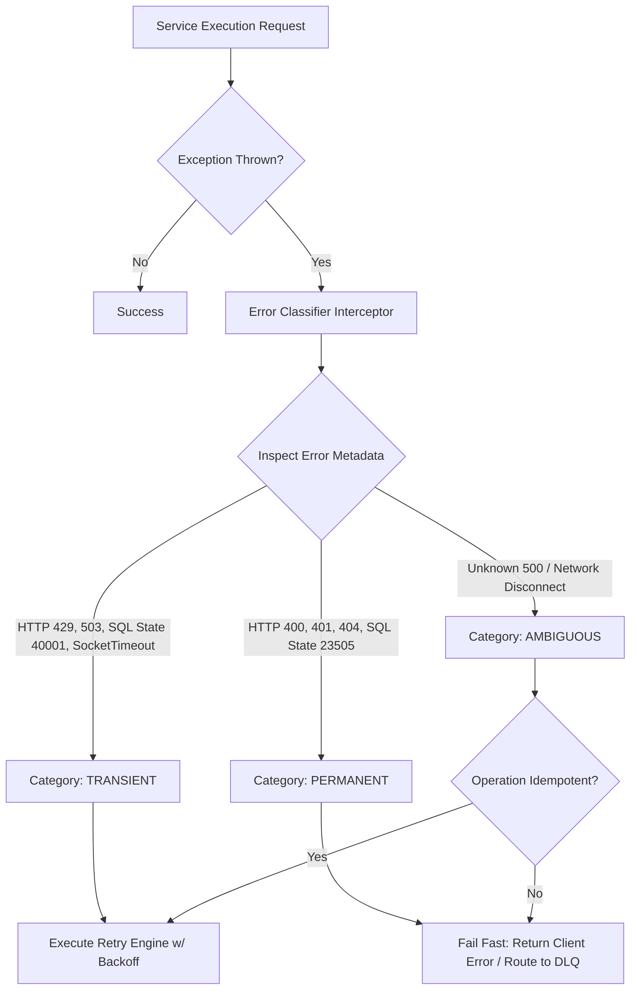

# Transient vs. Permanent Distributed Error Classification

---

### 1. 💡 The "Big Picture" (Plain English)

#### What is this in simple terms?
In a distributed system, when something goes wrong, not all errors are the same. **Transient vs. Permanent Error Classification** is the practice of inspecting a failure the exact moment it happens and deciding instantly: *"Is this a quick hiccup that will fix itself if I try again, or is this fundamentally broken and will fail every single time?"*

*   **Transient Errors** are temporary glitches: network blips, database connection pool exhaustion, or brief CPU spikes on a downstream server.
*   **Permanent Errors** are deterministic failures: invalid payload JSON, authorization failures, non-existent database IDs, or primary key collisions.

#### Real-World Analogy
Imagine calling a restaurant on the phone:
*   **Transient Failure:** The line is busy, or you get a static blip. You wait 10 seconds, call back, and get through. Retrying works!
*   **Permanent Failure:** You hear a recording saying, *"The number you have dialed has been disconnected."* Calling back 500 times in 10 seconds won't fix the line; it's a permanent error. You must stop immediately and update your address book.

#### Why should I care?
If your system treats every error as **transient** (retrying blindly), a single bad user request will trigger aggressive retry loops, flooding your databases, filling queues with poison pills, and causing cascading outages across your whole microservice architecture.

If your system treats every error as **permanent** (failing fast without retrying), a 5-millisecond network drop will crash an end-user's checkout flow, crippling your availability SLA. Proper classification gives you maximum resilience with minimum waste.

---

### 2. 🛠️ How it Works (Step-by-Step)

#### Step-by-Step Flow:
1. **Catch the Raw Exception:** Intercept low-level failures at the transport or driver layer (e.g., HTTP status, gRPC code, SQLState, IO socket errors).
2. **Execute Taxonomy Mapping:** Pass the raw exception through an `ErrorClassifier` component that evaluates the exception family and status codes.
3. **Assign Strategy Metadata:** Wrap the exception in a domain-aware decision object containing:
   * **Category:** `TRANSIENT` or `PERMANENT`.
   * **Action:** `RETRY`, `FAIL_FAST`, or `QUARANTINE_DLQ`.
4. **Route Accordingly:**
   * **If Transient:** Route to an automated retry policy (Exponential Backoff with Jitter).
   * **If Permanent:** Immediately bubble the error up to the client (e.g., return HTTP 4xx) or dump it directly into a Dead Letter Queue (DLQ), short-circuiting expensive retry loops.

#### System Architecture & Flow



#### Code Implementation (Java / Resilience Pattern)

Here is a clean, production-grade implementation of a custom classification strategy using an explicit error taxonomy:

```java
import java.io.IOException;
import java.sql.SQLException;
import java.net.SocketTimeoutException;

// 1. Domain Error Categories
public enum ErrorCategory {
    TRANSIENT,   // Safe and meaningful to retry
    PERMANENT,   // Never retry; will always fail
    AMBIGUOUS    // Outcome unknown; retry only if idempotent
}

// 2. Custom Classification Engine
public class DistributedErrorClassifier {

    public static ErrorCategory classify(Throwable throwable) {
        if (throwable == null) {
            return ErrorCategory.PERMANENT;
        }

        // Network / I/O Timeouts are usually transient
        if (throwable instanceof SocketTimeoutException || throwable instanceof IOException) {
            return ErrorCategory.TRANSIENT;
        }

        // Database Error Inspection (PostgreSQL / MySQL SQLState inspection)
        if (throwable instanceof SQLException sqlEx) {
            String sqlState = sqlEx.getSQLState();
            if (sqlState != null) {
                // SQLState 40001: Serialization Failure / Deadlock detected (Transient)
                // SQLState 08006: Connection Failure (Transient)
                if (sqlState.startsWith("08") || "40001".equals(sqlState)) {
                    return ErrorCategory.TRANSIENT;
                }
                // SQLState 23505: Unique Key Violation (Permanent)
                // SQLState 42601: Syntax Error (Permanent)
                if (sqlState.startsWith("23") || sqlState.startsWith("42")) {
                    return ErrorCategory.PERMANENT;
                }
            }
        }

        // HTTP Client / gRPC Wrapper Exception Inspection
        if (throwable instanceof DownstreamServiceException apiEx) {
            int statusCode = apiEx.getHttpStatusCode();
            return switch (statusCode) {
                case 408, 429, 502, 503, 504 -> ErrorCategory.TRANSIENT; // Timeouts, Rate Limits, Bad Gateways
                case 400, 401, 403, 404, 409, 422 -> ErrorCategory.PERMANENT; // Validation, Auth, Not Found
                default -> ErrorCategory.AMBIGUOUS; // 500 Internal Server Error (Needs caution)
            };
        }

        return ErrorCategory.AMBIGUOUS;
    }
}

// 3. Execution Wrapper Demonstrating Routing Strategy
public class ResilientExecutor {

    public <T> T execute(Supplier<T> operation, boolean isIdempotent) throws Exception {
        try {
            return operation.get();
        } catch (Throwable t) {
            ErrorCategory category = DistributedErrorClassifier.classify(t);

            switch (category) {
                case TRANSIENT -> {
                    // Safe to retry
                    return executeRetryLoop(operation);
                }
                case AMBIGUOUS -> {
                    // Only retry ambiguous errors if the action is idempotent!
                    if (isIdempotent) {
                        return executeRetryLoop(operation);
                    }
                    throw new NonRetryableDomainException("Ambiguous non-idempotent failure.", t);
                }
                case PERMANENT -> {
                    // Fail fast immediately to conserve downstream CPU/network threads
                    throw new NonRetryableDomainException("Permanent failure detected. Aborting.", t);
                }
                default -> throw t;
            }
        }
    }

    private <T> T executeRetryLoop(Supplier<T> operation) {
        // Retry logic with Exponential Backoff + Jitter goes here
        // ...
        return null;
    }
}
```

---

### 3. 🧠 The "Deep Dive" (For the Interview)

#### The Technical Magic Under the Hood
In monolithic applications, an exception hierarchy (`IOException` vs `IllegalArgumentException`) lives inside a single JVM or process memory. In distributed systems, exceptions are **marshaled across network boundaries** (JSON, Protocol Buffers, gRPC, HTTP). 

To classify distributed errors accurately, systems rely on low-level specs:
1. **Database Wire Protocols:** Systems inspect `SQLState` codes rather than generic driver messages. For example, PostgreSQL state `40001` (`serialization_failure`) means a optimistic concurrency transaction collided and *must* be retried by the app layer. Conversely, `23505` (`unique_violation`) means the row exists—retrying is completely futile.
2. **gRPC Status Codes:** gRPC explicitly separates transient errors like `UNAVAILABLE` (Code 14) and `DEADLINE_EXCEEDED` (Code 4) from permanent errors like `INVALID_ARGUMENT` (Code 3), `ALREADY_EXISTS` (Code 6), and `UNAUTHENTICATED` (Code 16).
3. **TCP Layer vs. Application Layer:** A TCP `RST` (reset packet) indicates an immediate network dropped-connection (Transient), whereas an HTTP 400 payload returned over a crisp TCP 200 connection is an Application-level permanent failure.

#### The Core Technical Trade-off

| Classification Focus | Pros | Cons |
| :--- | :--- | :--- |
| **Aggressive Transient Bias** (When in doubt, RETRY) | High success rate for eventual consistency. Prevents sporadic user-facing crashes. | High risk of **Retry Storms**. Severe thread pool exhaustion and DB connection lockups during prolonged outages. |
| **Aggressive Permanent Bias** (When in doubt, FAIL FAST) | Protects downstream resources. Minimal CPU overhead. Extremely fast system shedding. | High user disruption. Minor, temporary network blips break non-critical client operations. |

#### Interviewer Probes & Deep Answers

##### Probe 1: *"How do you handle ambiguous exceptions, such as an HTTP 500 or a connection reset during a non-idempotent WRITE operation?"*
*   **Senior Answer:** "An HTTP 500 or a TCP reset while waiting for a write response creates an state uncertainty problem: did the downstream system fail *before* executing the write, or *after* executing the write but *before* sending the ACK? 
    If the operation is **non-idempotent** (e.g., `POST /pay`), I must treat the error as **Permanent/Non-Retryable** at the transport level to prevent double-charging. I immediately fail fast or delegate to an asynchronous reconciliation loop (like an Outbox or Saga Coordinator) to inspect state. If the operation is **idempotent** (e.g., carrying an `Idempotency-Key` header or using a deterministic `PUT`), I safely reclassify the ambiguous error as **Transient** and execute a retry."

##### Probe 2: *"What happens when downstream microservices experience 'Contract Drift' and start returning HTTP 500 for validation errors instead of HTTP 400?"*
*   **Senior Answer:** "This is a classic failure mode where contract drift invalidates your error taxonomy. If a service returns HTTP 500 on validation failures, callers misclassify it as a transient system error and initiate aggressive retry loops, compounding the downstream system's load. 
    To protect against this, we use two safety bounds:
    1. **Circuit Breakers with Error Rate Thresholds:** Even if errors are wrongly marked as transient, a Circuit Breaker tracks overall failure volume and trips open, stopping the retry storm.
    2. **Fallback Classifiers / Schema Assertions:** Before classifying a 500 as transient, the classifier attempts to parse the payload. If the body matches a known business domain validation schema, it overrides the HTTP 500 and reclassifies it as Permanent."

---

### 4. ✅ Summary Cheat Sheet

#### 3 Key Takeaways
1. **Never retry blindly:** Retrying permanent failures causes self-inflicted Distributed Denial of Service (DDoS) attacks (Retry Storms) and fills message systems with poison pills.
2. **Inspect lower-level metadata:** Look beyond generic exceptions. Use gRPC status codes, HTTP specs, and DB `SQLState` values to classify errors deterministically.
3. **Context dictates retryability:** An error isn't purely transient or permanent in isolation; retryability depends on whether the underlying operation is **Idempotent**.

#### 1 "Golden Rule"
> **Classify at the boundary, retry only what is transient, and NEVER retry an ambiguous failure on a non-idempotent path.**