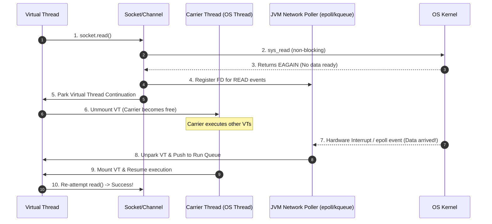

# The JVM Network Poller: Bridging Virtual Threads and OS-Level Non-Blocking I/O

---

### 1. 💡 The "Big Picture" (Plain English)

#### What is this in simple terms?
When you write code that reads data from a database or HTTP endpoint using Virtual Threads, your Java code looks completely synchronous (blocking): `socket.read()`. However, under the hood, Java **never actually blocks the underlying OS thread**. 

The **JVM Network Poller** is the silent engine that translates simple, imperative, blocking-style Java code into non-blocking OS system calls (like Linux `epoll` or macOS `kqueue`). It lets your application handle millions of concurrent network connections without burning CPU or hogging OS memory.

#### Real-World Analogy: The Restaurant Buzzer System
Imagine you go to a busy fast-food restaurant:
* **Platform Threads (Old Way):** You order food at the counter and stand right there blocking the register until your burger is ready. No one else can order at that register until you finish waiting.
* **JVM Network Poller (Virtual Threads Way):** You order your food. The clerk hands you a **wireless buzzer** and tells you to sit down. The register is immediately freed up for the next customer. You sit quietly doing crosswords (Virtual Thread yields). When your burger is ready, the buzzer vibrates (OS network event). You walk back up to the counter, pick up your food, and continue eating.

#### Why should I care? What problem does it solve today?
In the past, to handle hundreds of thousands of concurrent network requests, developers had to write complex asynchronous code using reactive frameworks (RxJava, Reactor) or `CompletableFuture` chains. 

With the JVM Network Poller, **you can write clean, sequential `try-catch` loops** while getting the exact same ultra-high performance and resource efficiency of non-blocking reactive frameworks.

---

### 2. 🛠️ How it Works (Step-by-Step)

#### Process Breakdown:

1. **Initiate I/O:** A Virtual Thread calls a network operation (e.g., `socket.getInputStream().read()`).
2. **Attempt Non-Blocking Read:** Under Java 21+, socket I/O relies on non-blocking File Descriptors (FDs). The JVM attempts an immediate non-blocking read.
3. **Handle `EAGAIN` / `EWOULDBLOCK`:** If data is ready, it reads and returns immediately. If no data is available yet, the OS returns an `EAGAIN` code.
4. **Register with JVM Poller:** Instead of blocking the underlying OS (Carrier) Thread, the JVM registers this socket's File Descriptor with the JVM's background **Network Poller**.
5. **Yield the Virtual Thread:** The Virtual Thread suspends its execution (`Continuation.yield()`) and **unmounts** from the Carrier Thread. The Carrier Thread goes back to work executing other Virtual Threads.
6. **OS Notification & Resume:** The Network Poller thread is running an OS multiplexing loop (`epoll_wait`). When the network data arrives, the OS notifies the Poller. The Poller marks the Virtual Thread as *Runnable*, placing it back into the `ForkJoinPool` queue to be mounted on an available Carrier Thread.

#### Clean Code Example:

```java
import java.io.InputStream;
import java.net.ServerSocket;
import java.net.Socket;
import java.util.concurrent.Executors;

public class NetworkPollerDemo {

    public static void main(String[] args) throws Exception {
        // Create an executor that spawns a new Virtual Thread per task
        try (var executor = Executors.newVirtualThreadPerTaskExecutor()) {
            
            executor.submit(() -> {
                try (ServerSocket server = new ServerSocket(8080)) {
                    System.out.println("Server listening on port 8080...");
                    
                    while (!Thread.currentThread().isInterrupted()) {
                        Socket socket = server.accept(); // Synchronous API!
                        
                        // Handle each client on a fresh Virtual Thread
                        executor.submit(() -> handleClient(socket));
                    }
                }
            });
        }
    }

    private static void handleClient(Socket socket) {
        try (InputStream in = socket.getInputStream()) {
            byte[] buffer = new byte[1024];
            
            // UNDER THE HOOD: 
            // 1. JVM sets socket to non-blocking.
            // 2. If no bytes are ready, VT yields & registers with JVM Poller.
            // 3. Carrier thread is released to serve other tasks.
            int bytesRead = in.read(buffer); 
            
            System.out.println("Received " + bytesRead + " bytes from client.");
        } catch (Exception e) {
            e.printStackTrace();
        }
    }
}
```

#### Flow Diagram (Sequence):



---

### 3. 🧠 The "Deep Dive" (For the Interview)

#### The Internal Architecture of the Network Poller

##### System Level Integration (`epoll`, `kqueue`, `IOCP`)
The JVM Network Poller maintains native interface abstractions depending on the operating system:
* **Linux:** `epoll` (`epoll_create`, `epoll_ctl`, `epoll_wait`)
* **macOS/BSD:** `kqueue`
* **Windows:** `WEPOLL` / I/O Completion Ports (IOCP)

When a Virtual Thread encounters an incomplete I/O operation, `Poller.java` adds the socket's File Descriptor (`fd`) to the active `epoll` interest list using `epoll_ctl(..., EPOLL_CTL_ADD, fd, ...)`.

##### Continuation Snapshots
When `VirtualThread.park()` is invoked:
1. The execution state (call stack frame instructions, local variables) is written to heap storage managed by the underlying `jdk.internal.vm.Continuation` object.
2. The Carrier Thread resets its native stack pointer and picks up the next task from the scheduler’s `ForkJoinPool` work-stealing queue.
3. When `epoll_wait()` notifies the Poller thread that the `fd` is ready to read, `Poller` unparks the Continuation, which puts the Virtual Thread back in the `ForkJoinPool` queue.

##### Crucial Difference: Network I/O vs. File System (Disk) I/O
> **Senior Specialty Detail:** Linux `epoll` **does not support regular file descriptors (Disk Files)**. It only supports socket descriptors, pipes, and event fds.

Because standard Linux kernels cannot handle asynchronous disk I/O via `epoll`, Java's Virtual Threads deal with File I/O differently:
* File I/O operations will **block the underlying Carrier Thread** directly, or rely on internal blocking worker pool offloading (e.g., via `AsynchronousFileChannel` mechanisms or standard blocking syscalls).
* Do not expect 1,000,000 Virtual Threads performing concurrent *Disk File reads* to scale the same way 1,000,000 Virtual Threads performing *Network Socket reads* do!

---

#### Technical Trade-offs

| Aspect | Classic Platform Threads | Virtual Threads + Network Poller |
| :--- | :--- | :--- |
| **OS Thread Allocation** | 1 Thread per Socket | $N$ Carrier Threads for $M$ Sockets ($M \gg N$) |
| **I/O Blocking Mechanism** | Blocks native OS Kernel thread (`read(2)` blocking) | Non-blocking at OS level (`epoll`), Virtual Thread parked on heap |
| **Memory Footprint** | ~1MB native stack per thread | ~1KB continuation frame on heap per paused VT |
| **Disk I/O Scaling** | Native scaling, predictable blocking | **Does not use Network Poller**; risks carrier starvation if unchecked |

---

#### Interviewer Probe Questions

##### Q1: "If Virtual Threads use non-blocking I/O under the hood, how is this structurally different from reactive frameworks like Netty or Spring WebFlux?"
* **Answer:** Functionally, both use non-blocking OS primitives (`epoll`/`kqueue`) to eliminate thread-per-connection bottlenecks. The difference is **where state and control flow are managed**:
  * **Reactive (Netty/WebFlux):** Control flow is split into callbacks, stage pipelines, and explicit state machines across different threads. Stack traces are shattered, and local context (`ThreadLocal`) is lost.
  * **Virtual Threads + Poller:** Control flow is linear and preserved in a standard Call Stack snapshot saved on the JVM heap via `Continuation`. You retain standard debugging, step-through line traces, and native exception handling (`try-catch`) while achieving identical Netty-level network throughput.

##### Q2: "What happens if a Virtual Thread makes a network call via a legacy JNI library that invokes C/C++ `read()` directly?"
* **Answer:** Native calls through JNI bypass Java's socket abstractions and the JVM Network Poller entirely. The C library makes a real, native OS blocking call. This **pins** the Virtual Thread to the Carrier Thread and blocks the OS Thread completely. If thousands of Virtual Threads do this, you will quickly exhaust the `ForkJoinPool` carrier threads, stalling the entire application.

##### Q3: "Can the JVM Network Poller thread itself become a bottleneck if millions of events fire simultaneously?"
* **Answer:** The JVM spawns a small, fixed number of Poller threads (usually 1 per available CPU socket/core platform group). Because the Poller thread only processes lightweight kernel event notifications (`epoll_wait`) and moves Virtual Threads into the `ForkJoinPool` execution queue without running task business logic, it takes mere nanoseconds per event. The primary bottleneck shifts from thread scheduling to memory bandwidth and network interface card (NIC) hardware limits.

---

### 4. ✅ Summary Cheat Sheet

#### 3 Key Takeaways
1. **Abstraction Magic:** Java 21 gives you simple blocking syntax (`socket.read()`), but the **JVM Network Poller** runs it non-blocking over OS primitives (`epoll`/`kqueue`).
2. **Carrier Thread Liberation:** When waiting for data over the network, Virtual Threads **unmount** from their Carrier Threads. Carrier threads are free to run other code while the Network Poller waits for network packets.
3. **Network vs Disk Distinction:** The Network Poller **only handles socket/network descriptors**. File system I/O cannot use `epoll` on Linux and behaves differently under Virtual Thread execution.

#### 1 "Golden Rule"
> **Write simple synchronous code, let the JVM Network Poller handle non-blocking scale—but watch out for native C/JNI libraries that bypass Java's socket layer!**