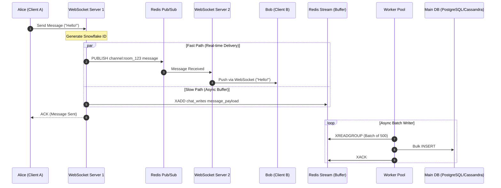

# Decoupling Real-Time WebSocket Delivery from Database Persistence

---

### 1. 💡 The "Big Picture" (Plain English)

#### What is this in simple terms?
When you send a message in a real-time chat app (like WhatsApp or Slack), two distinct jobs need to happen:
1. **The Fast Path (Live Delivery):** Get the message to the recipient’s screen *immediately* via an active WebSocket connection.
2. **The Slow Path (Persistence):** Save the message to a database so it appears in chat history tomorrow or when the app reopens.

Decoupling real-time delivery from database persistence means doing job #1 instantly without waiting for job #2 to finish.

```
       [ Client A ] ──(WebSocket)──> [ Chat Server ]
                                          │
                  ┌───────────────────────┴───────────────────────┐
                  ▼ (Fast Path: ~5ms)                             ▼ (Slow Path: ~50ms)
       [ Redis Pub/Sub ] ──> [ Client B ]               [ Async Persistence Queue ]
                                                                  │
                                                                  ▼
                                                          [ Primary Database ]
```

#### Real-World Analogy
Imagine ordering a hot pizza at a restaurant:
* **Synchronous (Bad):** The chef bakes the pizza, walks into the administrative office, files a paper tax invoice, waits for the accountant to sign it, and *then* hands you the hot pizza. Your pizza gets cold while waiting on paperwork.
* **Decoupled (Good):** The chef hands you the hot pizza instantly (**Fast Path**), and drops a copy of the receipt into a tray for the back-office team to process at the end of the hour (**Slow Path**).

#### Why should I care?
If you write every incoming chat message directly to PostgreSQL or MongoDB *before* sending it over the WebSocket:
* A database spike or transaction lock will freeze your entire live chat system.
* Your message latency will jump from **10ms to 200ms+**.
* Your WebSocket servers will hold onto thousands of open connections waiting for database disk I/O, leading to connection timeouts and crashed servers.

---

### 2. 🛠️ How it Works (Step-by-Step)

#### The Architecture Pipeline
1. **Ingestion:** User A sends a message over an open WebSocket connection to `WebSocket Server 1`.
2. **Fast Path (Live Delivery):** `WebSocket Server 1` assigns a unique temporal ID (e.g., Snowflake ID) to the message and immediately publishes it to **Redis Pub/Sub**.
3. **Fan-out:** Redis Pub/Sub delivers the message to `WebSocket Server 2` (where User B is connected), which immediately pushes it down User B's WebSocket.
4. **Buffer Step (Decoupled Write):** Simultaneously, `WebSocket Server 1` writes the message to an async ingestion queue (**Redis Streams** or **Kafka**).
5. **Slow Path (Batch Persistence):** Background **DB Writer Workers** pull messages off the stream in micro-batches (e.g., 500 messages or every 50ms) and perform a bulk `INSERT` into the database (e.g., Cassandra, ScyllaDB, or PostgreSQL).

#### Mermaid Flow Diagram



#### Code Implementation (Node.js/TypeScript)

Below is a production-ready pattern showing how a WebSocket node handles the fast path via Redis Pub/Sub while pushing to a decoupled persistence stream.

```typescript
import { createClient } from 'redis';
import { WebSocket } from 'ws';
import { generateSnowflakeId } from './snowflake';

const redisPub = createClient();
const redisStream = createClient();
await Promise.all([redisPub.connect(), redisStream.connect()]);

interface ChatMessage {
  roomId: string;
  senderId: string;
  content: string;
}

export async function handleIncomingMessage(ws: WebSocket, rawData: string) {
  const payload: ChatMessage = JSON.parse(rawData);

  // 1. Assign deterministic sequence ID (Snowflake: Timestamp + Node ID + Sequence)
  const messageId = generateSnowflakeId();

  const enrichedMessage = {
    id: messageId,
    roomId: payload.roomId,
    senderId: payload.senderId,
    content: payload.content,
    timestamp: Date.now(),
  };

  const serializedMsg = JSON.stringify(enrichedMessage);

  try {
    // ---------------------------------------------------------
    // FAST PATH: Fire-and-forget real-time routing via Pub/Sub
    // Latency target: < 5ms
    // ---------------------------------------------------------
    redisPub.publish(`room:${payload.roomId}`, serializedMsg);

    // Immediate acknowledgment to sender so UI updates state
    ws.send(JSON.stringify({ type: 'ACK', clientMsgId: messageId }));

    // ---------------------------------------------------------
    // SLOW PATH: Append to durable stream for batch persistence
    // Latency target: Non-blocking async queue
    // ---------------------------------------------------------
    redisStream.xAdd('stream:chat_persistence', '*', {
      data: serializedMsg,
    });

  } catch (error) {
    console.error('Failed to process message routing:', error);
    ws.send(JSON.stringify({ type: 'ERROR', message: 'Delivery failed' }));
  }
}
```

---

### 3. 🧠 The "Deep Dive" (For the Interview)

#### 1. The Dual-Write Problem & Split-Brain Scenarios
When decoupling real-time delivery from storage, you introduce the classic **Dual-Write Problem**:
* **Scenario A:** Message is published to Redis Pub/Sub, delivered to live users, but the application node crashes *before* pushing to the persistence stream. Result: **Ghost Message** (Users saw it live, but it disappears on refresh).
* **Scenario B:** Message is pushed to the persistence stream, but Redis Pub/Sub drops it due to network partition. Result: **Delayed Message** (Users don't see it live, but it appears after refreshing).

**Architectural Fix:** Use the **Transactional Outbox Pattern** or leverage **Redis Streams as the Single Source of Ingestion**. Instead of publishing to Pub/Sub *and* Stream independently:
1. Push strictly to a **Redis Stream** first (`XADD`).
2. A lightweight local consumer reads the Stream and broadcasts to **Redis Pub/Sub**.
3. Background workers read the same Stream via Consumer Groups to write to the DB.

```
Incoming Msg ──> [ Redis Stream ] ──┬──> (Reader 1) ──> Redis Pub/Sub ──> WebSockets
                                  └──> (Reader 2) ──> DB Workers    ──> Primary Database
```

#### 2. Message Ordering Guarantees in an Eventual System
Because messages are delivered instantly via Pub/Sub and written asynchronously in batches, **write order in the database is not guaranteed to match arrival order**.

To solve this without locking the database:
* **Monotonic ID Generation:** Use 64-bit **Snowflake IDs** (41 bits timestamp, 10 bits machine ID, 12 bits sequence) generated at the WebSocket edge node.
* **Client-Side Sorting:** Clients render messages ordered strictly by `Snowflake ID`, not by database insertion order or DB auto-increment IDs.
* **Database Schema:** Design tables to be **append-only** keyed by `(room_id, message_id)`.

```sql
-- Cassandra / ScyllaDB Schema Pattern for High-Throughput Chat
CREATE TABLE channel_messages (
    room_id uuid,
    message_id timeuuid, -- Guarantees time-ordering + uniqueness
    sender_id uuid,
    content text,
    PRIMARY KEY (room_id, message_id)
) WITH CLUSTERING ORDER BY (message_id ASC);
```

#### 3. Backpressure & Spike Protection
What happens during a high-concurrency event (e.g., millions of users commenting on a live stream)?
* **Redis Pub/Sub** drops messages if subscriber buffers overflow (`client-output-buffer-limit pubsub`).
* **Database** gets overwhelmed if workers attempt 1:1 inserts.

**Solution: Worker Batching & Ring Buffers**
* Workers use `XREADGROUP` to read up to 1,000 items from the Redis Stream at once.
* Converts 1,000 individual `INSERT INTO messages...` calls into **one single multi-row insert** (`INSERT INTO messages VALUES (...), (...), (...)`).
* Reduces DB IOPS (Input/Output Operations Per Second) by **99%**.

---

#### 🤺 Interviewer Probes & Counter-Strategies

##### Probe 1: "Redis Pub/Sub is fire-and-forget and offers no delivery guarantees. What happens if a WebSocket server loses network connectivity for 2 seconds?"
* **Answer:** "Redis Pub/Sub does not buffer messages for disconnected subscribers. If a WebSocket server flickers, messages sent during those 2 seconds are lost on the fast path. To resolve this, when a client reconnects, it sends its `last_seen_message_id`. The client then fetches missing messages directly from the cache/DB (or Redis Stream) via a standard REST/gRPC fallback request before resuming live Pub/Sub streaming."

##### Probe 2: "If your DB background workers fall behind by 10 minutes during a traffic spike, how does a user see chat history when opening the app?"
* **Answer:** "We implement a **Two-Tier Read Strategy**:
  1. The DB holds permanent history (slow path).
  2. A Redis `ZSET` (Sorted Set) holds the last 100 messages per room in memory (fast cache path), written during the ingestion phase.
  When a user opens a chat, the app first reads from the Redis `ZSET`. If missing, it falls back to the database. This shields the database completely from read amplification during write spikes."

##### Probe 3: "Why use Redis Streams for the write queue instead of Apache Kafka?"
* **Answer:** "It comes down to operational complexity and latency constraints:
  * **Redis Streams** run in-memory, providing sub-millisecond produce latencies on the exact same infrastructure already serving our Pub/Sub and session cache.
  * **Kafka** is superior for long-term retention, replayability, and massive multi-terabyte scale, but adds disk I/O latency and infrastructure overhead.
  * *Verdict:* For standard real-time chat, Redis Streams handles the temporary buffer (holding data for minutes/hours) perfectly before flushing to the primary DB."

---

### 4. ✅ Summary Cheat Sheet

```
┌─────────────────────────────────────────────────────────────────────────┐
│                      REAL-TIME CHAT WRITE PIPELINE                      │
├──────────────────┬──────────────────────────────────────────────────────┤
│ Fast Path        │ Redis Pub/Sub -> WebSocket -> Client (<10ms)        │
│ Slow Path        │ Stream Buffer -> Async Worker -> DB Batch Insert    │
│ Ordering         │ Monotonic Snowflake IDs generated at Edge Nodes      │
│ Backpressure     │ Micro-batching DB writes (e.g., 500 msgs/query)     │
└──────────────────┴──────────────────────────────────────────────────────┘
```

#### 3 Key Takeaways
1. **Never await database writes in the WebSocket thread:** Always isolate real-time broadcasting (fast path) from persistence (slow path) using an in-memory queue.
2. **Batch your writes:** Never issue single-row `INSERT` statements for high-throughput chat. Buffer messages in memory/stream and perform bulk multi-row operations.
3. **Clients manage ordering:** Use time-sortable unique IDs (like Snowflake IDs) assigned at ingestion so messages display correctly regardless of async DB insertion sequences.

#### 1 "Golden Rule" to Remember
> **"Deliver over memory, persist over queue: push live messages instantly via Pub/Sub, and flush to disk asynchronously in batches."**