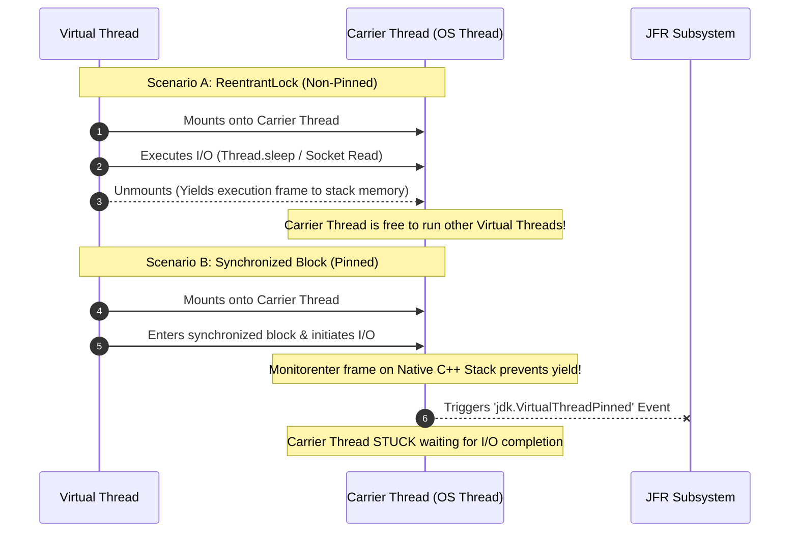

# Observability and Diagnostics for Virtual Threads: JFR Events, Thread Dumps, and Pinning Detection

---

### 1. 💡 The "Big Picture" (Plain English)

#### What is this in simple terms?
When you scale an application using Java Virtual Threads, you can easily go from having 200 platform threads to **1,000,000 virtual threads**. However, traditional debugging tools (like standard thread dumps or IDE debuggers) were built for hundreds of threads, not millions. 

If a Virtual Thread gets stuck inside a native C++ call or a legacy `synchronized` block during I/O, it **"pins"** its underlying OS worker thread (Carrier Thread). This paralyzes the worker thread, preventing other virtual threads from running. Observability and Diagnostics for Virtual Threads is the set of JVM tooling, JFR (Java Flight Recorder) events, and diagnostic flags designed to detect, trace, and inspect these millions of virtual threads without crashing your diagnostics tools.

```
       Traditional Stack (Easily Visually Audited)
       ┌─────────────────────────────────────────┐
       │ 200 Platform Threads -> Standard Thread Dump │
       └─────────────────────────────────────────┘

       Virtual Thread Stack (Requires specialized JSON dumps & JFR)
       ┌─────────────────────────────────────────────────────────┐
       │ 1,000,000 Virtual Threads -> 16 Carrier OS Threads       │
       │ (1 Pinned Carrier Thread = Loss of 6.25% Compute Capacity!) │
       └─────────────────────────────────────────────────────────┘
```

#### Real-World Analogy
Imagine a massive airport taxi fleet. 
* **Platform Threads** are individual taxicabs driving passengers directly. If a cab driver gets stuck in traffic, you inspect that one car.
* **Virtual Threads** are passengers, and **Carrier Threads** are large shuttle buses. Thousands of passengers share a few shuttle buses. 
* **Carrier Pinning** happens when a passenger superglues themselves to a seat on the bus (`synchronized` block during I/O). The bus cannot drop them off or pick up any other passengers. Standard traffic cameras only monitor the bus from the outside; you need **specialized internal cameras (JFR & `jcmd` JSON Dumps)** to see *which passenger* superglued themselves to the seat and why.

#### Why should I care?
If a developer on your team leaves a `synchronized` block wrapped around an HTTP request or database call, your application won't throw an `Exception`—it will simply suffer a dramatic drop in overall throughput under load. Standard thread profiling won't immediately flag this. Knowing how to diagnostic-check carrier pinning and generate lightweight thread dumps will save you from catastrophic performance degradation in production.

---

### 2. 🛠️ How it Works (Step-by-Step)

#### Step-by-Step Diagnostic Process
1. **Detect Pinning at Runtime:** Enable the JVM flag `-Djdk.tracePinnedThreads=full` (or `short`) during development to print stack traces whenever a virtual thread pins its carrier thread.
2. **Profile with Java Flight Recorder (JFR):** Capture `jdk.VirtualThreadPinned` events in production to evaluate the *duration* of pinning events.
3. **Inspect Active Virtual Threads:** Instead of `jstack` (which skips unmounted virtual threads), execute `jcmd <PID> Thread.dump_to_file -format=json <file.json>` to capture the state of all virtual and platform threads.
4. **Remediate Code:** Replace `synchronized` blocks performing I/O with `java.util.concurrent.locks.ReentrantLock`.

#### Code Example: Reproducing and Detecting Carrier Pinning

```java
import java.time.Duration;
import java.util.concurrent.Executors;
import java.util.concurrent.locks.ReentrantLock;

public class VirtualThreadDiagnostics {

    private static final ReentrantLock lock = new ReentrantLock();
    private static final Object monitor = new Object();

    public static void main(String[] args) throws InterruptedException {
        // Run with: -Djdk.tracePinnedThreads=short
        
        try (var executor = Executors.newVirtualThreadPerTaskExecutor()) {
            
            // TASK 1: BAD - Triggers Carrier Pinning
            executor.submit(() -> {
                synchronized (monitor) { // Monitor lock forces pinning during blocking I/O
                    System.out.println("Inside synchronized block. Sleeping...");
                    simulateBlockingIO(); // JVM cannot unmount thread here!
                }
            });

            // TASK 2: GOOD - Unmounts Carrier Thread smoothly
            executor.submit(() -> {
                lock.lock(); // ReentrantLock allows unmounting while waiting/blocking
                try {
                    System.out.println("Inside ReentrantLock block. Sleeping...");
                    simulateBlockingIO(); // JVM unmounts thread seamlessly
                } finally {
                    lock.unlock();
                }
            });
        }
    }

    private static void simulateBlockingIO() {
        try {
            Thread.sleep(Duration.ofSeconds(1));
        } catch (InterruptedException e) {
            Thread.currentThread().interrupt();
        }
    }
}
```

#### Diagram: Unmounted vs. Pinned Thread Execution Flow



---

### 3. 🧠 The "Deep Dive" (For the Interview)

#### JVM Internals & Diagnostic Mechanics

##### 1. Why `synchronized` Pins Carrier Threads
Virtual threads are implemented as Java-level continuations (`jdk.internal.vm.Continuation`). When a Virtual Thread hits a blocking operation (e.g., socket read), the continuation yields, unmounting its execution stack from the underlying Carrier Thread (`ForkJoinPool` worker).

However, if a Virtual Thread enters a `synchronized` block, a native JVM monitor reference (`ObjectMonitor`) is pushed onto the **native C++ call stack**. The JVM's current implementation cannot parse or unmount continuation frames that are linked to native stack frames or monitor entry points. As a result:
* The Virtual Thread cannot yield.
* The Carrier Thread becomes blocked alongside the Virtual Thread.
* If all Carrier Threads in the default pool (`Runtime.getRuntime().availableProcessors()`) become pinned, the system completely freezes (starvation).

##### 2. Diagnostic Mechanics: Modern Thread Dumps
Traditional `ThreadMXBean.dumpAllThreads()` or standard `jstack` only dump **Platform Threads** to keep diagnostic overhead low. Dumping 1,000,000 Virtual Threads using traditional string-formatting approaches would consume gigabytes of heap memory and crash the diagnostic agent.

JDK 21 introduced the `Thread.dump_to_file` command accessible via `jcmd`:
```bash
jcmd <PID> Thread.dump_to_file -format=json /path/to/dump.json
```
* **Internal Behavior:** The JVM walks the internal `VirtualThread` object graph streaming JSON chunks directly to file descriptors, bypassing massive Java String allocations on the heap.
* **Format:** Grouped by thread containers, explicitly separating active platform threads from unmounted virtual thread continuations.

##### 3. Java Flight Recorder (JFR) Pinning Traces
JFR exposes the low-overhead event `jdk.VirtualThreadPinned`:
* **Attributes captured:** `pinnedThread` (Carrier thread ID), `duration` (time blocked), and `stackTrace`.
* **Threshold configuration:** By default, JFR records pinning events taking longer than 20ms (`-XX:StartFlightRecording:filename=recording.jfr,settings=profile`).

#### Trade-Offs & Operational Risks

| Feature / Diagnostic Tool | Performance Impact | Primary Benefit | Production Readiness |
| :--- | :--- | :--- | :--- |
| **`-Djdk.tracePinnedThreads=full`** | 🔴 **High:** Heavy stack-walking overhead on every pinned lock. | Instantly prints pinning stack trace to `System.err`. | **Dev / Staging Only.** Avoid in high-throughput prod. |
| **JFR (`jdk.VirtualThreadPinned`)** | 🟢 **Negligible (<1%):** Low-overhead ring-buffer recording. | Captures exact pinning durations and stack traces. | **Production Safe.** Always on in enterprise profiles. |
| **`jcmd Thread.dump_to_file -format=json`** | 🟡 **Medium:** I/O heavy write operation proportional to active VT count. | Full visibility into unmounted virtual thread states. | **On-Demand Diagnostic.** Safe when disk space is clear. |

---

#### Interviewer Probe Questions

##### Q1: "We migrated our Spring Boot application to Virtual Threads, but under load, thread starvation occurs and throughput plummets. Standard thread dumps show only 16 active threads. How do you diagnose this?"
* **Expected Answer:** Standard `jstack` or traditional metrics tools only report the 16 platform Carrier Threads executing in the `ForkJoinPool`. The throughput drop is caused by **Carrier Pinning**—virtual threads executing blocking I/O within native frames or `synchronized` blocks, blocking the 16 worker threads. 
* **Diagnostic Strategy:** 
  1. Trigger a JFR recording and search for `jdk.VirtualThreadPinned` events where `duration > 20ms`.
  2. Alternatively, attach `jcmd <PID> Thread.dump_to_file -format=json` to analyze unmounted virtual threads.
  3. Locate `synchronized` blocks performing network/disk operations and refactor them to use `ReentrantLock`.

##### Q2: "Does calling a `synchronized` block inside a Virtual Thread ALWAYS pin the Carrier Thread?"
* **Expected Answer:** No, entering a `synchronized` block alone does **not** pin the thread. Pinning *only* occurs if a **blocking operation** (e.g., IO, `Thread.sleep()`, `Object.wait()`, lock contention) happens **while holding** the monitor lock. If a virtual thread enters a `synchronized` block, mutates an in-memory variable, and exits immediately without blocking, no pinning event hurts system throughput.

##### Q3: "Why shouldn't I use `-Djdk.tracePinnedThreads=full` in a production environment?"
* **Expected Answer:** Printing stack traces to standard error requires synchronous stack walking across C++ and Java frames inside hot code paths. Under high concurrency with legacy third-party libraries that use `synchronized` frequently, this JVM flag introduces severe CPU overhead, console log IO bottlenecks, and can degrade application latency far worse than the pinning itself. JFR profiling should be used in production instead.

---

### 4. ✅ Summary Cheat Sheet

```
   +-------------------------------------------------------------------------+
   | Diagnostic Tool   | Mechanism              | Target Use Case            |
   +-------------------------------------------------------------------------+
   | tracePinnedThreads| Console output         | Local Dev / Unit Testing   |
   | JFR Events        | Event Ring Buffer      | Production Profiling       |
   | JSON Thread Dump  | Heap-bypassing Stream  | Live Incident Analysis     |
   +-------------------------------------------------------------------------+
```

#### 3 Key Takeaways
1. **Pinning = Carrier Starvation:** Carrier pinning happens when a Virtual Thread cannot unmount during blocking operations (primarily inside `synchronized` blocks or native calls).
2. **Standard Tools Miss Virtual Threads:** Traditional `jstack` ignores unmounted virtual threads; always use `jcmd <PID> Thread.dump_to_file -format=json` for total system visibility.
3. **JFR is Production Safe:** Use the `jdk.VirtualThreadPinned` event via Java Flight Recorder to trace production pinning latency with minimal overhead.

#### 1 "Golden Rule"
> **Replace `synchronized` with `ReentrantLock` around I/O, and use JFR rather than console flags to catch pinning in production.**