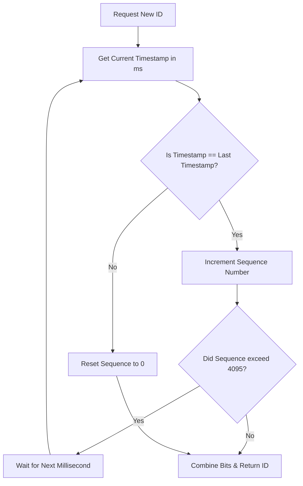

# High-Performance Unique Key Generation: Implementing the Snowflake Algorithm

---

### 1. 💡 The "Big Picture" (Plain English)

#### What is this in simple terms?
Imagine you run a global app like Twitter or Uber. Millions of actions (tweets, rides, payments) happen every second across thousands of servers worldwide. Every single action needs a **unique ID**. 

A **Snowflake ID** is a 64-bit smart number designed to solve this. Instead of asking a single database "Hey, what number are we on?", every server generates its own guaranteed unique ID instantly, without talking to any central coordinator.

#### Real-World Analogy
Imagine a national banking chain issuing check numbers. If every bank teller in the country had to call headquarters in New York to ask for the next check number, the phone lines would jam, and customers would wait forever.

Instead, headquarters gives every teller a rulebook:
1. Print **today's exact date and millisecond**.
2. Print your **assigned Branch ID** (e.g., Branch #104).
3. Print a **counter** for how many checks *you* wrote in that exact millisecond.

Because no two tellers have the same Branch ID, and no single teller can write two checks with the same sequence number at the exact same millisecond, **every check number in the world is guaranteed unique**—and generated zero seconds after asking.

```
[ Current Time ] + [ Branch ID ] + [ Local Counter ] = Guaranteed Unique ID
```

#### Why should I care? What problem does it solve today?
1. **Database auto-increment breaks down at scale:** A single MySQL `AUTO_INCREMENT` primary key becomes a bottleneck when you shard your database across 50 nodes.
2. **UUIDs (v4) hurt database performance:** standard 128-bit UUIDs are completely random. When inserted into a database index (like a B-Tree), random values force constant page splits, slowing down writes drastically.
3. **Snowflake IDs give you the best of both worlds:** They are **64-bit** (fit in a standard integer column), **decentralized** (fast), and **time-ordered** (friendly to database indexes).

---

### 2. 🛠️ How it Works (Step-by-Step)

A Snowflake ID is a 64-bit integer broken down into four distinct sections:

```
 1 Bit      41 Bits                 10 Bits         12 Bits
+-------+-----------------------+---------------+---------------+
| Unused| Timestamp (ms)        | Node/Worker ID| Sequence No.  |
|  (0)  | (milli-secs since epoch) | (0 to 1023)  | (0 to 4095)   |
+-------+-----------------------+---------------+---------------+
```

1. **Sign Bit (1 bit):** Always set to `0`. Keeps the integer positive across languages that use signed integers (like Java).
2. **Timestamp (41 bits):** Milliseconds elapsed since a custom starting point (epoch). 41 bits gives us $2^{41}$ milliseconds $\approx$ **69.7 years** of operation.
3. **Node/Worker ID (10 bits):** Identifies the specific machine/process issuing the ID. Allows up to $2^{10} = \mathbf{1,024}$ unique machines.
4. **Sequence Number (12 bits):** A local counter for IDs generated in the exact same millisecond on the exact same node. Allows $2^{12} = \mathbf{4,096}$ IDs per millisecond per node.

#### Flowchart of ID Generation Logic



#### Clean Code Implementation (Java)

```java
public class SnowflakeIdGenerator {
    // Custom Epoch: Jan 1, 2024 00:00:00 UTC (in milliseconds)
    private final long START_EPOCH = 1704067200000L;

    // Bit lengths
    private final long WORKER_ID_BITS = 10L;
    private final long SEQUENCE_BITS = 12L;

    // Max allowed values
    private final long MAX_WORKER_ID = -1L ^ (-1L << WORKER_ID_BITS); // 1023
    private final long MAX_SEQUENCE = -1L ^ (-1L << SEQUENCE_BITS);   // 4095

    // Bit shift positions
    private final long WORKER_ID_SHIFT = SEQUENCE_BITS; // Shift 12
    private final long TIMESTAMP_SHIFT = SEQUENCE_BITS + WORKER_ID_BITS; // Shift 22

    private final long workerId;
    private long sequence = 0L;
    private long lastTimestamp = -1L;

    public SnowflakeIdGenerator(long workerId) {
        if (workerId < 0 || workerId > MAX_WORKER_ID) {
            throw new IllegalArgumentException("Worker ID out of range [0, " + MAX_WORKER_ID + "]");
        }
        this.workerId = workerId;
    }

    // Thread-safe method to generate the next unique ID
    public synchronized long nextId() {
        long currentTimestamp = getCurrentTime();

        if (currentTimestamp < lastTimestamp) {
            throw new RuntimeException("Clock moved backwards! Refusing to generate ID for " 
                + (lastTimestamp - currentTimestamp) + "ms");
        }

        if (currentTimestamp == lastTimestamp) {
            // Same millisecond: increment counter
            sequence = (sequence + 1) & MAX_SEQUENCE;
            if (sequence == 0) {
                // Sequence exhausted: wait for next millisecond
                currentTimestamp = waitNextMillis(lastTimestamp);
            }
        } else {
            // New millisecond: reset sequence counter
            sequence = 0L;
        }

        lastTimestamp = currentTimestamp;

        // Combine fields using Bitwise OR (|) and Shift (<<) operators
        return ((currentTimestamp - START_EPOCH) << TIMESTAMP_SHIFT)
                | (workerId << WORKER_ID_SHIFT)
                | sequence;
    }

    private long waitNextMillis(long lastTimestamp) {
        long timestamp = getCurrentTime();
        while (timestamp <= lastTimestamp) {
            timestamp = getCurrentTime();
        }
        return timestamp;
    }

    protected long getCurrentTime() {
        return System.currentTimeMillis();
    }
}
```

---

### 3. 🧠 The "Deep Dive" (For the Interview)

#### The Internal "Magic": Bit Packing Efficiency
Why do we shift bits instead of string concatenation (e.g., `"timestamp" + "worker" + "seq"`)?
- **Memory & Wire Efficiency:** String manipulation creates object garbage and takes up ~18-20 characters (~160 bits). Bit packing packs everything into a raw 64-bit primitive `long`.
- **Speed:** CPU bitwise ops (`<<`, `|`, `&`) take a single CPU cycle (under a nanosecond).

#### Architectural Trade-offs

| Strategy | Speed | Size | Time-Ordered? | Single Point of Failure? |
| :--- | :--- | :--- | :--- | :--- |
| **MySQL Auto-Increment** | Slow (Network I/O) | 64-bit | Yes | High (unless clustered) |
| **UUID v4 (Random)** | Ultra Fast (Local) | 128-bit | No | None |
| **Snowflake ID** | Ultra Fast (Local) | 64-bit | Yes (k-sortable) | None |

* **Trade-off:** Snowflake requires managing **Worker IDs**. If two nodes accidentally start with the same Worker ID, you risk collision.
* **Database Friendliness:** Because the higher bits represent time, Snowflake IDs are **k-sortable** (roughly ordered by creation time). This reduces B-Tree index fragmentation in databases like PostgreSQL or MySQL (InnoDB) compared to pure random UUIDs.

---

#### Interviewer Probe Questions & Answers

##### Probe 1: "What happens if the system clock rolls backward (Clock Skew/Drift)?"
* **Why they ask:** Network Time Protocol (NTP) adjustments or leap seconds can cause system time to jump backward by a few milliseconds. If time moves back, duplicate IDs could be generated!
* **Senior Answer:** 
  1. **Short Drift (< a few ms):** Have the thread sleep or spin-wait until `currentTime >= lastTimestamp`.
  2. **Large Drift (> 100ms):** Fail fast by throwing an exception, dropping the node out of service, or logging an alert for operational intervention.
  3. **Advanced Mitigation:** Use NTP in **step-less (slewing)** mode (e.g., `chrony`), which adjusts clock drift gradually without jumping backward, or rely on hardware monotonic clocks if supported.

##### Probe 2: "How do you allocate and assign Worker IDs in a auto-scaling environment like Kubernetes?"
* **Why they ask:** Hardcoding worker IDs doesn't scale when pods spin up and down dynamically.
* **Senior Answer:** Use a central coordination registry at worker startup:
  * **Option A (Kubernetes):** Use a `StatefulSet`. Pod ordinal index (`pod-0`, `pod-1`) natively maps to Worker ID (`0`, `1`).
  * **Option B (Consul/ZooKeeper/Etcd):** When a service starts, it registers an ephemeral node with ZooKeeper to acquire an available Worker ID from `0` to `1023`. When the service dies, the lease expires and the ID becomes available again.

##### Probe 3: "What if you need more than 4,096 IDs per millisecond on a single worker?"
* **Why they ask:** Checks if you understand bit-masking boundaries and trade-offs.
* **Senior Answer:**
  1. **Borrow Bits:** Steal bits from the Worker ID field. For example, change Worker IDs to 8 bits (256 nodes) and Sequence to 14 bits (16,384 IDs/ms).
  2. **Micro-Batch Wait:** If the sequence overflows, wait 1 ms for the clock to tick. $4,096 \text{ IDs/ms} = 4.096 \text{ million IDs/sec}$ per node, which is rarely exceeded by a single process core.

---

### 4. ✅ Summary Cheat Sheet

```
+---------------------------------------------------------------------------------+
|                         SNOWFLAKE ID BIT STRUCTURE                              |
|                                                                                 |
|  [0]  [00000000000000000000000000000000000000001]  [0000000001]  [000000000001] |
| 1 Bit                 41 Bits                       10 Bits        12 Bits      |
| Sign            Delta Timestamp (ms)                Worker ID      Sequence     |
| (Always 0)       (~69.7 Year Lifespan)              (1024 Nodes)  (4096 IDs/ms) |
+---------------------------------------------------------------------------------+
```

#### Key Takeaways
1. **Zero Coordination:** Node computes unique IDs locally via Bitwise operations—no cross-network lock or database call needed.
2. **Compact & Index-Friendly:** At 64 bits, it easily fits in a standard 8-byte Integer and keeps DB indexes ordered (k-sortable).
3. **Three Core Risks to Manage:**
   - **Clock Skew:** NTP time jumps backward.
   - **Worker ID Allocation:** Preventing ID collision between instances.
   - **Sequence Rollover:** Exceeding 4,096 operations in under 1 ms.

#### The Golden Rule
> *"To generate unique IDs at scale without network overhead, pack time, machine identity, and a local counter into a 64-bit integer—and handle clock drift defensively."*