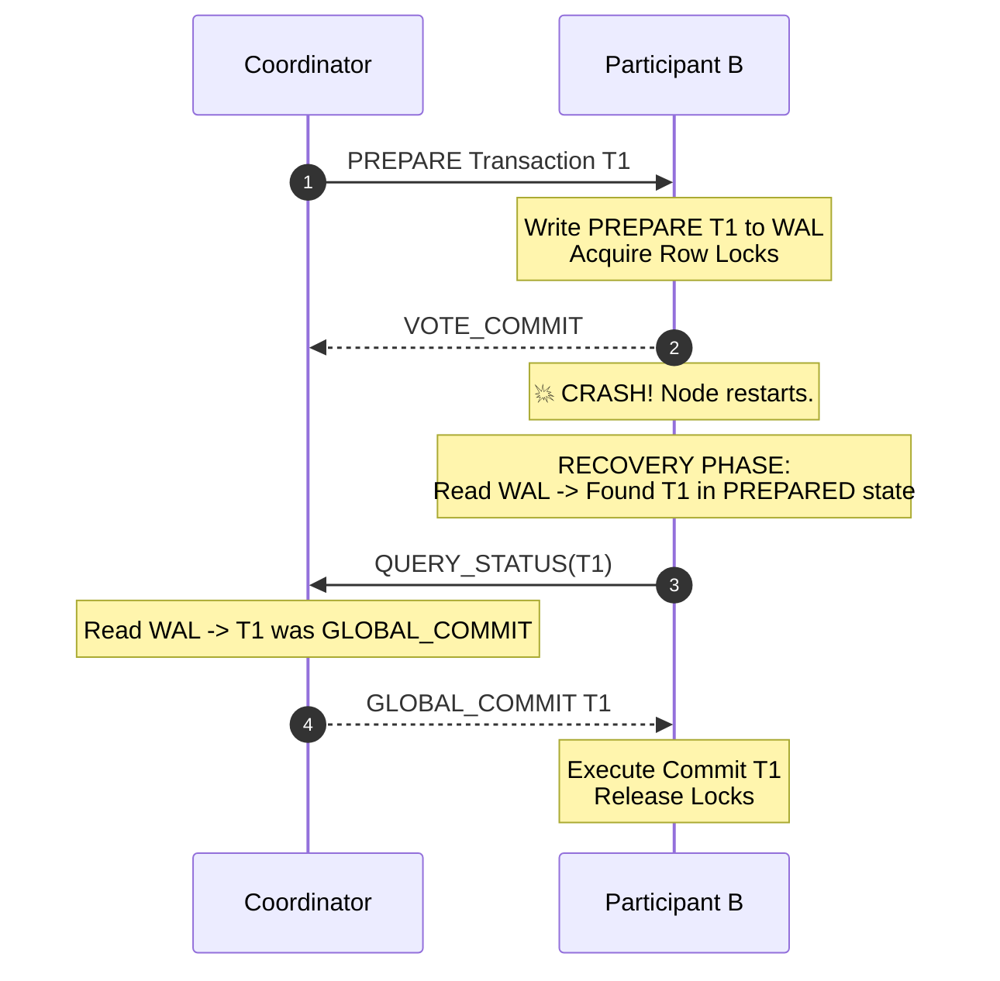

# Two-Phase Commit (2PC) Exception Recovery: Managing Coordinator and Participant Failures

## 1. 💡 The "Big Picture" (Plain English)

### What is this in simple terms?
Imagine you need to update two completely separate databases at the exact same millisecond. Either **both** updates succeed, or **neither** does. 

The **Two-Phase Commit (2PC)** protocol is an algorithm designed to guarantee this "all-or-nothing" rule across different servers. However, when networks drop, hardware dies, or processes crash *during* this process, 2PC faces severe exception scenarios. **2PC Exception Recovery** defines the strict, log-based procedures nodes follow to recover from crashes without corrupting data or leaving database locks stuck open forever.

### Real-World Analogy
Imagine buying a house through an **Escrow Agent** (the Coordinator) involving you (the Buyer) and the Seller (Participants):

1. **Prepare Phase:** The Escrow Agent calls both of you: *"Buyer, do you have the cash locked in account? Seller, do you have the signed title locked in desk?"* 
   - Both of you write down in your personal notebook: *"I locked the assets,"* and reply *"YES"*.
2. **Commit Phase:** The Escrow Agent receives both "YES" replies, writes *"DEAL APPROVED"* in their master ledger, and calls both parties to finalize.

**The Exception Scenario:** What if the Escrow Agent’s office catches fire *after* you said "YES", but *before* they told you the final decision? You are stuck holding cash you can't spend, unsure if you own the house. 2PC Exception Recovery provides the explicit rules for how you, the Seller, and a replacement Escrow Agent inspect each other’s notebooks to safely finalize or cancel the deal.

```
       +-------------------+
       |    Coordinator    |
       +---------+---------+
                 |
        Prepare  |  Commit/Abort
       (Phase 1) |  (Phase 2)
                 v
   +-------------+-------------+
   |                           |
   v                           v
+--+--------------+     +------+---------------+
|  Participant A  |     |    Participant B     |
| (Database 1)    |     |   (Database 2)       |
+-----------------+     +----------------------+
```

### Why should I care?
If a distributed system crashes during multi-database operations without proper 2PC recovery strategies:
* Transactions stay in an indeterminate state indefinitely.
* Database connection pools deplete because unreleased locks block incoming queries.
* Data drifts into inconsistent states (e.g., money leaves Account A, but never arrives in Account B).

---

## 2. 🛠️ How it Works (Step-by-Step)

To survive crashes, every node (Coordinator and Participants) maintains a persistent **Write-Ahead Log (WAL)** on disk. The system handles exceptions based on *when* the failure happens in the timeline:

```
Timeline of 2PC Exception Handling:

[Phase 1: Prepare]                        [Phase 2: Commit / Abort]
      |                                         |
      |-- (A) Failure during Prepare -----------> ABORT transaction
      |                                         |
      |-- (B) Participant crashes after YES ----> Replay WAL & ask Coordinator
      |                                         |
      |-- (C) Coordinator crashes after Decision-> New Coordinator reads WAL
```

### 1. Failure Before Voting (Phase 1)
* **Exception:** A Participant crashes or times out while the Coordinator waits for "Prepare" votes.
* **Recovery Action:** The Coordinator assumes the worst, logs `GLOBAL_ABORT` to its WAL, and sends `ABORT` messages to all reachable nodes.

### 2. Participant Failure After Voting "YES"
* **Exception:** Participant A votes `VOTE_COMMIT`, writes `PREPARED` to its local WAL, and immediately crashes.
* **Recovery Action:** Upon rebooting, Participant A reads its WAL and sees an uncommitted transaction in the `PREPARED` state. It queries the Coordinator for the transaction's status (`GLOBAL_COMMIT` or `GLOBAL_ABORT`) and completes the operation.

### 3. Coordinator Failure After Decision
* **Exception:** Coordinator collects all `VOTE_COMMIT` responses, writes `GLOBAL_COMMIT` to its local WAL, and crashes before sending the decision to participants.
* **Recovery Action:** A backup node or recovery process reads the Coordinator's persistent WAL, finds the `GLOBAL_COMMIT` record, and re-broadcasts `COMMIT` to all participants.

---

### Mermaid Flow Diagram: Recovery from Participant Crash



---

### Python Code Implementation (Recovery Engine Simulation)

```python
import enum
import os

class TxState(enum.Enum):
    INIT = "INIT"
    PREPARED = "PREPARED"
    COMMITTED = "COMMITTED"
    ABORTED = "ABORTED"

class SimulatedDiskWAL:
    """Simulates a Write-Ahead Log written to persistent disk storage."""
    def __init__(self, node_id: str):
        self.filename = f"wal_{node_id}.txt"

    def write_entry(self, tx_id: str, state: TxState):
        # Force flush to disk (simulating fsync)
        with open(self.filename, "a") as f:
            f.write(f"{tx_id}:{state.value}\n")
            f.flush()
            os.fsync(f.fileno())

    def read_last_state(self, tx_id: str) -> TxState:
        if not os.path.exists(self.filename):
            return TxState.INIT
        
        last_state = TxState.INIT
        with open(self.filename, "r") as f:
            for line in f:
                entry_tx, state_str = line.strip().split(":")
                if entry_tx == tx_id:
                    last_state = TxState[state_str]
        return last_state


class ParticipantNode:
    def __init__(self, node_id: str, coordinator_rpc):
        self.node_id = node_id
        self.wal = SimulatedDiskWAL(node_id)
        self.coordinator_rpc = coordinator_rpc

    def prepare(self, tx_id: str) -> bool:
        """Phase 1: Acquire locks and write PREPARE to disk."""
        try:
            # Simulate local validation/locking
            self.wal.write_entry(tx_id, TxState.PREPARED)
            return True # VOTE_COMMIT
        except Exception:
            self.wal.write_entry(tx_id, TxState.ABORTED)
            return False # VOTE_ABORT

    def recover_after_crash(self, tx_id: str):
        """Crash Recovery Procedure triggered on node startup."""
        last_state = self.wal.read_last_state(tx_id)
        
        if last_state == TxState.PREPARED:
            # DANGER ZONE: Participant is blocked holding locks!
            # Must ask Coordinator for ultimate decision.
            decision = self.coordinator_rpc.get_transaction_status(tx_id)
            if decision == TxState.COMMITTED:
                self.commit(tx_id)
            else:
                self.abort(tx_id)
        elif last_state == TxState.ABORTED:
            self.abort(tx_id)

    def commit(self, tx_id: str):
        self.wal.write_entry(tx_id, TxState.COMMITTED)
        print(f"[{self.node_id}] Successfully COMMITTED {tx_id}")

    def abort(self, tx_id: str):
        self.wal.write_entry(tx_id, TxState.ABORTED)
        print(f"[{self.node_id}] Successfully ABORTED {tx_id}")
```

---

## 3. 🧠 The "Deep Dive" (For the Interview)

### The Technical Magic & Internals

#### 1. Why `fsync()` is mandatory before network responses
When a participant votes `VOTE_COMMIT`, it **must** execute an explicit `fsync` call to flush its log buffer from OS cache to hardware media *before* transmitting the vote across the network. If it relies on asynchronous disk writing and crashes before the buffer hits the disk, the rebooted node will have no record of the transaction. It might auto-abort locally, violating consistency while the rest of the cluster commits.

#### 2. The Inherent "Blocking Problem" of 2PC
Traditional 2PC is fundamentally a **blocking protocol**. 

If both the **Coordinator** and **Participant A** crash at the exact same moment *after* Participant A voted `YES`:
* Remaining participants (Participant B) are stuck in the `PREPARED` state.
* Participant B cannot safely commit (because Participant A might have voted `NO`).
* Participant B cannot safely abort (because Participant A might have received a `COMMIT` signal before crashing).
* **Result:** Database row locks are held open indefinitely until the Coordinator comes back online or manual human intervention clears the lock.

```
       +-------------------+
       |    Coordinator    |  💥 CRASHES AFTER DECISION
       +-------------------+
                 |
                 +-------------------+
                 |                   |
                 v                   v
        +-----------------+ +-----------------+
        |  Participant A  | |  Participant B  |
        |  💥 CRASHES     | |  ⏳ BLOCKED!    |
        +-----------------+ |  Holds Locks    |
                            +-----------------+
```

#### 3. Modern Enhancements: Paxos/Raft-Backed Coordinators
To prevent the coordinator from becoming a single point of failure (SPOF), modern distributed engines (e.g., Google Spanner, CockroachDB) do not use a single node as the 2PC Coordinator. Instead, the coordinator function itself is hosted on a high-availability **Consensus Group (Raft/Paxos)**. If the primary coordinator node dies mid-transaction, Raft instantly elects a new leader with access to the replicated log, allowing transaction recovery to resolve in milliseconds.

---

### Key Trade-offs

| Strategy Metric | Basic 2PC Protocol | Consensus-Backed 2PC (Raft/Paxos) | Non-Blocking Saga Pattern |
| :--- | :--- | :--- | :--- |
| **Consistency Level** | Strict Atomicity / Serializability | Strict Atomicity / Serializability | Eventual Consistency |
| **Availability Impact** | Low (Blocks if coordinator dies) | High | Very High |
| **Latencies** | High (2 disk flushes + 2 roundtrips) | Very High (Network quorum + disk syncs) | Low (Async asynchronous messaging) |
| **Resource Lock Time**| Long (Locks held across phases) | Long (Locks held across phases) | Minimal (Local transactions isolate locks) |

---

### Interviewer Probes (Tricky Questions & Answers)

#### Question 1: "What happens if a participant times out while waiting for the Coordinator's commit message in Phase 2?"
* **Answer:** The participant **cannot** unilaterally make a decision to abort! Because it already voted `VOTE_COMMIT` in Phase 1, it gave up its autonomy. The Coordinator might have logged `GLOBAL_COMMIT` and notified other participants. The participant must enter a polling loop, asking peer nodes or backup coordinators for the status of the transaction ID until it receives an answer. It must hold its local database locks open during this entire period.

#### Question 2: "Why can't we use 2PC for all cross-microservice operations across an entire enterprise?"
* **Answer:** Scale and availability limits. 2PC holds local database row locks from the start of Phase 1 until the end of Phase 2. Across high-latency or unstable microservice networks, holding database locks across network boundaries severely degrades throughput, leads to cascading system timeouts, and increases the risk of global deadlocks. Sagas are preferred for long-running microservice workflows.

#### Question 3: "What is the difference between Preserved Abort and Preserved Commit optimization in 2PC logging?"
* **Answer:** In **Preserved Abort**, if a coordinator receives a status request for an unknown or unlogged transaction ID, it safely assumes the transaction was aborted (allowing it to drop abort records from disk early to save space). In **Preserved Commit**, missing records are assumed to be committed. Modern engines use *Preserved Abort* because aborting on missing context prevents accidental illegal writes.

---

## 4. ✅ Summary Cheat Sheet

### 3 Key Takeaways
1. **WAL is the Single Source of Truth:** Disk logs (`fsync`'d before network messages) are the only way nodes can safely reconstruct state after mid-transaction crashes.
2. **2PC is a Synchronous, Blocking Protocol:** If the coordinator dies along with a node that voted `YES`, surviving participants remain blocked holding locks until recovery occurs.
3. **Phase 1 Decisions lock options:** Once a participant votes `YES` in Phase 1, it surrenders its authority to abort the transaction unilaterally.

### 1 Golden Rule to Remember
> *"Before sending a vote or decision over the network in 2PC, write it to persistent disk and `fsync`. Unwritten network messages lead to split-brain data corruption on reboot."*