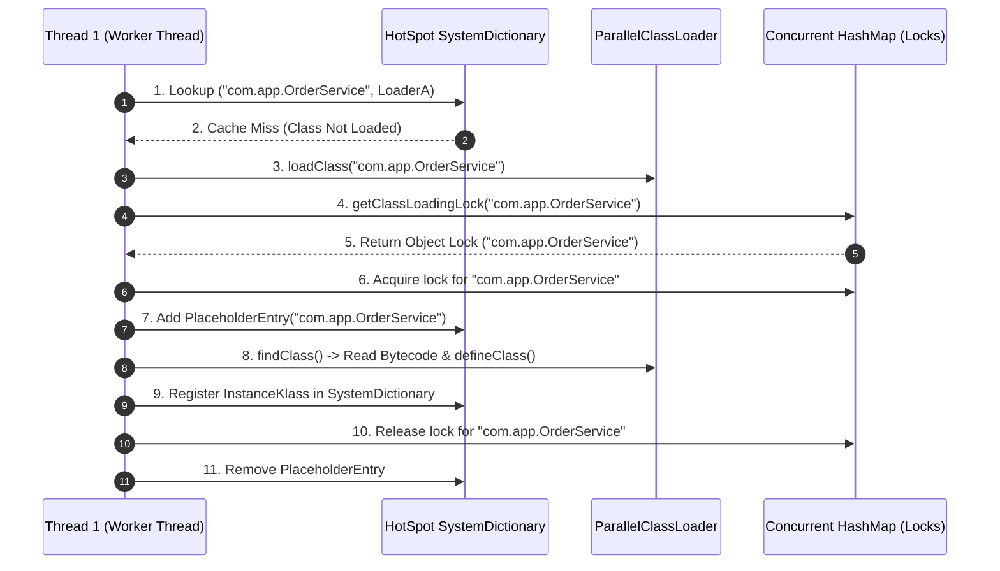

# JVM Class Loading: SystemDictionary Resolution, Parallel Class Loaders, and Concurrent Loading Locks

1. 💡 The "Big Picture" (Plain English)

### What is this in simple terms?
When your Java program runs, the Java Virtual Machine (JVM) doesn't load every single `.class` file into memory at startup. Instead, it loads classes **on demand** the first time code references them. 

**Parallel Class Loading** and the internal **SystemDictionary** are the JVM mechanisms responsible for looking up, locking, and defining these classes concurrently across multiple threads without corrupting memory or crashing the application in deadlocks.

### Real-World Analogy: The Municipal Records Office
Imagine a city records office (the **JVM**). Citizens (**Thread 1** and **Thread 2**) arrive asking for property deeds (**Classes**). 
* The **SystemDictionary** is the master filing cabinet containing all verified deeds.
* In the old days (Java 1.6 and earlier), there was **one single room clerk** (a global classloader lock). If Citizen A asked for Deed A, and Citizen B asked for Deed B, Citizen B had to stand in line and wait, even though their requests were completely unrelated. If Citizen A needed Deed B to finish filing Deed A, while Citizen B needed Deed A to finish filing Deed B, both citizens stood looking at each other forever (**Deadlock**).
* **Parallel Class Loading** gives every record request its own dedicated processing counter (**Per-Class Locks**). Now, multiple citizens can process requests at the exact same time without blocking each other unless they are requesting the exact same deed.

### Why should I care? What problem does it solve today?
Modern Java applications (Spring Boot, Tomcat, Netty, OSGi frameworks) load thousands of classes dynamically on multiple worker threads during startup and high-load requests. 
* Without concurrent parallel class loading, startup times would spike dramatically due to thread contention over classloaders.
* Without fine-grained locking, custom framework classloaders that load interdependent classes on separate threads will deadlock your application at startup or during execution.

---

2. 🛠️ How it Works (Step-by-Step)

### The Class Resolution Flow
1. **Request Phase:** Thread execution hits a bytecode instruction (`new`, `checkcast`, `invokestatic`) referencing an unlinked class.
2. **SystemDictionary Lookup:** The JVM checks its internal **SystemDictionary** (a concurrent hashtable mapping `(class_name, loader_object)` to the C++ `InstanceKlass` pointer) to see if the class is already loaded.
3. **Lock Acquisition:** If missing, the thread calls the ClassLoader's `loadClass(name)`. If registered as *parallel capable*, it retrieves a lock specific *only* to that class name instead of locking the entire ClassLoader instance (`synchronized(this)`).
4. **Placeholder Tracking:** The JVM adds a **Placeholder Entry** in its internal table to signal: *"Class X is currently being parsed by Thread Y"*. This prevents duplicate parsing and detects cyclic class loading dependencies.
5. **Bytecode Definition:** The classloader reads bytes from disk/network, calls `defineClass()`, and passes bytecode to the HotSpot JVM for verification and creation of the `InstanceKlass` in Metaspace.
6. **Dictionary Registration & Release:** The JVM updates the **SystemDictionary** with the new `InstanceKlass` mapping, notifies pending threads, and releases the per-class lock.

### Visual Architecture & Flow



### Implementing a Parallel-Capable ClassLoader

Below is how custom class loaders register parallel capability to avoid dynamic classloader deadlocks:

```java
package com.mentor.jvm;

import java.io.ByteArrayOutputStream;
import java.io.InputStream;
import java.util.concurrent.ConcurrentHashMap;

public class GranularParallelClassLoader extends ClassLoader {

    static {
        // CRITICAL: Tells the JVM that this ClassLoader can load distinct 
        // classes concurrently without locking the ClassLoader instance.
        boolean registered = ClassLoader.registerAsParallelCapable();
        System.out.println("Parallel Capable Registered: " + registered);
    }

    public GranularParallelClassLoader(ClassLoader parent) {
        super(parent);
    }

    @Override
    protected Class<?> findClass(String name) throws ClassNotFoundException {
        // Simulate reading bytecode from custom location (e.g., encrypted bytes, remote storage)
        byte[] classData = loadClassBytesFromCustomSource(name);
        if (classData == null) {
            throw new ClassNotFoundException(name);
        }
        
        // Converts raw bytes into an InstanceKlass in Metaspace.
        // HotSpot checks SystemDictionary internal locks during this call.
        return defineClass(name, classData, 0, classData.length);
    }

    private byte[] loadClassBytesFromCustomSource(String className) {
        // Utility method simulation: Reads file bytes from resource stream
        String resourcePath = className.replace('.', '/') + ".class";
        try (InputStream is = getResourceAsStream(resourcePath);
             ByteArrayOutputStream baos = new ByteArrayOutputStream()) {
            if (is == null) return null;
            int b;
            while ((b = is.read()) != -1) {
                baos.write(b);
            }
            return baos.toByteArray();
        } catch (Exception e) {
            return null;
        }
    }
}
```

---

3. 🧠 The "Deep Dive" (For the Interview)

### HotSpot SystemDictionary Internals
The **SystemDictionary** is a critical native HotSpot C++ structure. It is essentially a dictionary hashtable where keys are `(Symbol*, Handle/Oop)` representing `(ClassNameSymbol, ClassLoaderObject)`.

* **Dictionary Entry:** Once loaded, a class is recorded as a `DictionaryEntry` pointing to its native C++ metadata structure (`InstanceKlass`).
* **Initiating vs. Defining Loader:** 
  * The **Defining Loader** is the ClassLoader that actually called `defineClass()` and produced the byte representation.
  * An **Initiating Loader** is any ClassLoader that was asked to load the class and delegated it up the hierarchy. The SystemDictionary records *both* to optimize future lookups so parent delegation chains don't need to be re-traversed.

### Legacy Lock vs. Parallel Lock Mechanism

Prior to Java 7, `ClassLoader.loadClass()` was synchronized directly on the `ClassLoader` instance:

```java
// LEGACY (Pre-Java 7 / Non-Parallel)
protected synchronized Class<?> loadClass(String name, boolean resolve) {
    // Locks entire ClassLoader instance ('this')
}
```

#### The Legacy Deadlock Scenario:
1. `ClassLoader A` extends `ClassLoader B`.
2. **Thread 1** asks `ClassLoader A` to load `Class X`. `Thread 1` acquires lock on `ClassLoader A`. To resolve `Class X`, `ClassLoader A` delegates to `ClassLoader B`, attempting to acquire lock on `ClassLoader B`.
3. Simultaneously, **Thread 2** asks `ClassLoader B` to load `Class Y`. `Thread 2` acquires lock on `ClassLoader B`. `Class Y` requires superclass `Class Z` handled by `ClassLoader A`, attempting to acquire lock on `ClassLoader A`.
4. **Deadlock!** Thread 1 holds `ClassLoader A` waiting on `ClassLoader B`. Thread 2 holds `ClassLoader B` waiting on `ClassLoader A`.

#### The Java 7+ Fix (`ParallelCapable`):
Instead of synchronizing on `this`, `getClassLoadingLock(className)` utilizes an internal `ConcurrentHashMap<String, Object>` mapping class names to specific lock objects:

```java
// MODERN (Java 7+ Parallel Capable)
protected Object getClassLoadingLock(String className) {
    Object lock = this;
    if (parallelLockMap != null) {
        Object newLock = new Object();
        lock = parallelLockMap.putIfAbsent(className, newLock);
        if (lock == null) {
            lock = newLock;
        }
    }
    return lock; // Returns lock tied ONLY to the specific class name
}
```

### HotSpot `PlaceholderTable` & Handshaking
When a thread decides to load a class, it inserts a `PlaceholderEntry` into the native C++ `PlaceholderTable`. This handles three concurrent edge cases:
1. **Circular Dependency Detection:** If Thread 1 attempts to load `Class A`, which requires `Class B`, which in turn attempts to re-entry load `Class A`, the JVM checks the `PlaceholderTable`, detects the cyclic dependency by the same thread, and throws a `ClassCircularityError`.
2. **Concurrent Request Wait:** If Thread 2 asks for `Class A` while Thread 1 is midway through parsing its bytes, Thread 2 sees the `PlaceholderEntry` in the JVM, skips parsing, and blocks on the SystemDictionary condition variable until Thread 1 finishes or fails.

### Trade-Off Analysis

| Approach | Memory Footprint | Concurrency / Throughput | Deadlock Risk |
| :--- | :--- | :--- | :--- |
| **Legacy ClassLoader Lock** | **Minimal:** Single intrinsic monitor per class loader object. | **Poor:** All thread requests hit serial queue bottleneck per class loader instance. | **High:** Cross-loader cyclic dependencies cause hard native thread deadlocks. |
| **Parallel Capable ClassLoader** | **Slightly Higher:** Overhead of internal `ConcurrentHashMap` and lock objects per class name. | **High:** Non-blocking concurrent loads for distinct class names across threads. | **Zero (for class loading locks):** Thread synchronization is isolated strictly per class name. |

---

### Interviewer Probe Questions & Senior Answers

#### Probe 1: "If two threads concurrently call `loadClass()` for the exact same class name on a Parallel Capable Classloader, how does the JVM prevent `defineClass()` from being called twice?"
**Candidate Answer:** 
Parallel capability changes the scope of the Java-level lock from the ClassLoader instance (`this`) to a per-class-name lock object obtained via `getClassLoadingLock(className)`. 

When Thread 1 and Thread 2 request the exact same class simultaneously:
1. Both attempt to acquire the lock returned by `getClassLoadingLock("com.Example")`.
2. Thread 1 wins the lock; Thread 2 blocks at the Java monitor.
3. Thread 1 double-checks `findLoadedClass("com.Example")`, proceeds to read bytecode, calls `defineClass()`, registers the resulting `InstanceKlass` in the JVM's native `SystemDictionary`, and releases the lock.
4. Thread 2 acquires the lock, executes `findLoadedClass("com.Example")` inside `loadClass()`, hits the cache (which now resolves via `SystemDictionary`), returns the already loaded `Class` instance, and completely skips `defineClass()`.

#### Probe 2: "What is the role of the HotSpot `SystemDictionary_lock` dynamic lock, and how does it interact with application-level class loader locks?"
**Candidate Answer:**
Application-level locks (`getClassLoadingLock`) operate at the Java frame level inside `ClassLoader.loadClass()`. Once `defineClass()` is called, control transitions into native HotSpot C++ code.

Inside C++, HotSpot uses the internal native mutex `SystemDictionary_lock` to safely mutate JVM internal tables:
* It locks `SystemDictionary_lock` briefly to check if another thread defined the class concurrently or to insert a `PlaceholderEntry`.
* It allocates the `InstanceKlass` in Metaspace and parses bytecode without holding `SystemDictionary_lock` (to maximize concurrency).
* Finally, it re-acquires `SystemDictionary_lock` to place the completed `InstanceKlass*` into the SystemDictionary hashtable and clean up the `PlaceholderEntry`.

This two-tier locking design isolates heavy IO/bytecode parsing actions from critical JVM global dictionary mutations.

---

4. ✅ Summary Cheat Sheet

### 3 Key Takeaways
1. **SystemDictionary is the Master Registry:** HotSpot maintains an internal C++ hashtable (`SystemDictionary`) mapping `(className, classLoader)` to `InstanceKlass*` pointers in Metaspace.
2. **Parallel Class Loading Uses Granular Locks:** Registering a class loader as *parallel capable* replaces instance-wide `synchronized(this)` locks with per-class-name lock objects inside an internal map.
3. **PlaceholderTable Handles Cyclic States:** HotSpot uses native `PlaceholderEntry` tracking to prevent double-parsing and detect `ClassCircularityError` conditions across concurrent threads.

### 1 "Golden Rule"
> **Always register custom ClassLoaders as parallel capable (`ClassLoader.registerAsParallelCapable()`) in a static initializer block to prevent multi-threaded class loading deadlocks in dynamic frameworks.**