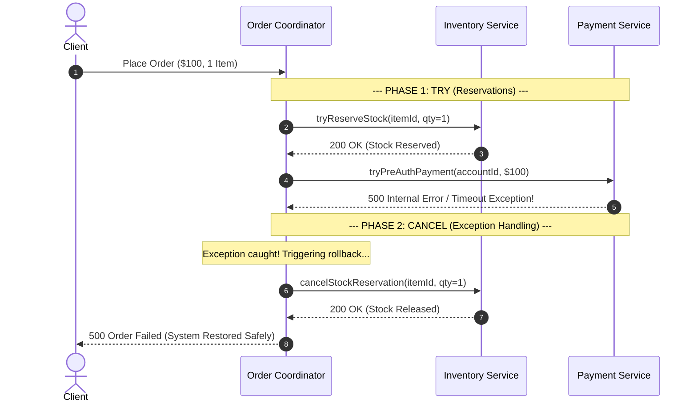

# The Try-Confirm-Cancel (TCC) Pattern: Business-Level Exception Recovery

## 1. 💡 The "Big Picture" (Plain English)

### What is this in simple terms?
The **Try-Confirm-Cancel (TCC)** pattern is an application-level exception recovery strategy for distributed systems. Instead of modifying system state permanently right away, every service involved in a transaction first **reserves** (tries) the required resources. 

If all services successfully reserve their resources, a coordinator sends a **Confirm** signal to finalize the changes. If any service encounters an exception or fails validation during the reservation phase, the coordinator sends a **Cancel** signal to release all held reservations.

### Real-World Analogy: Booking a Vacation Package
Imagine booking a flight and a hotel package online:
* **Try (Reservation):** The system places a 15-minute temporary hold on Hotel Room #302 and Flight Seat 12B, and places a temporary pre-authorization hold on your credit card. No money has left your account, and no permanent hotel check-in has occurred.
* **The Exception:** The flight service suddenly throws an error—Seat 12B was taken mid-transaction.
* **Cancel (Rollback):** Because an exception occurred, the system immediately releases the hold on Hotel Room #302 and drops the credit card pre-authorization. You aren't charged, and no awkward refund process is required because no actual charge ever went through.
* **Confirm (Commit):** If both holds succeed without exceptions, the system executes the actual charge and marks the flight seat and hotel room as permanently booked.

```
       +-------------------------------------------------+
       |                  TCC PHASES                     |
       +-------------------------------------------------+
       | 1. TRY     : Reserve resources (Soft State)      |
       | 2. CONFIRM : Commit reservation (Hard State)    |
       | 3. CANCEL  : Release reservation (Cleanup)      |
       +-------------------------------------------------+
```

### Why should I care? What problem does it solve for me today?
In distributed microservices, traditional database ACID transactions (like 2PC) lock database rows across networks, causing extreme performance bottlenecks and deadlocks. On the flip side, compensating patterns (like Saga) commit changes immediately, which requires complex "undo" logic (like issuing refunds) if a downstream service crashes.

TCC gives you **strong consistency at the business layer** without holding database locks. It guarantees that if an exception occurs anywhere during a multi-service workflow, your system gracefully cleans up unused reservations without leaving orphaned or corrupted data.

---

## 2. 🛠️ How it Works (Step-by-Step)

### The Step-by-Step Process

1. **Initiate Try Phase:** The Coordinator calls the `try()` endpoint on Service A and Service B.
2. **Resource Reservation:** Each service checks business rules, validates constraints, and writes a pending record with an expiration timestamp (`reserved_until`).
3. **Exception Check:**
   * **Path A (All Succeeded):** The Coordinator calls `confirm()` on Service A and Service B. Reserved resources transition to `CONFIRMED`.
   * **Path B (Exception Occurred):** The Coordinator catches the exception and calls `cancel()` on all services where `try()` succeeded. Reserved resources transition to `CANCELLED` / `RELEASED`.

### Flow Diagram



### Production-Grade Code Snippet (Java / Spring Boot Style)

#### Interface Definition for TCC Participants
```java
public interface TccParticipant<T> {
    /** Phase 1: Reserve resources. Throws exception if unavailable. */
    boolean prepareTry(String txId, T request);
    
    /** Phase 2a: Confirm reservation permanently. Must be IDEMPOTENT. */
    boolean confirm(String txId);
    
    /** Phase 2b: Release reserved resources. Must be IDEMPOTENT. */
    boolean cancel(String txId);
}
```

#### Coordinator Implementation Handling Exceptions
```java
@Service
public class OrderTccCoordinator {

    @Autowired private InventoryTccService inventoryService;
    @Autowired private PaymentTccService paymentService;

    public void executeOrderTransaction(String txId, OrderRequest request) {
        List<TccParticipant<?>> successfulTries = new ArrayList<>();

        try {
            // STEP 1: Try Inventory Reservation
            boolean stockReserved = inventoryService.prepareTry(txId, request.getItemDetails());
            if (!stockReserved) {
                throw new BusinessReservationException("Insufficient stock available.");
            }
            successfulTries.add(inventoryService);

            // STEP 2: Try Payment Pre-Authorization
            boolean paymentReserved = paymentService.prepareTry(txId, request.getPaymentDetails());
            if (!paymentReserved) {
                throw new BusinessReservationException("Payment pre-authorization failed.");
            }
            successfulTries.add(paymentService);

            // STEP 3: Confirm All (Phase 2a - Success Path)
            inventoryService.confirm(txId);
            paymentService.confirm(txId);

        } catch (Exception ex) {
            // STEP 4: Cancel Executed Tries (Phase 2b - Exception Handling)
            log.error("TCC Transaction [{}] failed due to exception: {}. Rolling back...", txId, ex.getMessage());
            rollbackTccPhase(txId, successfulTries);
            
            throw new OrderProcessingException("Order failed, all reservations released.", ex);
        }
    }

    private void rollbackTccPhase(String txId, List<TccParticipant<?>> completedSteps) {
        for (TccParticipant<?> participant : completedSteps) {
            try {
                // Guaranteed idempotency retry loop in production systems
                participant.cancel(txId);
            } catch (Exception cancelEx) {
                log.error("CRITICAL: Failed to cancel TCC step for txId: {}. Retrying via background worker.", txId, cancelEx);
                // Push to async reconciliation queue
            }
        }
    }
}
```

---

## 3. 🧠 The "Deep Dive" (For the Interview)

### The Technical Magic: Application-Level Concurrency & Soft States
Unlike Two-Phase Commit (2PC), which relies on database transactions (`XAResource`) to maintain atomic isolation, TCC shifts concurrency management entirely to the **application domain model**.

To achieve this without database locks:
1. **Explicit Soft State Modeling:** The database schema explicitly tracks resource allocation across states:
   * **Total Capacity:** 100
   * **Reserved Capacity:** 20 (Soft hold via `prepareTry`)
   * **Available for Sale:** $100 - 20 = 80$
2. **Atomic In-Memory / Conditional Updates:** The `prepareTry` step uses atomic database queries to prevent race conditions:
   ```sql
   UPDATE inventory 
   SET reserved_qty = reserved_qty + :qty 
   WHERE item_id = :id AND (total_qty - reserved_qty) >= :qty;
   ```
3. **Isolation without Locks:** Other transactions see that available stock is 80, preventing double-booking without blocking read/write database connections.

```
+-----------------------------------------------------------------------+
|                       DATABASE ROW STATE MODEL                        |
+-------------------+--------------------+------------------------------+
| TOTAL_QTY: 100    | RESERVED_QTY: 20   | AVAILABLE: 80 (Calculated)   |
+-------------------+--------------------+------------------------------+
         |                     |
         | (Confirm)           | (Cancel)
         v                     v
RESERVED_QTY -> 0     RESERVED_QTY -> 0
TOTAL_QTY    -> 80    TOTAL_QTY    -> 100
```

### System Trade-Offs

| Advantage | Disadvantage / Cost |
| :--- | :--- |
| **No Database Locking:** High throughput; doesn't hold open long DB connections across network boundaries. | **Implementation Overhead:** Every single microservice must implement **three** API endpoints (`Try`, `Confirm`, `Cancel`). |
| **No Complex Compensation Logic:** You don't need to "undo" a real event (like issuing a bank refund). You simply drop the reservation hold. | **Dangling Soft-State Risk:** If the coordinator crashes mid-transaction, reserved resources remain tied up until a timeout/reconciliation occurs. |
| **High Consistency Control:** Prevents partial state visibility bugs seen in basic event-driven architectures. | **Requires Strict Idempotency:** Retry mechanisms for `Confirm` and `Cancel` require persistent transactional tracking tables. |

---

### Interviewer Probe Questions

#### Probe 1: "How does TCC differ from the Saga Pattern, and when would you select TCC over Saga?"
* **Answer:** 
  * **Saga** operates on a **Commit-Then-Compensate** model. Local database transactions are committed immediately in step 1. If step 2 fails, a compensating transaction executes a reverse action (e.g., refunding money or deleting a row).
  * **TCC** operates on a **Reserve-Then-Commit** model. Resources are only locked in a temporary "Pending" state during `Try`. Nothing is permanently committed until all steps succeed.
  * **When to choose TCC:** Choose TCC when business actions **cannot be easily reversed** (e.g., sending an external SMS alert, performing an irreversible third-party bank wire) or when dirty reads during intermediate Saga steps are unacceptable to the business.

#### Probe 2: "What happens if the Coordinator node abruptly crashes right after a successful `Try` phase, but before invoking `Confirm` or `Cancel`?"
* **Answer:** This creates a temporary resource leak where items remain `RESERVED`. To resolve this, TCC relies on two mechanisms:
  1. **Time-To-Live (TTL) / Leases:** Every `Try` reservation includes a timestamp (e.g., `reserved_until = NOW() + 5 minutes`).
  2. **Background Reconciliation Daemon:** A scheduled job polls for expired records where status is `RESERVED` and `reserved_until < NOW()`. The daemon automatically invokes the `cancel()` logic to free up resources.

#### Probe 3: "What if a `Cancel` HTTP request reaches a participant service BEFORE its `Try` HTTP request due to network reordering or retries?"
* **Answer:** This is known as the **"Out-of-Order Execution"** or **"Empty Cancel"** problem.
  * To fix this, the participant service records a **Transaction Control Record** when processing `cancel()`.
  * If `cancel(txId)` arrives first, it writes a status record: `{ txId: "TX123", status: "CANCELLED" }`.
  * When the delayed `try(txId)` request finally arrives, the service checks the control table, sees the `CANCELLED` status, and immediately aborts the operation without reserving any resources.

---

## 4. ✅ Summary Cheat Sheet

### 3 Key Takeaways
1. **TCC is a 2-Phase Application-Level Pattern:** It splits distributed operations into **Try** (Reserve), **Confirm** (Commit), and **Cancel** (Release).
2. **Eliminates DB Locking:** It moves isolation out of database engines and into business domain models (`total_qty` vs. `reserved_qty`).
3. **Requires 3 Endpoints Per Service:** Every participant service must expose idempotent `try`, `confirm`, and `cancel` interfaces.

### 1 "Golden Rule"
> **"Never permanently mutate business state in the `Try` phase—only reserve capacity, and ensure both `Confirm` and `Cancel` are strictly idempotent."**