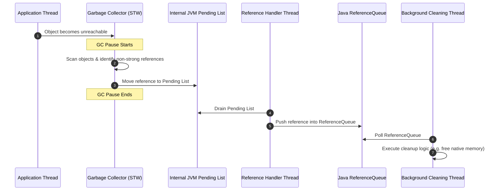

# Reference Processing & Cleanup Queue Tuning: Eliminating GC Pause Spikes and Reference Accumulation

---

## 1. 💡 The "Big Picture" (Plain English)

### What is this in simple terms?
When objects are no longer needed by your program, the Garbage Collector (GC) reclaims their memory. However, some objects hold onto external resources—like open database connections, native file descriptors, or off-heap memory buffers. 

Before these objects can be completely destroyed, the runtime must perform cleanup tasks on them. **Reference Processing and Cleanup Queues** are the mechanisms the GC uses to discover, track, and offload these special objects so their external resources can be safely freed.

### Real-World Analogy: The Restaurant Dirty Dish System
Imagine a busy restaurant:
* **Standard Garbage Collection:** Customers leave, and the busboy immediately dumps disposable paper plates into the trash. Fast and simple.
* **Reference Processing:** A customer leaves a table with expensive, custom glassware. The busboy can’t just throw it away. Instead, he places it on a **special holding tray** (the Reference Queue). A dedicated **dishwasher worker** (the Reference Processing thread) must inspect each glass, hand-wash it, and put it back in storage.

If customers leave thousands of custom glasses all at once, or if the dishwasher is too slow, the holding tray overflows, tables pile up with dirty dishes, and the entire restaurant grinds to a halt waiting for clean tables!

```
[ Dirty Table ] ──(Customer Leaves)──> [ Standard GC: Trash Paper Plates ]
                                 └──> [ Special Glassware ] ──> [ Holding Tray (Queue) ] ──> [ Dishwasher Worker ]
```

### Why should I care? What problem does it solve today?
If you don't tune reference processing, your application can suffer from **mysterious, multi-second GC pauses**—even when overall heap usage looks totally healthy. 

Un-tuned reference handling causes:
1. **Hidden Stop-The-World (STW) Spikes:** The GC spends huge amounts of time inspecting references during GC pauses.
2. **OutOfMemoryErrors (OOM):** Memory bloats because objects are waiting in line to be cleaned up faster than the background threads can process them.
3. **Native Memory Leaks:** Off-heap buffers (like Java's `DirectByteBuffer`) fail to release native operating system memory quickly enough, causing OS-level crashes.

---

## 2. 🛠️ How it Works (Step-by-Step)

### Step-by-Step Execution Flow

1. **Registration:** You create an object bound to a non-strong reference type (`SoftReference`, `WeakReference`, `PhantomReference`, or modern `Cleaner`) linked to a `ReferenceQueue`.
2. **Unreachability Detection:** During a GC cycle, the GC discovers that the target object has no remaining strong references.
3. **Discovery Phase (STW):** During the Garbage Collection pause, the GC intercepts these special references and attaches them to a JVM internal `Pending` linked list instead of immediate deletion.
4. **Enqueuing Phase:** The JVM's high-priority background thread (the `Reference Handler` thread) unlinks references from the `Pending` list and enqueues them onto their respective Java-level `ReferenceQueue`.
5. **Draining & Cleanup:** Application or background system threads poll the `ReferenceQueue` and execute the required resource teardown (e.g., releasing native memory, closing sockets).

---

### Clean Code Example: Modern Native Buffer Cleaner vs. Weak Reference Queue

Here is how cleanup queues are implemented using modern Java `Cleaner` (which replaces legacy, dangerous `finalizers` under the hood):

```java
import java.lang.ref.Cleaner;

public class NativeResourceManager implements AutoCloseable {
    
    // Global shared cleaner instance across the application
    private static final Cleaner CLEANER = Cleaner.create();

    // State class MUST NOT hold a reference to the outer class instance!
    // Storing a reference back to NativeResourceManager prevents GC reclamation.
    private static class CleaningState implements Runnable {
        private long nativeMemoryAddress;

        CleaningState(long address) {
            this.nativeMemoryAddress = address;
        }

        @Override
        public void run() {
            if (this.nativeMemoryAddress != 0) {
                System.out.println("[GC Thread Hook] Freeing native address: " + nativeMemoryAddress);
                // Simulate releasing off-heap native memory via unsafe/FFM API
                this.nativeMemoryAddress = 0;
            }
        }
    }

    private final CleaningState state;
    private final Cleaner.Cleanable cleanable;

    public NativeResourceManager(long address) {
        this.state = new CleaningState(address);
        // Register object and cleanup task with the Reference Queue system
        this.cleanable = CLEANER.register(this, state);
    }

    @Override
    public void close() {
        // Explicit manual cleanup if caller cleans up before GC
        cleanable.clean();
    }
}
```

---

### Lifecycle Process Diagram



---

## 3. 🧠 The "Deep Dive" (For the Interview)

### The Technical Magic Under the Hood

Reference processing is one of the few places where the GC pipeline directly interacts with Java application threads.

During the GC mark phase, when an object is deemed unreachable through normal reference paths, the GC checks its reference type:

```
Reachability Hierarchy:
Strong > Soft > Weak > Phantom > Unreachable
```

#### The `refProc` Bottleneck
During a Garbage Collection pause, there is a dedicated phase called **Reference Processing (`refProc`)**. By default in older JVMs (and depending on collector configuration), reference processing was **single-threaded**, even if you had a 64-core machine running parallel GC worker threads!

If an application generates millions of weak/phantom references (e.g., intensive caching, Netty byte buffers, Jackson serialization, or ORM frameworks like Hibernate):
1. Parallel GC threads pause all app threads.
2. GC marks all objects.
3. **Single-Thread Bottleneck:** A *single* GC thread scans the entire list of discovered references, updates their states, and links them to the JVM `Pending` list.
4. The STW pause time explodes from `10ms` to `3000ms`, spent entirely in `refProc`.

#### The `Reference Handler` Thread Lock Bottleneck
Once the STW pause finishes, the Java `Reference Handler` thread must take those references from the native JVM `Pending` list and put them onto Java `ReferenceQueue` instances. This thread holds a synchronized lock (`PendingList_lock`). If application code or third-party libraries synchronously lock on reference objects or overflow queues, the `Reference Handler` thread gets blocked, halting *all* reference processing globally across the JVM.

---

### Key Tuning JVM Flags

To eliminate these bottlenecks, performance engineers use specific JVM options:

| Flag | Description | Default | Impact |
| :--- | :--- | :--- | :--- |
| `-XX:+ParallelRefProcEnabled` | Enables parallel processing of references during GC STW phases using multiple GC threads. | False (G1/Parallel in older JVMs, True in modern OpenJDK) | Dramatically reduces `refProc` STW pause times when reference counts are high. |
| `-XX:ReferencesPerThread=1000` | Defines the ratio of references assigned to each parallel GC thread. | 1000 | Controls task granularity during parallel reference processing. |
| `-XX:+PrintReferenceGC` or `-Xlog:gc+ref=debug` | Enables fine-grained logging for reference processing execution time breakdown. | Disabled | Exposes exact milliseconds spent processing Soft, Weak, Phantom, and Final references. |

---

### Trade-Offs Matrix

```
                          ┌──────────────────────────────────────────────┐
                          │     Parallel Reference Processing Enabled    │
                          └──────────────────────┬───────────────────────┘
                                                 │
                        ┌────────────────────────┴────────────────────────┐
                        ▼                                                 ▼
            [ ADVANTAGES / PROS ]                             [ TRADE-OFFS / CONS ]
  • Cuts refProc STW pause times by up to 80-90%.     • Higher CPU cache contention during GC.
  • Prevents single-core bottleneck on massive heaps. • Small overhead if reference count is tiny.
```

---

### Interviewer Probe Questions & Winning Answers

#### Q1: "We see high GC pause times, but our heap usage is low and non-surviving object counts are small. What GC log metrics should we check, and how do we debug this?"
> **Winning Answer:** I would check the GC detailed logs for phase breakdowns, specifically looking at the **`refProc` (Reference Processing)** and **`refEnq` (Reference Enqueueing)** phase durations using `-Xlog:gc+ref=debug`. 
>
> If `refProc` takes up the majority of the pause, it means the app is creating a massive volume of `Weak`, `Soft`, or `Phantom` references (often from caches, proxy libraries, or off-heap buffers like Netty). 
> 
> To resolve this, I would:
> 1. Ensure `-XX:+ParallelRefProcEnabled` is explicitly set if using older JVM versions.
> 2. Dump the heap to inspect which classes dominate non-strong reference types (e.g., `java.lang.ref.WeakReference` or `java.lang.ref.PhantomReference`).
> 3. Verify if objects are using legacy `finalize()` methods, which force slow dual-GC cycle processing.

#### Q2: "Why is `Object.finalize()` deprecated, and how do modern GC runtimes handle `Cleaner` or `PhantomReference` differently under the hood?"
> **Winning Answer:** `finalize()` is fundamentally broken for three reasons:
> 1. **Double GC Cycle Latency:** An object with a finalizer cannot be collected when first found unreachable. It must be promoted to a finalizer queue, resurrected for `finalize()` execution, and only collected in the *next* GC cycle.
> 2. **Thread Starvation:** All finalizers share a single low-priority thread (`FinalizerThread`). If one finalizer hangs or runs slowly, all other finalizer cleanups block indefinitely, leading to memory exhaustion.
> 3. **Object Resurrection:** Finalizers allow an object to make itself strongly reachable again by assigning `this` to a live field, breaking GC invariants.
>
> `PhantomReference` and modern `Cleaner` decouple the resource cleanup logic from the target object. The target object is freed **immediately** in the current GC cycle. Only a lightweight wrapper with no reference back to the original target object remains in the reference queue, preventing object resurrection and enabling predictable, parallel cleanup.

#### Q3: "Can enabling `-XX:+ParallelRefProcEnabled` ever worsen application latency?"
> **Winning Answer:** Yes. Parallel reference processing incurs synchronization overhead to divide reference work items among worker threads. If an application maintains a very small number of references (e.g., only a few hundred active weak/phantom references), the thread orchestration overhead can actually take longer than simply processing them sequentially on a single thread. 
> 
> However, on modern multi-core systems with high-throughput applications using off-heap buffers or complex frameworks, the benefits of parallel reference processing almost always outweigh this overhead.

---

## 4. ✅ Summary Cheat Sheet

```
   ┌────────────────────────────────────────────────────────────────────────┐
   │                         GC REFERENCE TUNING                            │
   ├────────────────────────────────────────────────────────────────────────┤
   │  1. Check Logs:      Look for long 'refProc' times in GC logs.         │
   │  2. Enable Parallel: Set -XX:+ParallelRefProcEnabled to fix STW spikes.│
   │  3. Avoid Finalize:  Never use finalize(); use Cleaner/PhantomRef.     │
   └────────────────────────────────────────────────────────────────────────┘
```

### 3 Key Takeaways
1. **Reference Processing Happens During STW Pauses:** GC doesn't just collect heap space; it pauses your application to scan non-strong references. High reference counts equal long pauses.
2. **Never Use `finalize()`:** It delays garbage collection by at least one extra GC cycle and relies on a fragile, single-threaded executor.
3. **Inspect the `refProc` Phase:** When diagnosing unexplained latency spikes, always log reference processing metrics (`-Xlog:gc+ref=debug`).

### 1 "Golden Rule"
> **If you manage off-heap resources or high-frequency weak references, always enable parallel reference processing (`-XX:+ParallelRefProcEnabled`) and ensure cleanup tasks never hold locks or block the global Reference Handler thread.**