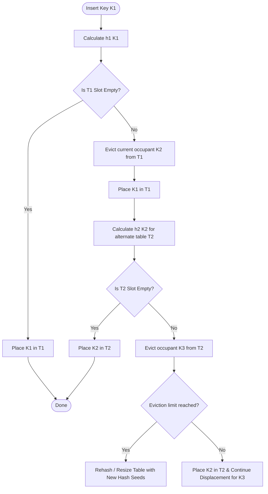

# The Cuckoo Hash Table: Custom Constant Worst-Case Lookup Collections

## 1. 💡 The "Big Picture" (Plain English)

### What is this in simple terms?
A **Cuckoo Hash Table** is a specialized hash-based collection designed with one uncompromising goal: **guaranteed $O(1)$ worst-case lookup time**. 

Unlike a standard `HashMap`—where multiple keys can collide and stack up in linked lists or trees—a Cuckoo Hash Table ensures that every key lives in one of **exactly two possible memory locations**. Finding an item never requires scanning long chains; you simply check Location A, check Location B, and you’re done.

### The Real-World Analogy: The Cuckoo Bird & Hotel Rooms
Think of the Cuckoo bird's behavioral quirk: it lays its eggs in other birds' nests, pushing the original eggs out.

Imagine a hotel where every guest is assigned **exactly two preferred room numbers** based on their name:
1. Guest **Alice** checks into her first choice: **Room 101**.
2. Later, **Bob** arrives. His first choice is *also* **Room 101**. 
3. Instead of sharing the room (chaining) or searching down the hall (linear probing), Bob moves into **Room 101** and **kicks Alice out**.
4. Alice packs her bags and moves to her *second choice*, **Room 205**.
5. If **Room 205** is currently occupied by Charlie, Alice kicks Charlie out, forcing Charlie to move to *his* second choice, and so on.

```
[ New Guest: Bob ] ---> Wants Room 101 (Occupied by Alice)
                          │
                          ▼
                 [ Bob takes Room 101 ]
                          │
                          ▼ (Kicks Alice out)
[ Alice ] -------------> Moves to Her 2nd Choice: Room 205
```

### Why should I care? What problem does it solve today?
Standard Java `java.util.HashMap` offers $O(1)$ *average* lookup time, but degrades to $O(\log N)$ (or $O(N)$ under hash flooding attacks or poor hash distribution). 

In **latency-critical systems**—such as high-frequency trading (HFT) engines, network packet routers, in-memory database indexes, or real-time gaming backends—unpredictable latency spikes caused by long hash collisions are fatal. Cuckoo Hashing guarantees that lookups take at most **2 memory accesses**, making latency completely predictable.

---

## 2. 🛠️ How it Works (Step-by-Step)

### The Algorithm Mechanics
1. **Two Tables & Two Hash Functions**: Maintain two parallel arrays ($T_1$ and $T_2$) and two distinct, independent hash functions ($h_1(key)$ and $h_2(key)$).
2. **Lookup ($O(1)$ Guaranteed)**: Look at $T_1[h_1(key)]$ and $T_2[h_2(key)]$. If the key isn't in either position, it **does not exist** in the collection.
3. **Insertion (Displacement Chain)**:
   - Calculate $idx_1 = h_1(key)$. If $T_1[idx_1]$ is free, place the entry there.
   - If occupied, **evict** the current tenant, place the new key, and try to re-insert the evicted key into its alternate position in $T_2$.
   - Repeat this eviction chain until every key finds a home.
   - **Loop Detection**: If the eviction chain runs too long (e.g., exceeds a threshold $MAX\_DISPLACEMENTS$), a cycle is detected. Re-hash the entire table using new hash functions or double the capacity.

### Visual Workflow


### Java Custom Implementation

```java
import java.util.Objects;

/**
 * A custom Cuckoo Hash Map providing O(1) worst-case lookup guarantees.
 */
public class CuckooHashMap<K, V> {

    private static class Entry<K, V> {
        final K key;
        V value;

        Entry(K key, V value) {
            this.key = key;
            this.value = value;
        }
    }

    private static final int DEFAULT_CAPACITY = 16;
    private static final double MAX_LOAD_FACTOR = 0.49; // Cuckoo hashing degrades above ~50% load factor

    private Entry<K, V>[] table1;
    private Entry<K, V>[] table2;
    private int capacity;
    private int size;
    
    // Salt values to generate distinct hash behaviors
    private int hashSeed1 = 0x811c9dc5;
    private int hashSeed2 = 0x01000193;

    @SuppressWarnings("unchecked")
    public CuckooHashMap(int capacity) {
        this.capacity = capacity;
        this.table1 = new Entry[capacity];
        this.table2 = new Entry[capacity];
        this.size = 0;
    }

    public CuckooHashMap() {
        this(DEFAULT_CAPACITY);
    }

    // Hash Function 1
    private int hash1(Object key) {
        int h = Objects.hashCode(key) ^ hashSeed1;
        h ^= (h >>> 16);
        return Math.abs(h) % capacity;
    }

    // Hash Function 2
    private int hash2(Object key) {
        int h = Objects.hashCode(key) ^ hashSeed2;
        h = Math.reverseBytes(h) * 0x45d9f3b;
        return Math.abs(h) % capacity;
    }

    /**
     * Guaranteed O(1) worst-case search. Checks exactly 2 memory locations.
     */
    public V get(K key) {
        int idx1 = hash1(key);
        if (table1[idx1] != null && table1[idx1].key.equals(key)) {
            return table1[idx1].value;
        }

        int idx2 = hash2(key);
        if (table2[idx2] != null && table2[idx2].key.equals(key)) {
            return table2[idx2].value;
        }

        return null; // Guaranteed not in table
    }

    /**
     * Inserts key-value pair. May trigger displacement cycles or rehashing.
     */
    public void put(K key, V value) {
        // If key exists, update value
        V existing = get(key);
        if (existing != null) {
            updateValue(key, value);
            return;
        }

        if ((double) size / (capacity * 2) >= MAX_LOAD_FACTOR) {
            rehash(capacity * 2);
        }

        Entry<K, V> current = new Entry<>(key, value);
        int maxEvictions = capacity; // Upper limit to detect cycles

        for (int i = 0; i < maxEvictions; i++) {
            // Step 1: Try placing into Table 1
            int idx1 = hash1(current.key);
            if (table1[idx1] == null) {
                table1[idx1] = current;
                size++;
                return;
            }

            // Evict occupant from Table 1
            Entry<K, V> temp = table1[idx1];
            table1[idx1] = current;
            current = temp;

            // Step 2: Try placing evicted occupant into Table 2
            int idx2 = hash2(current.key);
            if (table2[idx2] == null) {
                table2[idx2] = current;
                size++;
                return;
            }

            // Evict occupant from Table 2
            temp = table2[idx2];
            table2[idx2] = current;
            current = temp;
        }

        // Cycle detected: Rehash with new random hash seeds
        this.hashSeed1 = (int) (System.nanoTime() ^ (System.currentTimeMillis() << 8));
        this.hashSeed2 = (int) (System.nanoTime() >> 3);
        rehash(capacity * 2);
        put(current.key, current.value); // Retry insertion
    }

    private void updateValue(K key, V value) {
        int idx1 = hash1(key);
        if (table1[idx1] != null && table1[idx1].key.equals(key)) {
            table1[idx1].value = value;
            return;
        }
        int idx2 = hash2(key);
        if (table2[idx2] != null && table2[idx2].key.equals(key)) {
            table2[idx2].value = value;
        }
    }

    @SuppressWarnings("unchecked")
    private void rehash(int newCapacity) {
        Entry<K, V>[] oldTable1 = table1;
        Entry<K, V>[] oldTable2 = table2;

        this.capacity = newCapacity;
        this.table1 = new Entry[newCapacity];
        this.table2 = new Entry[newCapacity];
        this.size = 0;

        for (Entry<K, V> entry : oldTable1) {
            if (entry != null) put(entry.key, entry.value);
        }
        for (Entry<K, V> entry : oldTable2) {
            if (entry != null) put(entry.key, entry.value);
        }
    }
}
```

---

## 3. 🧠 The "Deep Dive" (For the Interview)

### Hardware-Level Performance & Cache Locality
Modern CPUs spend hundreds of clock cycles fetching data from main memory (DRAM) on L3 cache misses. 
- In standard **Chaining Hash Maps**, traversing pointer-linked nodes causes frequent unpredictable L3 cache misses.
- In **Cuckoo Hashing**, reading an entry requires accessing **at most 2 fixed memory addresses**. 
- Advanced Cuckoo implementations pack both candidate slots or bucket entries into adjacent memory locations (fitting entirely within a single **64-byte CPU cache line**), achieving sub-nanosecond lookups.

### The Math & Trade-Offs: Load Factor Thresholds
Why don't standard collections use 2-entry Cuckoo Hashing everywhere?
- **Low Maximum Load Factor**: Standard 2-hash Cuckoo Hashing experiences eviction loops at a theoretical max load factor of **~50%**. If you try to fill the table past 50%, the probability of an infinite eviction loop approaches 1.
- **Space vs. Time Trade-off**: You sacrifice memory efficiency (50% wasted space unless bucketed) to obtain deterministic $O(1)$ read latencies.
- **Insert Cost Variance**: While Reads are strictly $O(1)$, Insertions are amortized $O(1)$ but have high variance. An insertion can trigger a cascade of evictions or a total table rehash.

### Bucketed (d-ary) Cuckoo Hashing Optimizations
To solve the 50% load factor limit, production Cuckoo collections (like Intel's Hyperscan or MEMCACHED variants) use **Bucketed Cuckoo Maps**:
- Instead of single slots in $T_1$ and $T_2$, each bucket holds $b$ elements (e.g., 4 slots per bucket).
- With $b = 4$ entries per bucket, the threshold before experiencing cycle collisions jumps from **50% to over 95% space utilization**, while keeping worst-case lookups to checking just two contiguous memory blocks!

---

### 🎙️ Interviewer Probe Questions

#### Probe 1: "How do you guarantee that insertion won't cause an infinite loop during evicted key relocations?"
**Answer:**
> "We enforce a strict upper bound on eviction steps ($MAX\_EVICTIONS$), typically set to $O(\log N)$ or proportional to table capacity. If an insertion exceeds this limit, a cycle is proven. At that point, we perform a **Rehash**: we re-seed or change our hash function family (rendering past cycles statistically improbable) and re-insert existing entries into new positions or a larger array."

#### Probe 2: "Java 8 upgraded `HashMap` to use Red-Black Trees ($O(\log N)$) when buckets get long. Why would you prefer Cuckoo Hashing over Treeified Buckets?"
**Answer:**
> "Treeified buckets cap worst-case lookups to $O(\log N)$ where $N$ is the number of keys in that bucket, but tree traversal still involves chasing heap pointers across non-contiguous memory, triggering CPU cache misses. Cuckoo Hashing provides a strict **upper bound of 2 memory lookups** regardless of table size. In hardware or low-latency systems, 2 predictable memory fetches consistently beat traversing tree pointers."

#### Probe 3: "Can Cuckoo Hashing be made thread-safe for high-concurrency environments?"
**Answer:**
> "Yes, but with caveats. Reads are non-blocking because a read only inspects two deterministic slots. However, writes modify multiple slots unpredictably during eviction cascades. Fine-grained locking strategies (e.g., lock striping across bucket ranges) or transactional memory must be used to lock both candidate locations during displacement to prevent write races and phantom reads."

---

## 4. ✅ Summary Cheat Sheet

### 3 Key Takeaways
1. **Strict $O(1)$ Worst-Case Read**: Cuckoo Hashing guarantees that finding or missing an entry takes **at most two hash evaluations and two memory lookups**.
2. **Kick and Relocate**: Insertions use a displacement technique—evicting existing keys and pushing them to their alternate hash slot to avoid node chaining.
3. **Space Trade-off**: Standard 2-slot Cuckoo Hash tables can only reach **~50% space utilization** before infinite eviction cycles force a rehash (unless optimized with multi-slot buckets).

### 1 "Golden Rule" to Remember
> **Use standard `HashMap` when you care about average memory efficiency; use `Cuckoo Hash Table` when you care about strict, non-negotiable read-latency bounds.**