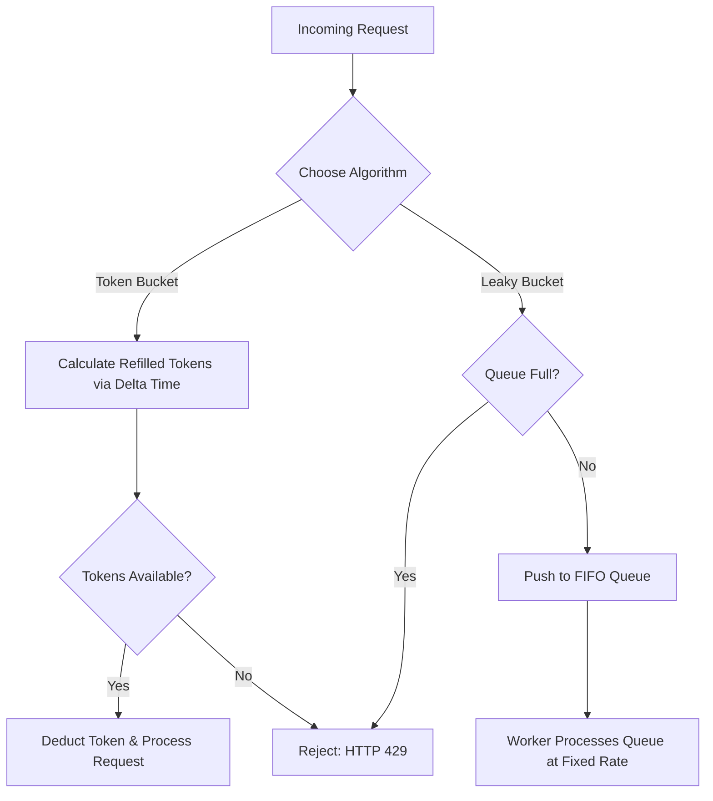

# Scalable Rate Limiting: Token Bucket vs. Leaky Bucket Algorithmic Trade-offs

---

### 1. 💡 The "Big Picture" (Plain English)

#### What is this in simple terms?
A **Rate Limiter** is a traffic control gatekeeper for your system. It controls how many requests a user, service, or IP address can make to your API within a specific timeframe. If someone sends too many requests, the rate limiter blocks them (typically returning an **HTTP 429 Too Many Requests** status).

When building one, two core algorithms dominate system design interviews: **Token Bucket** and **Leaky Bucket**.

#### Real-World Analogies

*   **Token Bucket (The Amusement Park Pass):**
    Imagine a guest holding a small bucket that holds a maximum of 5 ride tokens. Every minute, a park staff member adds 1 new token to the bucket (up to 5 max). To go on a ride, the guest hands over a token. If they saved up 5 tokens, they can jump on 5 rides back-to-back in 10 seconds (**bursting**). But once the bucket is empty, they must wait for the staff member to add more tokens.
    
*   **Leaky Bucket (The Funnel):**
    Imagine a funnel (a bucket with a small hole at the bottom). Water (incoming user requests) gets poured into the funnel in sudden, random bursts. Regardless of how fast water pours in, it drips out of the hole at a **strictly constant rate** into your core system. If you pour water in faster than the funnel's capacity can hold, the bucket overflows (requests are dropped).

```
   Token Bucket: Allows sudden bursts (if tokens exist)
   [ 🎟️ 🎟️ 🎟️ ] ---> Consume immediately ---> [ Fast Processing ]

   Leaky Bucket: Converts bursty input into steady output
   [ 💧💧💧💧 ] === Funnel ===> 💧 ... 💧 ... 💧 ---> [ Constant Rate Processing ]
```

#### Why should I care?
Without rate limiters, your infrastructure is vulnerable to:
1.  **DDoS & Brute Force Attacks:** Malicious actors spamming login or checkout endpoints.
2.  **Resource Exhaustion:** A single client running a buggy `while(true)` loop fetching data can crash your database.
3.  **Uncontrolled Cloud Bills:** Overusing paid 3rd-party APIs (like OpenAI or Twilio) due to unthrottled internal requests.

---

### 2. 🛠️ How it Works (Step-by-Step)

#### Algorithm Steps

##### Token Bucket Mechanics:
1.  Initialize a bucket with maximum capacity $B$ and a refill rate $R$ tokens per second.
2.  When a request arrives, check if available tokens $\ge 1$.
3.  If **yes**: Deduct 1 token and allow the request through.
4.  If **no**: Drop or reject the request (HTTP 429).
5.  *Optimization Trick:* Instead of a background thread actively filling tokens every millisecond, compute tokens **lazily** on request arrival using the formula:  
    $$\text{Tokens}_{\text{new}} = \min(\text{Capacity}, \text{Tokens}_{\text{old}} + (\text{Time}_{\text{now}} - \text{Time}_{\text{last\_refill}}) \times R)$$

##### Leaky Bucket Mechanics:
1.  Maintain a First-In, First-Out (FIFO) Queue of capacity $B$.
2.  When a request arrives, check if the queue is full.
3.  If full, drop the request.
4.  If not full, add the request to the queue.
5.  A background worker pulls requests from the queue at a **fixed output rate** $R$ and processes them.

---

#### Visualizing the Flow



---

#### Thread-Safe Python Implementation (Token Bucket)

Below is a production-style, thread-safe implementation of the **Token Bucket** algorithm using lazy refill math.

```python
import time
import threading

class TokenBucket:
    def __init__(self, capacity: float, refill_rate: float):
        """
        :param capacity: Max tokens the bucket can hold.
        :param refill_rate: Tokens added per second.
        """
        self.capacity = capacity
        self.refill_rate = refill_rate
        self.tokens = capacity
        self.last_refill_timestamp = time.monotonic()
        self._lock = threading.Lock()

    def allow_request(self, tokens_requested: int = 1) -> bool:
        with self._lock:
            now = time.monotonic()
            
            # 1. Lazily calculate elapsed time and add tokens
            elapsed = now - self.last_refill_timestamp
            self.tokens = min(
                self.capacity, 
                self.tokens + elapsed * self.refill_rate
            )
            self.last_refill_timestamp = now

            # 2. Evaluate if request can be fulfilled
            if self.tokens >= tokens_requested:
                self.tokens -= tokens_requested
                return True
            
            return False

# Quick Usage Example
if __name__ == "__main__":
    # Capacity of 3 tokens, recharges 1 token every 2 seconds (0.5 tokens/sec)
    limiter = TokenBucket(capacity=3, refill_rate=0.5)

    # Fire 4 rapid requests
    for i in range(1, 5):
        allowed = limiter.allow_request()
        print(f"Request {i}: {'Allowed ✅' if allowed else 'Rate Limited ❌'}")
```

---

### 3. 🧠 The "Deep Dive" (For the Interview)

#### Distributed Systems & Concurrency Challenges

In high-throughput, distributed environments (e.g., hundreds of API Gateway instances behind a load balancer), running rate limiters in local application memory fails because requests hit different server nodes. 

##### 1. Atomic Operations via Redis + Lua
To centralize state, store bucket values in Redis. However, a standard **Read-Modify-Write** pattern introduces severe **Race Conditions**:

```
[Server A] Read tokens (1)  ------> 
                                   ---> Both allow request! Token count drops to -1 (Bug)
[Server B] Read tokens (1)  ------>
```

**Solution:** Execute the rate-limiting logic inside a single **Redis Lua Script**. Redis executes Lua scripts atomically, guaranteeing thread safety without distributed locks.

```lua
-- Redis Lua Script for Token Bucket
local key = KEYS[1]
local capacity = tonumber(ARGV[1])
local refill_rate = tonumber(ARGV[2])
local now = tonumber(ARGV[3])
local requested = tonumber(ARGV[4])

local info = redis.call("HMGET", key, "tokens", "last_refill")
local tokens = tonumber(info[1])
local last_refill = tonumber(info[2])

if not tokens then
    tokens = capacity
    last_refill = now
else
    local elapsed = now - last_refill
    tokens = math.min(capacity, tokens + elapsed * refill_rate)
end

if tokens >= requested then
    tokens = tokens - requested
    redis.call("HMSET", key, "tokens", tokens, "last_refill", now)
    return 1 -- Allowed
else
    return 0 -- Rejected
```

##### 2. Clock Drift Issues
Distributed servers rely on NTP (Network Time Protocol), which can cause system wall clocks to jump forward or backward.
*   **Fix:** Use monotonic timers (`CLOCK_MONOTONIC` in C/C++, `time.monotonic()` in Python) for single-node calculations, or rely on Redis server's time (`TIME` command) in distributed contexts to ensure single-source-of-truth time measurement.

---

#### Deep Comparison: Token Bucket vs. Leaky Bucket

| Feature | Token Bucket | Leaky Bucket |
| :--- | :--- | :--- |
| **Traffic Shape Output** | **Bursty**: Allows short surges up to capacity $B$. | **Smooth**: Strictly uniform output rate. |
| **Memory Efficiency** | $O(1)$: Stores 2 numbers per user (token count, last timestamp). | $O(N)$: Requires a buffer/queue to hold pending requests. |
| **Latency Impact** | Zero added delay for valid requests. | Adds delay/latency while requests wait in the queue. |
| **Best Used For** | General user-facing APIs, web applications. | Asynchronous job processing, rate-sensitive payment gateways. |

---

#### Interviewer Probe Questions

##### Probe 1: "Token Bucket handles bursts, but what if a burst crashes our database?"
*   **Answer:** That is the primary trade-off of Token Bucket. If downstream protection requires strict traffic smoothing, we should use a **Leaky Bucket** (or a Token Bucket coupled with a strict downstream Rate Limiter/Circuit Breaker). Leaky Bucket acts as a buffer that normalizes traffic spikes into a consistent, predictable flow.

##### Probe 2: "How do you handle rate limiting at global scale (billions of requests) without making Redis a bottle-neck?"
*   **Answer:** Apply a **Hybrid/Two-Tier Architecture**:
    1.  **In-Memory Local Throttling:** Every API Gateway node maintains a local bucket batch (e.g., syncs with Redis every 1 second or buys token 'leases' in bulk).
    2.  **Eventual Consistency:** Accept slight accuracy trade-offs in exchange for zero network round-trips to Redis on every single API request.
    3.  **Sharding:** Hash user IDs across multiple Redis instances (Redis Cluster) to distribute key read/write operations evenly.

##### Probe 3: "How do you distinguish between rate limiting per user vs. per IP address?"
*   **Answer:**
    *   **Per-IP:** Used for unauthenticated endpoints (login, register). *Risk:* NAT gateways (offices, universities) share public IPs, causing false-positive blocking for innocent users.
    *   **Per-User (JWT/API Key):** Used for authenticated requests. Much fairer and accurate.
    *   **Hybrid:** Rate limit unauthenticated routes by IP + User-Agent fingerprints, and authenticated routes strictly by User ID/Tenant ID.

---

### 4. ✅ Summary Cheat Sheet

#### 3 Key Takeaways
1.  **Token Bucket** is optimized for low latency and bursty traffic; **Leaky Bucket** is optimized for steadying traffic flow and protecting sensitive downstream systems.
2.  Always use **Lazy Evaluation Math** ($\Delta \text{Time} \times \text{Refill Rate}$) instead of running active background timers per user.
3.  In distributed architectures, use **Redis + Lua scripts** to perform atomic rate-checking without race conditions.

#### The Golden Rule
> **Choose Token Bucket by default for general web APIs due to memory efficiency and support for user bursts; switch to Leaky Bucket when your downstream service strictly requires a constant processing rate.**