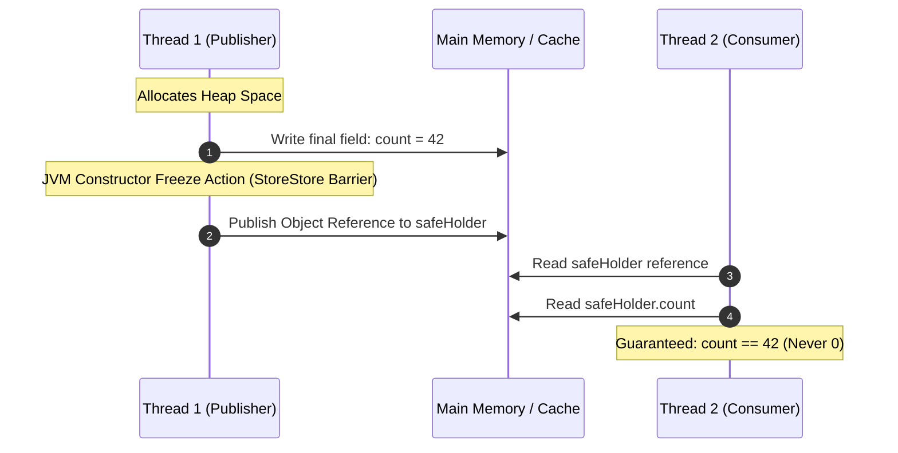

# JVM Memory Model: Safe Publication, Final Field Semantics, and Constructor Freeze Actions

---

### 1. 💡 The "Big Picture" (Plain English)

#### What is this in simple terms?
When one thread creates a Java object and passes it to another thread, there is a dangerous hidden risk: the receiving thread might see a **half-baked object**. Modern CPUs and JIT compilers aggressively reorder instructions for speed. Without specific rules, a thread might observe the reference to an object *before* its internal fields have finished being written to memory. 

**Safe Publication** and the JVM’s **Final Field Semantics** are the Memory Model rules that guarantee an object is fully constructed before any other thread can look inside it.

```
Unsafe World:   [Create Shell] -> [Share Address] 💥 -> [Finish Building Inside]
Safe World:     [Create Shell] -> [Finish Building] -> [Freeze Barrier] -> [Share Address] ✅
```

#### Real-World Analogy
Imagine ordering a custom-built house. 
* **Unsafe Publication:** The contractor gives you the front door key (reference) the second the foundation is laid. You walk in, flip the light switch, and get electrocuted because the electricians are still working behind the walls.
* **Safe Publication with `final`:** The city inspector places an official **"Occupancy Certificate" (Freeze Action)** on the door only *after* all plumbing and wiring are completed. You are only handed the key once the house is 100% stable.

#### Why should I care? What problem does it solve for me today?
1. **Heisenbugs in Production:** A multi-threaded service might run fine on your developer laptop (often x86 architecture with strong memory ordering) but throw random `NullPointerExceptions` or read default values (`0`, `false`, `null`) when deployed to cloud servers running ARM processors (like AWS Graviton).
2. **True Immutability:** It explains why classes like `String` and `UUID` can be safely shared across hundreds of threads without locks or synchronization.

---

### 2. 🛠️ How it Works (Step-by-Step)

The Java Virtual Machine Memory Model (JSR-133) defines a formal mechanism called a **Freeze Action** at the end of constructors containing `final` fields.

```
========================================================================================
                               CONSTRUCTOR EXECUTION FLOW
========================================================================================

  Thread 1 (Creator):
  [ 1. Allocate Memory ] 
           │
           ▼
  [ 2. Write normal & final fields ] 
           │
           ▼
  [ 3. Freeze Action (StoreStore Barrier) ] <─── Prevents writes from floating below!
           │
           ▼
  [ 4. Assign reference to variable ]

----------------------------------------------------------------------------------------

  Thread 2 (Reader):
  [ 1. Read Reference ] 
           │
           ▼
  [ 2. Read Fields ] <── Guaranteed to see values initialized before the Freeze Action!
========================================================================================
```

#### The Lifecycle Step-by-Step:
1. **Memory Allocation:** The JVM allocates raw zeroed-out memory on the heap for the object.
2. **Field Assignment:** Constructor code executes, writing initial values into fields.
3. **The "Freeze Action":** When the constructor ends, the JVM places a compiler/hardware memory barrier (specifically a `StoreStore` barrier) after writes to all `final` fields.
4. **Safe Dereferencing:** The reference is published. Any thread that obtains this reference is mathematically guaranteed to read the initialized values of `final` fields without needing locks.

#### Code Comparison: Unsafe vs. Safe Publication

```java
public class SafePublicationDemo {

    // --- UNSAFE PATTERN ---
    static class UnsafeResource {
        private int count; // Non-final: Can be reordered!

        public UnsafeResource(int count) {
            this.count = count; // Write 1
            // NO Freeze barrier here!
        }
        public int getCount() { return count; }
    }

    // --- SAFE PATTERN ---
    static class SafeResource {
        private final int count; // Final: Enforces Freeze Action!

        public SafeResource(int count) {
            this.count = count; // Write 1
            // JVM automatically inserts a Freeze Action (StoreStore barrier) here!
        }
        public int getCount() { return count; }
    }

    // Shared references published without locks
    public static UnsafeResource unsafeHolder;
    public static SafeResource safeHolder;

    // Thread A: Publisher
    public void publish() {
        // May reorder: unsafeHolder points to allocated memory BEFORE count is written!
        unsafeHolder = new UnsafeResource(42); 

        // SAFE: Freeze action guarantees count=42 is visible BEFORE safeHolder is assigned
        safeHolder = new SafeResource(42); 
    }

    // Thread B: Consumer
    public void consume() {
        if (unsafeHolder != null) {
            // DANGER: Can print 0 on ARM/PowerPC architectures!
            System.out.println(unsafeHolder.getCount()); 
        }

        if (safeHolder != null) {
            // GUARANTEED: Always prints 42 on all CPU architectures!
            System.out.println(safeHolder.getCount()); 
        }
    }
}
```



---

### 3. 🧠 The "Deep Dive" (For the Interview)

#### The Internal Mechanics: JSR-133 and Memory Barriers
Under JSR-133, the Java Memory Model specifies two formal rules for `final` fields:

1. **Freeze Rule on Write:** A write to a `final` field inside a constructor *happens-before* the freeze action at the end of the constructor. The freeze action *happens-before* any initial reference assignment of that object to another variable.
   * On hardware, this translates to a **`StoreStore` barrier** (or `dmb.ish` on ARM64) placed right before the constructor returns. It blocks the CPU from reordering the pointer publication ahead of the field stores.
2. **Dereference Rule on Read:** The initial read of a reference to an object *happens-before* any subsequent read of a `final` field of that object.
   * On weakly ordered CPUs like Alpha/ARM, this prevents the CPU from speculatively reading stale cached field data before reading the reference pointer.

#### The "Escaped `this`" Trap
The freeze action **only** protects you if the reference to the object does not escape the constructor before it finishes.

```java
public class BrokenEscape {
    public static BrokenEscape instance;
    private final int value;

    public BrokenEscape() {
        this.value = 100;
        // FATAL FLAW: 'this' escapes BEFORE the constructor freeze action!
        instance = this; 
    }
}
```
If another thread reads `BrokenEscape.instance` at that exact microsecond, it bypasses the freeze action and can read `value == 0`.

#### Trade-offs
* **Immutability vs. Allocation Overhead:** Ensuring safe publication via immutable objects (`final` fields everywhere) requires creating new instances on change rather than mutating in place. This increases GC pressure, though modern generational GCs (like G1 and Generational ZGC) collect short-lived objects efficiently via TLABs.
* **Architecture Penalties:** On **x86/x64**, CPU stores are already ordered (Total Store Order - TSO). Thus, a `StoreStore` barrier is essentially a compiler-only no-op (zero CPU cycles). However, on **ARM64 / Apple Silicon**, hardware memory barrier instructions (`dmb`) must be emitted, carrying a minor CPU cycle cost.

---

### 4. 💡 Interviewer Probes: How They Test You

#### Probe 1: *"Why does Double-Checked Locking (DCL) break without `volatile`, even if the fields in the Singleton are set?"*
* **Candidate Answer:** "Without `volatile`, the instruction sequence `new Singleton()` involves three operations: *1. Allocate memory*, *2. Invoke `<init>`*, and *3. Assign reference*. The compiler/CPU can reorder step 3 before step 2. Thread B can see a non-null instance variable and access its non-final fields while Thread A is still executing the constructor. `volatile` introduces an acquire/release barrier that prohibits this reordering."

#### Probe 2: *"Can a `final` field ever be observed to change its value at runtime?"*
* **Candidate Answer:** "Yes, in two scenarios:
  1. **Constructor Escape:** If the `this` reference leaks before the constructor completes.
  2. **Reflection / `VarHandle`:** If reflection modifies a `final` field after construction. However, the JMM does not guarantee visibility of reflected writes to other threads, and the JIT compiler often aggressively inlines/constant-folds `final` values into machine code, leading to situations where different threads see different values forever."

#### Probe 3: *"Why is `String` considered thread-safe even though it caches its `hash` code in a non-final mutable `int` field?"*
* **Candidate Answer:** "The internal byte array `value` of a `String` is `final`, ensuring safe publication of the actual characters across threads. The `hash` field is not `final`, but its computation is *idempotent* (pure and deterministic). If multiple threads calculate the hash simultaneously without synchronization, they will all compute the exact same `int` and overwrite it safely (benign data race)."

---

### 5. ✅ Summary Cheat Sheet

```
+---------------------------+-------------------------------------------------------------+
| Concept                   | Guarantee                                                   |
+---------------------------+-------------------------------------------------------------+
| final field               | Freeze Action (StoreStore barrier) at end of constructor.   |
| Safe Publication          | Reference shared ONLY after full initialization.           |
| Escaped 'this'            | Destroys all final-field memory guarantees!                |
| CPU Differences           | x86 hides ordering bugs; ARM/Graviton will expose them.    |
+---------------------------+-------------------------------------------------------------+
```

* **3 Key Takeaways:**
  1. Making fields `final` is not just about code design; it tells the JVM to insert **hardware-level memory barriers** that guarantee visibility across threads.
  2. Never let the `this` pointer escape a constructor (e.g., passing `this` to listeners, starting threads inside constructors).
  3. Safe publication requires either **immutable state (`final`)**, **volatile references**, or **locking/static initializers**.

* **The Golden Rule:**
  > *"An object is only safely published if its construction is completely finished and frozen before its reference becomes visible to the rest of the world."*