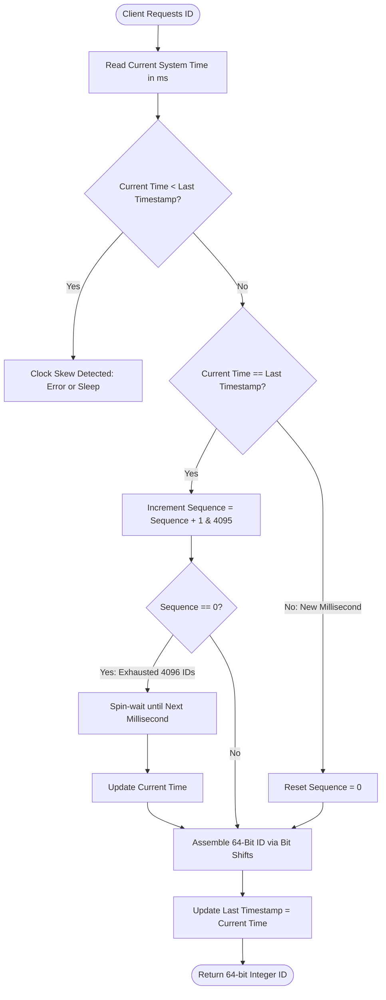

# Distributed System Primitives: Designing a 64-Bit Snowflake ID Generator

---

### 1. 💡 The "Big Picture" (Plain English)

#### What is this in simple terms?
A **Snowflake ID Generator** is a decentralized algorithm that produces unique, 64-bit numeric identifiers (like `1583920194857201664`) across thousands of independent servers without requiring a central database or cross-network locking.

#### Real-World Analogy
Imagine a massive international automotive conglomerate with 1,024 regional assembly plants.
* **The Naive Way:** Every time any plant builds a car, it calls a central headquarters in Geneva over the phone: *"Hey, what's the next serial number?"* Geneva answers *"#4,000,102"*. If the phone line cuts or Geneva gets overwhelmed, all global production stops.
* **The Snowflake Way:** Geneva gives each plant a permanent **Plant ID** (e.g., Plant #42). The plant stamps its own serial numbers using a strict formula: 
  $$\text{Serial} = [\text{Current Millisecond}] + [\text{Plant \#42}] + [\text{Local Car Counter for this millisecond}]$$
No phone calls, no central bottlenecks, no duplicate serial numbers—and every car's serial number naturally tells you roughly when and where it was built.

```
+-----------------------------------------------------------------------+
| Naive Centralized Counter           | Snowflake Distributed Pattern   |
+-----------------------------------------------------------------------+
| [Worker 1] ---\                     | [Worker 1 (ID: 01)] -> Local Gen|
| [Worker 2] ----> [DB: Next ID?]     | [Worker 2 (ID: 02)] -> Local Gen|
| [Worker 3] ---/  (Bottleneck/SPOF!) | [Worker 3 (ID: 03)] -> Local Gen|
+-----------------------------------------------------------------------+
```

#### Why should I care? What problem does it solve today?
1. **Database Bottlenecks:** Traditional auto-increment IDs (`AUTO_INCREMENT` or `SERIAL`) require a central database leader. When you write millions of records per second across sharded databases, the central ID generator becomes your single point of failure and primary throughput bottleneck.
2. **UUID Inefficiencies:** Standard UUIDs (UUIDv4) are 128-bit strings. When indexed in a relational database (like a B-Tree index in MySQL/PostgreSQL), completely random UUIDs cause severe page fragmentation and random disk I/O, degrading write performance.
3. **Snowflake Solves Both:** It generates compact **64-bit integers** (fits natively in standard CPU registers and database `BIGINT` types) that are **roughly time-sorted (k-ordered)**, keeping database index writes sequential and blazing fast.

---

### 2. 🛠️ How it Works (Step-by-Step)

A Snowflake ID is a 64-bit integer composed of four distinct bit segments:

```
 1 Bit    41 Bits                  5 Bits     5 Bits     12 Bits
+-------+------------------------+----------+----------+------------------+
|   0   | Epoch Milliseconds     | Datacenter| Worker   | Sequence Counter |
| (Sign)| (~69 years lifespan)   | ID (0-31)| ID (0-31)| (0-4095 / ms)    |
+-------+------------------------+----------+----------+------------------+
```

1. **Sign Bit (1 bit):** Set to `0` so the number remains positive in programming languages with signed integers (e.g., Java's `long`).
2. **Timestamp (41 bits):** Milliseconds elapsed since a custom epoch (e.g., when your company launched). $2^{41}$ milliseconds $\approx 69.73\text{ years}$.
3. **Datacenter ID (5 bits):** Supports up to $2^5 = 32$ datacenters.
4. **Worker/Machine ID (5 bits):** Supports up to $2^5 = 32$ worker nodes per datacenter (total $32 \times 32 = 1,024$ unique generation nodes).
5. **Sequence Number (12 bits):** A local rollover counter ($2^{12} = 4,096$ IDs per millisecond per worker). If a worker generates more than 4,096 IDs in the same millisecond, it waits for the next millisecond.

#### ID Generation Flowchart



#### Production-Grade Implementation (Python)

```python
import time
import threading

class SnowflakeIDGenerator:
    def __init__(self, datacenter_id: int, worker_id: int, custom_epoch: int = 1704067200000):
        # 1704067200000 = 2024-01-01 00:00:00 UTC
        self.custom_epoch = custom_epoch
        
        # Bit allocations
        self.datacenter_id_bits = 5
        self.worker_id_bits = 5
        self.sequence_bits = 12
        
        # Max values calculated using bitmask arithmetic
        self.max_datacenter_id = -1 ^ (-1 << self.datacenter_id_bits)  # 31
        self.max_worker_id = -1 ^ (-1 << self.worker_id_bits)          # 31
        self.max_sequence = -1 ^ (-1 << self.sequence_bits)            # 4095
        
        # Bit shifts
        self.worker_id_shift = self.sequence_bits                      # 12
        self.datacenter_id_shift = self.sequence_bits + self.worker_id_bits # 17
        self.timestamp_left_shift = self.sequence_bits + self.worker_id_bits + self.datacenter_id_bits # 22
        
        # Validation
        if datacenter_id < 0 or datacenter_id > self.max_datacenter_id:
            raise ValueError(f"Datacenter ID must be between 0 and {self.max_datacenter_id}")
        if worker_id < 0 or worker_id > self.max_worker_id:
            raise ValueError(f"Worker ID must be between 0 and {self.max_worker_id}")
            
        self.datacenter_id = datacenter_id
        self.worker_id = worker_id
        
        # Generator State
        self.sequence = 0
        self.last_timestamp = -1
        self._lock = threading.Lock()

    def _current_millis(self) -> int:
        return int(time.time() * 1000)

    def _wait_next_millis(self, last_timestamp: int) -> int:
        timestamp = self._current_millis()
        while timestamp <= last_timestamp:
            timestamp = self._current_millis()
        return timestamp

    def next_id(self) -> int:
        with self._lock:
            timestamp = self._current_millis()
            
            # Clock moved backwards (NTP skew detected)
            if timestamp < self.last_timestamp:
                drift = self.last_timestamp - timestamp
                raise RuntimeError(f"Clock moved backwards! Rejecting requests for {drift}ms")
                
            # Same millisecond: increment sequence
            if timestamp == self.last_timestamp:
                self.sequence = (self.sequence + 1) & self.max_sequence
                if self.sequence == 0:
                    # 4096 IDs exhausted in this millisecond; block until next ms
                    timestamp = self._wait_next_millis(self.last_timestamp)
            else:
                # New millisecond: reset sequence counter
                self.sequence = 0
                
            self.last_timestamp = timestamp
            
            # Construct the 64-bit integer using bitwise OR and bitwise Shifts
            snowflake_id = (
                ((timestamp - self.custom_epoch) << self.timestamp_left_shift) |
                (self.datacenter_id << self.datacenter_id_shift) |
                (self.worker_id << self.worker_id_shift) |
                self.sequence
            )
            return snowflake_id

# Example Usage
if __name__ == "__main__":
    generator = SnowflakeIDGenerator(datacenter_id=1, worker_id=3)
    generated_id = generator.next_id()
    print(f"Generated Snowflake ID: {generated_id}")
    print(f"Binary Representation: {bin(generated_id)}")
```

---

### 3. 🧠 The "Deep Dive" (For the Interview)

#### Deep Technical Internals
1. **K-Sortable / B-Tree Index Locality:**
   Because the most significant bits (excluding the sign bit) represent time, Snowflake IDs are **k-ordered** (roughly time-sorted). When inserted into a relational database B+Tree clustered index (like InnoDB in MySQL), new entries are appended monotonically to the end leaf pages rather than inserted randomly. This avoids frequent page splits, reduces disk I/O, and keeps write amplification low.
2. **Epoch Millisecond Math:**
   If using the standard Unix epoch (`1970-01-01`), 41 bits would expire in $1970 + 69.7 = 2039$. By setting a custom epoch (e.g., $2024-01-01$), the generator remains fully operational until approximately $2024 + 69.7 = 2093\text{ AD}$.

#### Trade-offs & Limitations

| Advantage | Limitation / Cost |
| :--- | :--- |
| **Ultra-High Throughput:** Autonomous generation; up to 4.096M IDs/sec per node with $0$ network latency. | **Clock Drift Sensitivity:** Vulnerable to NTP adjustments or leap seconds. |
| **Compact Size (64-bit):** Half the memory/storage footprint of UUIDv4 (128-bit) and fits in a standard `BIGINT`. | **Node Scaling Cap:** Fixed at 1,024 worker nodes unless you change bit allocation. |
| **Chronologically Ordered:** Great for B-Tree indexing and time-range filtering. | **Security / Leakage:** Timestamp and worker IDs are publicly decipherable, revealing business metrics (e.g., order volume). |

#### Tricky Interviewer Probes

##### Probe 1: *"What happens if the system clock synchronizes via NTP and steps backwards by 50 milliseconds?"*
* **Candidate Answer:** "If the clock steps backwards, the generator risks producing duplicate IDs because a prior millisecond's timestamp could be reused. We can handle this in three tiers:
  1. **Short skew ($<5\text{ms}$):** Busy-wait/sleep until `current_time == last_timestamp`.
  2. **Large skew ($>5\text{ms}$):** Refuse generation and immediately raise an alert/exception so traffic routes to other healthy nodes.
  3. **Infrastructure Prevention:** Configure NTP daemons to use **clock slewing** (gradual microsecond adjustments, e.g., using `chrony` or `adjtime()`) rather than abrupt clock stepping."

##### Probe 2: *"How do you dynamically assign the 5-bit Datacenter and Worker IDs in an elastic, containerized environment like Kubernetes?"*
* **Candidate Answer:** "Instead of hardcoding configurations:
  * **StatefulSets:** Use Kubernetes StatefulSets where each Pod receives a stable ordinal index (`pod-0`, `pod-1`), directly mapped to the Worker ID.
  * **Distributed Registry:** Use a consensus store like **Apache ZooKeeper**, **Consul**, or **Etcd**. When a generator pod boots, it registers an ephemeral sequential znode (e.g., `/workers/worker-0000000012`). The assigned sequence number modulo 1,024 becomes its Worker ID. When the pod dies, the ephemeral lease expires and releases the ID."

##### Probe 3: *"Why not use 64-bit random numbers or UUIDv4 if collisions are statistically improbable?"*
* **Candidate Answer:** "UUIDv4 is 128-bit (double the storage footprint) and completely non-sequential. In high-write relational databases, random inserts into a clustered B+Tree index trigger random memory access, constant page splits, and cache evictions. Snowflake IDs give us the distribution independence of UUIDs combined with the sequential append performance of auto-incrementing integers."

---

### 4. ✅ Summary Cheat Sheet

#### 3 Key Takeaways
1. **64-Bit Bitwise Composition:** 1 sign bit + 41-bit custom timestamp ($\approx 69\text{ yrs}$) + 10-bit machine/worker ID ($1,024\text{ nodes}$) + 12-bit sequence ($4,096\text{ IDs/ms/node}$).
2. **Zero-Coordination High Throughput:** Each node generates unique, collision-free IDs locally in memory without distributed locks or network hops.
3. **B+Tree Friendly:** Roughly chronologically sorted (k-ordered), preventing index fragmentation and write amplification.

#### 1 "Golden Rule" to Remember
> **"Snowflake trades clock dependency for network independence."** It achieves blazing-fast, zero-coordination ID generation by trusting the local clock; therefore, NTP clock drift management is mandatory.