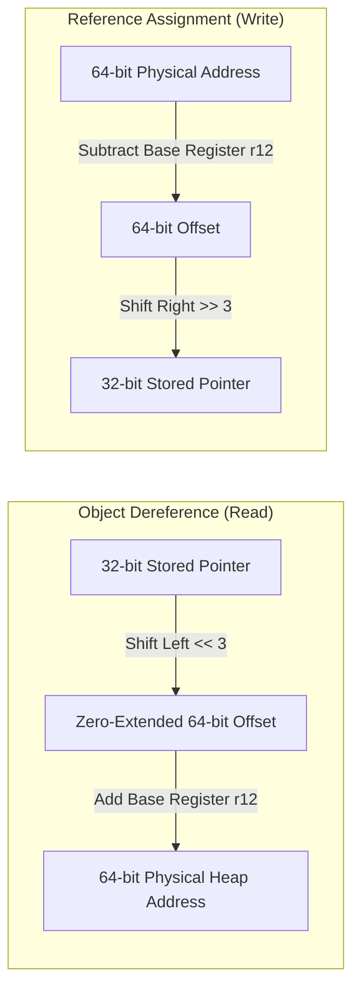

# Compressed OOPs (Ordinary Object Pointers) & Heap Alignment Tuning

---

### 1. 💡 The "Big Picture" (Plain English)

#### What is this in simple terms?
On a 64-bit system, every memory reference (pointer) is 8 bytes (64 bits) wide. This allows programs to address petabytes of memory, but it doubles the size of every single reference compared to older 32-bit systems. 

**Compressed OOPs (Ordinary Object Pointers)** is a JVM optimization technique that shrinks these 64-bit pointers back down to 32 bits (4 bytes) inside managed heaps up to **32 GB**, drastically reducing memory overhead and improving CPU cache efficiency without losing the benefits of a 64-bit runtime.

#### The Real-World Analogy
Imagine a massive warehouse with thousands of storage bays. 
* **Uncompressed 64-bit pointers:** The manager writes down exact foot-by-foot coordinates for every item: `"Row 12, Foot 0"`, `"Row 12, Foot 8"`, `"Row 12, Foot 16"`. Writing these long numbers requires large clipboards and slows down workers reading them.
* **Compressed OOPs:** Because every pallet occupies a standard 8-foot slot, the manager drops the exact foot coordinates and writes **pallet numbers**: `"Slot 0"`, `"Slot 1"`, `"Slot 2"`. A 4-digit slot number can now address a warehouse that is 8 times larger. When a worker walks to the pallet, they simply multiply the slot number by 8 to get the exact foot coordinate.

#### Why should I care?
* **The "32 GB Cliff":** A Java application with a `-Xmx31g` heap often holds **more live business data** than an application running with `-Xmx33g`. Crossing 32 GB disables pointer compression, instantly inflating your object headers and reference fields by ~30–40% and blowing up your L1/L2/L3 cache misses.
* **GC Pause Reductions:** Smaller references mean less data for Garbage Collectors (G1, ZGC, Parallel) to scan, copy, and compact, directly lowering GC pause times.

---

### 2. 🛠️ How it Works (Step-by-Step)

Pointer compression relies on **8-byte object alignment** (all objects in the JVM start at memory addresses divisible by 8, meaning the lowest 3 bits of an address are always `000`).

```
Step 1: Allocation
  Object created at 64-bit native address: 0x00000006_40000000 (divisible by 8).

Step 2: Compression (Storing reference in Heap)
  The JVM drops the last 3 zero-bits (Logical Right Shift: >> 3).
  Address is stored as a 32-bit integer: 0xC8000000.

Step 3: De-compression (Reading reference into CPU register)
  CPU executes a bitwise shift left (Logical Left Shift: << 3) and adds Heap Base:
  Decoded = (Compressed_Pointer << 3) + Heap_Base_Address
```

#### Memory Representation Diagram

```
Native 64-bit Address:
+-------------------------------------------------------------+
| 00000000 00000000 00000000 00000110 01000000 ... 00000 000 | (64-bit Pointer)
+-------------------------------------------------------------+
                                                             \
                                [ Shift Right 3 Bits (>> 3) ] \ Drop lowest 3 zeros
                                                               v
Compressed 32-bit Reference:
+-------------------------------------------------------------+
|               00001100 10000000 00000000 00000000           | (Stored on Heap)
+-------------------------------------------------------------+
```

#### Visualizing the Mechanics



#### Demonstrating Object Header Overhead

Using Java Object Layout (JOL) principles, observe the field-level memory savings:

```java
// Run with:
// Case A (Compressed): -Xmx4g  -XX:+UseCompressedOops -XX:+UseCompressedClassPointers
// Case B (Uncompressed): -Xmx36g -XX:-UseCompressedOops -XX:-UseCompressedClassPointers

public class UserSession {
    // 64-bit JVM Header: Mark Word (8 bytes)
    // Compressed:   Klass Word = 4 bytes (12 bytes total header + 4 byte padding = 16 bytes)
    // Uncompressed: Klass Word = 8 bytes (16 bytes total header)
    
    private int userId;         // 4 bytes
    private String username;    // 4 bytes (Compressed OOP) vs 8 bytes (Uncompressed)
    private String email;       // 4 bytes (Compressed OOP) vs 8 bytes (Uncompressed)
    private byte[] sessionData; // 4 bytes (Compressed OOP) vs 8 bytes (Uncompressed)
    
    /* 
     * TOTAL INSTANCE SIZE:
     * - With Compressed OOPs:    16 (header+padding) + 4 (int) + 3*4 (refs) + 4 (padding) = 36 -> aligned to 40 bytes.
     * - Without Compressed OOPs: 16 (header)         + 4 (int) + 3*8 (refs) + 4 (padding) = 48 bytes.
     *
     * Result: The exact same object consumes 20% more heap without compressed OOPs.
     * The payload (references) doubles in size, spilling out of CPU L1/L2 caches.
     */
}
```

---

### 3. 🧠 The "Deep Dive" (For the Interview)

#### The Three Modes of Compressed OOPs
The JVM automatically selects the compression mode based on the allocated `-Xmx`:

1. **32-bit Zero-Based (`[0 GB to 4 GB]`):** 
   Heap is allocated in the low 4GB virtual address space. No bit-shifting or base-addition is needed. A 32-bit pointer directly addresses bytes.
2. **Zero-Based Compressed OOPs (`[4 GB to ~28-32 GB]` depending on OS):** 
   Heap base is `0x0`. Pointer decoding only requires a 3-bit left shift: `Address = CompressedPtr << 3`. No addition with a base register is required.
3. **Heap-Based Compressed OOPs (`[Up to 32 GB]` when zero-base allocation fails):**
   The OS cannot allocate starting at `0x0`. Decoding requires an `R12` base register addition: `Address = Base_Reg + (CompressedPtr << 3)`. Adds minimal CPU overhead.

#### The 32 GB Cliff & Alignment Scaling
$2^{32} \text{ addresses} \times 8 \text{ bytes (alignment)} = 34,359,738,368 \text{ bytes} = 32 \text{ GB}$.

If you allocate **32.5 GB (`-Xmx32500m`)**:
* Compressed OOPs turn off automatically.
* All object references expand from 4 bytes to 8 bytes.
* Total memory footprint expands by ~25%–40%.
* **Effective capacity:** A 32.5 GB heap holds *less usable application data* than a 31 GB heap.

```
Usable Data Capacity Comparison:
[-Xmx31g with +UseCompressedOops]  ████████████████████ (High Payload Density)
[-Xmx33g with -UseCompressedOops]  █████████████▒▒▒▒▒▒▒ (Lost to 8-byte pointer bloat)
```

#### Scaling Beyond 32 GB with Object Alignment Tuning
You can extend Compressed OOPs up to 64 GB by setting 16-byte alignment:
`-XX:ObjectAlignmentInBytes=16` $\rightarrow 2^{32} \times 16 = 64 \text{ GB}$ (shifts by 4 bits).

* **The Catch:** Every object is padded to multiples of 16 bytes. If an application creates millions of small objects (e.g., small strings, nodes), the internal padding (fragmentation inside the object) often wastes more memory than 8-byte pointers would have consumed.

---

### Interviewer Probe Questions

#### 1. "We increased our production heap from 30 GB to 34 GB to solve out-of-memory errors, but the application ran slower and OOM occurred faster. Why?"
**Strong Answer:** 
> "Crossing the 32 GB threshold disabled Compressed OOPs (`-XX:+UseCompressedOops`). Pointers expanded from 4 bytes to 8 bytes, and object headers grew. This pointer inflation consumed an extra 4 to 8 bytes per reference across every cached object, collection, and class reference, resulting in roughly 20-30% less effective heap space than before. Furthermore, CPU L1/L2 cache hit rates plummeted because fewer pointers fit inside a 64-byte cache line, causing GC pause times and thread CPU usage to spike."

#### 2. "How does `-XX:ObjectAlignmentInBytes=16` work, and why wouldn't we always enable it to get a 64 GB compressed heap?"
**Strong Answer:** 
> "It shifts pointers by 4 bits instead of 3, allowing 32-bit addresses to reference 16-byte boundaries ($2^{32} \times 16 = 64 \text{ GB}$). However, it enforces that every single object size must be a multiple of 16 bytes. Small objects that naturally fit in 24 or 40 bytes are padded out to 32 or 48 bytes. Unless your average object size is large, the padding overhead (slack memory) negates the savings of the 4-byte reference, rendering it counterproductive for small-object workloads."

#### 3. "Does Compressed OOPs have an impact on CPU instruction pipelines?"
**Strong Answer:** 
> "Yes, but it is overwhelmingly positive. While decoding requires an extra shift/add operation (`lea` instruction on x86: `mov rbx, [r12 + rax*8]`), modern out-of-order CPU execution pipelines hide this single-cycle latency easily. The massive win comes from fitting twice as many object references inside each 64-byte L1/L2/L3 CPU cache line, reducing memory bus traffic and RAM read stalls."

---

### 4. ✅ Summary Cheat Sheet

* **3 Key Takeaways:**
  1. **Compressed OOPs** converts 64-bit memory addresses to 32-bit relative offsets using an 8-byte alignment bit-shift (`>> 3`), saving up to 40% memory overhead.
  2. **The 32 GB Cliff:** Never configure a heap between 31.5 GB and ~38 GB. Either stay at `<= 31 GB` with compressed pointers enabled or jump directly to `>= 48 GB` to compensate for reference expansion.
  3. **CPU Cache Density:** 4-byte references pack double the pointers per CPU cache line compared to 8-byte references, lowering L1/L2 data cache misses and accelerating GC phase traversals.

* **Golden Rule:**
  > **"Never set `-Xmx` between 32 GB and 36 GB—keep your heap at 31 GB for maximum density, or scale past 40 GB to overcome the 64-bit pointer penalty."**