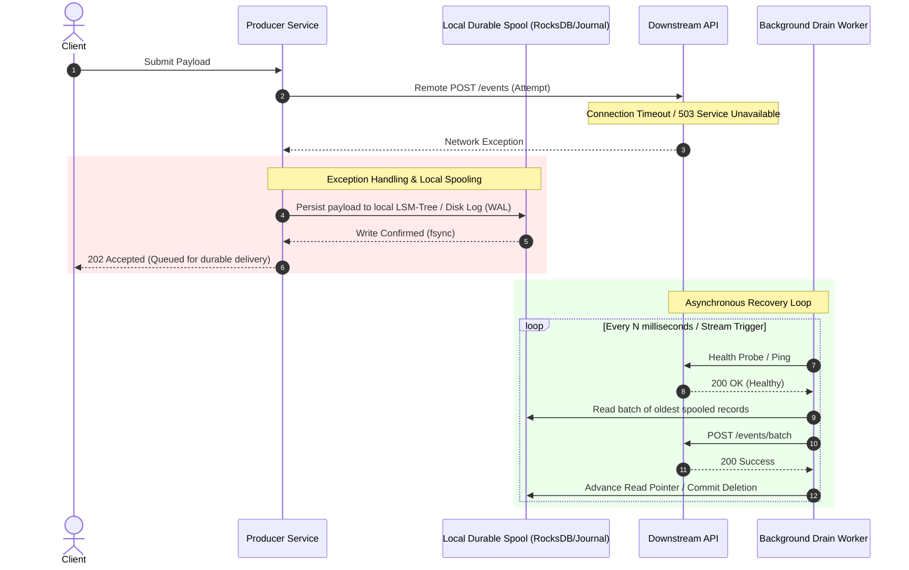

# The Store-and-Forward Pattern: Local Durable Spooling for Remote Outages

---

### 1. 💡 The "Big Picture" (Plain English)

#### What is this in simple terms?
When a service fails to send data to a downstream remote dependency due to a network partition or remote outage, instead of throwing an unhandled exception, dropping the request, or crashing due to memory bloat, it catches the failure and safely writes the payload to **local, durable storage (like an embedded disk journal or local database)**. Once the downstream system recovers, a background worker transparently replays the stored requests.

```
                  ┌────────────────────────┐
                  │   Incoming Traffic     │
                  └───────────┬────────────┘
                              │
                              ▼
                   [ Service / Gateway ]
                              │
               (Remote Call Fails / Throws Ex)
                              │
                              ▼
             ┌─────────────────────────────────┐
             │ Caught! Write to Local Disk Log │
             └────────────────┬────────────────┘
                              │
                 (Downstream Heals Later)
                              │
                              ▼
             ┌─────────────────────────────────┐
             │ Background Spool Replayer Drains│
             │       Payloads Downstream       │
             └─────────────────────────────────┘
```

#### Real-World Analogy
Imagine an **airplane point-of-sale terminal** (like buying a coffee at 35,000 feet) or a food truck in a dead zone. The credit card terminal cannot reach Visa’s central servers because the internet is down. Instead of rejecting your purchase (and losing the sale), the terminal verifies the card locally, encrypts the transaction, and safely writes it to its internal flash memory ("Store"). When the plane lands and connects to airport Wi-Fi, the terminal uploads all stored transactions in batches ("Forward").

#### Why should I care? What problem does it solve for me today?
1. **Zero Data Loss for Write-Heavy Ingestion:** Critical logs, metrics, IoT sensor data, payment authorizations, and telemetry cannot afford to be dropped simply because downstream networks flicker.
2. **Elimination of In-Memory Out-Of-Memory (OOM) Crashes:** When downstream services crash, in-memory retry queues rapidly fill up and consume RAM. Local disk spooling prevents your service from blowing up its own heap memory while waiting for the dependency to recover.

---

### 2. 🛠️ How it Works (Step-by-Step)



#### Step-by-Step Lifecycle
1. **Try Primary Route:** The application attempts to send the data across the network boundary to the downstream service.
2. **Catch & Isolate Failure:** If an `IOException`, `TimeoutException`, or `5xx Server Error` occurs, the exception handler catches it.
3. **Persist to Local Storage:** The caught payload is serialized and appended immediately to a crash-resilient, embedded local storage engine (e.g., RocksDB, SQLite, or a write-ahead log).
4. **Respond to Caller:** The client receives an acknowledgment (e.g., `202 Accepted`) indicating the message has been accepted durably.
5. **Background Recovery:** An independent drain worker constantly monitors downstream health. When downstream latency and error rates return to normal, it streams the stored records from the local disk to the downstream service in ordered batches.

#### Clean Code Implementation (TypeScript / Node.js with Embedded Storage Concept)

```typescript
import { Level } from 'level'; // Fast, embedded disk-backed key-value store (LSM-tree)

interface MessagePayload {
  id: string;
  data: Record<string, unknown>;
  createdAt: number;
}

export class ResilientDispatcher {
  private localSpoolDb: Level<string, string>;
  private isReplaying = false;

  constructor(spoolDirectory: string) {
    // Durable embedded disk storage on the local container/machine volume
    this.localSpoolDb = new Level<string, string>(spoolDirectory);
    this.startBackgroundReplayer();
  }

  /**
   * Main dispatch method with Store-and-Forward exception handling
   */
  public async dispatch(message: MessagePayload): Promise<{ status: string; spooled: boolean }> {
    try {
      // 1. Attempt live delivery
      await this.sendToRemoteService(message);
      return { status: 'DELIVERED', spooled: false };
    } catch (error) {
      // 2. Catch network/remote exceptions and divert to local disk
      console.warn(`Downstream failure for message ${message.id}. Spooling to local disk...`);
      await this.spoolLocally(message);
      return { status: 'ACCEPTED_LOCALLY', spooled: true };
    }
  }

  private async spoolLocally(message: MessagePayload): Promise<void> {
    // Prefix key with timestamp to preserve FIFO order during sequential disk replay
    const key = `spool_${String(message.createdAt).padStart(20, '0')}_${message.id}`;
    await this.localSpoolDb.put(key, JSON.stringify(message));
  }

  private async sendToRemoteService(message: MessagePayload): Promise<void> {
    // Simulated remote HTTP/gRPC call
    const controller = new AbortController();
    const timeout = setTimeout(() => controller.abort(), 1000);

    try {
      const response = await fetch('https://api.internal.infra/v1/events', {
        method: 'POST',
        headers: { 'Content-Type': 'application/json' },
        body: JSON.stringify(message),
        signal: controller.signal,
      });

      if (!response.ok) {
        throw new Error(`Remote API returned HTTP ${response.status}`);
      }
    } finally {
      clearTimeout(timeout);
    }
  }

  /**
   * Background worker to drain the spooled records when the remote dependency heals
   */
  private startBackgroundReplayer(): void {
    setInterval(async () => {
      if (this.isReplaying) return;
      this.isReplaying = true;

      try {
        // Read oldest items from embedded disk storage
        for await (const [key, value] of this.localSpoolDb.iterator({ limit: 50 })) {
          const payload: MessagePayload = JSON.parse(value);
          try {
            await this.sendToRemoteService(payload);
            // Delivery succeeded: delete from local disk
            await this.localSpoolDb.del(key);
          } catch {
            // Downstream is still down; abort iteration and back off
            break;
          }
        }
      } finally {
        this.isReplaying = false;
      }
    }, 2000);
  }
}
```

---

### 3. 🧠 The "Deep Dive" (For the Interview)

#### The Technical Internals
* **LSM-Tree vs. In-Memory Ring Buffer:** Using an embedded Log-Structured Merge-tree (like RocksDB or LevelDB) converts incoming random failure writes into sequential disk writes. This yields massive write throughput (tens of thousands of spooled ops/sec) while strictly preventing Java/Node heap pressure.
* **Page Cache vs. `fsync` Semantics:** A pure OS write writes to the OS Page Cache. If the power cuts or the underlying hypervisor dies, unflushed data is lost. True high-durability systems configure the local embedded store with periodic `fsync` calls (e.g., flushing the Write-Ahead Log every 10–50ms).
* **The "Dual-Path Inversion" Problem:** If Service A spools a failed event $E_1$, downstream goes offline for 5 seconds, and then recovers, a new event $E_2$ might succeed immediately over the live path *before* the background replayer drains $E_1$. If downstream requires causal ordering, your exception handler must implement a **state latch**: once local spooling begins, all subsequent writes must divert to the spool until the local queue is completely drained.

#### Key Architectural Trade-offs
| Dimension | Store-and-Forward | Standard In-Memory Retries |
| :--- | :--- | :--- |
| **Memory Footprint** | Extremely low (writes go directly to local disk/OS cache). | High (accumulates payloads in RAM, risking OOM). |
| **Durability** | High (survives service process crashes and restarts). | Low (crashes wipe queued events). |
| **Consistency / Ordering**| Out-of-order risk unless careful partition spooling is designed. | Strictly chronological (or strictly fails together). |
| **Storage Constraint** | Disk capacity bounded (must handle disk-full exceptions). | RAM capacity bounded. |

#### Tricky Interviewer Probes

##### Probe 1: "What happens to your local spool if the downstream service is down for 12 straight hours and your local disk runs out of space?"
* **Answer:** "You must design a deterministic **Disk Saturation Policy**. First, establish high-water mark alarms (e.g., at 80% disk capacity). When storage is exhausted, you choose between two explicit strategies based on business criticality:
  1. *Drop-Oldest / Drop-Lowest-Priority:* Purge transient logs or degraded telemetry to save high-value events.
  2. *Hard Backpressure (Fail-Fast):* Reject new incoming traffic at the edge with `HTTP 429 Too Many Requests` or `HTTP 503` so upstream systems or clients slow down, preventing the physical host from crashing."

##### Probe 2: "How is this different from the Transactional Outbox Pattern?"
* **Answer:** "The Transactional Outbox pattern is designed for **atomicity in normal operation**—it writes domain state and event state to the *same centralized database* within a single ACID transaction to solve the dual-write problem. 
* Store-and-Forward is an **exception fallback strategy for transient connectivity loss**. It occurs on the client or intermediate gateway, leveraging **local embedded storage** on the local node when the remote system cannot be reached at all."

##### Probe 3: "If your application runs in an ephemeral Kubernetes pod and crashes, don't you lose all spooled data on the local disk?"
* **Answer:** "Yes, if using container-ephemeral storage (`emptyDir`). To make Store-and-Forward production-ready in Kubernetes, you must bind the spool directory to a **Persistent Volume (PV)** or use a sidecar architecture where a dedicated durable agent (like Vector, FluentBit, or Envoy) manages the disk queue on a dedicated node mount."

---

### 4. ✅ Summary Cheat Sheet

#### 3 Key Takeaways
1. **Isolate RAM from Network Downtime:** Never hold unbounded failed requests in application memory; spool them into an embedded, append-only disk engine (RocksDB, SQLite, disk journal).
2. **Design for the "Dual-Path" Hazard:** If order matters, ensure live requests don't bypass older spooled requests when the remote system recovers.
3. **Set Explicit Disk Limits:** Always configure a bounded storage quota with backpressure or dropping policies before the physical disk fills up.

#### 1 Golden Rule
> *"Never let a remote dependency's network outage turn into a local service's Out-Of-Memory crash—catch the exception, spool durably to disk, and drain asynchronously."*