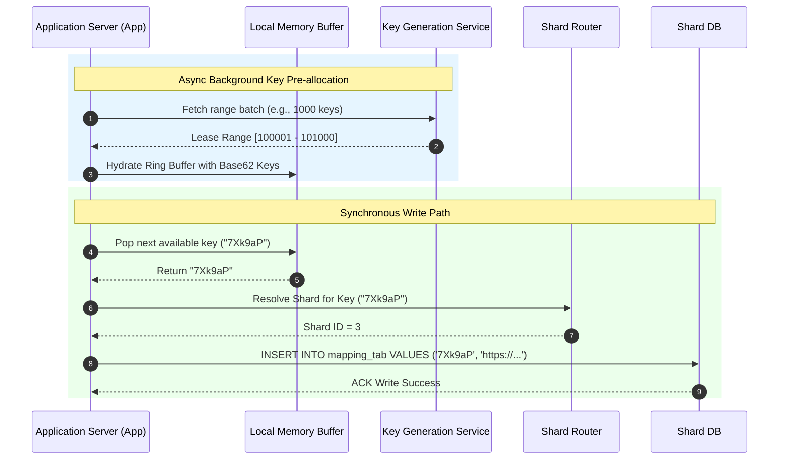

---
title: Low-Latency Key Vending and Deterministic Sharding Strategy for High-Scale URL Shorteners
date: 2026-08-07T10:32:06.352593
---

# Low-Latency Key Vending and Deterministic Sharding Strategy for High-Scale URL Shorteners

## 1. 💡 The "Big Picture" (Plain English)

### What is this in simple terms?
A URL shortener converts a long link like `https://example.com/products/category/item?id=98765&ref=newsletter` into a tiny, unique alias like `https://short.url/aB3x9Z`. 

To do this for billions of users without slowing down or crashing, we decouple **generating unique keys** from **storing the mapping**. We use a **Key Generation Service (KGS)** to pre-create short codes, and **Database Sharding** to split our storage across multiple database servers.

### Real-World Analogy: The Coat Check at a Massive Stadium
Imagine a coat check counter handling 100,000 sports fans:

* **Without KGS & Sharding:** Every time a fan hands over a coat, the clerk sits down, manually writes out a custom ticket, searches a single giant ledger to ensure no two tickets have the same code, and then walks to a single massive closet to hang it. The line backs up for miles.
* **With KGS & Sharding:** 
  1. **KGS (Pre-printed Tickets):** A ticket printing machine creates thousands of unique plastic tickets (`aB3x9Z`, `k8P2qL`) *in advance*. When you arrive, the clerk instantly hands you a ticket without waiting or checking a master book.
  2. **Sharding (Dedicated Closets):** Instead of one huge closet, the stadium has 16 separate coat closets (Shards). The ticket number instantly tells the clerk which specific closet stores your coat (e.g., tickets starting with `a` go to Closet 1).

### Why should I care? What problem does it solve today?
If you try to generate short keys on the fly using standard hashing (like `MD5` or `SHA-256`) and write them to a single database:
* **Hash Collisions:** Different long URLs will eventually generate the same short key, forcing slow retry loops.
* **Database Bottlenecks:** A single database server hits write locks and disk limits at high throughput.
* **Latencies Spikes:** On-the-fly coordination across servers creates cross-datacenter lock contention.

By pairing a KGS with a deterministic sharding scheme, you achieve **sub-millisecond write latencies** and **infinite horizontal scaling** with **zero collisions**.

---

## 2. 🛠️ How it Works (Step-by-Step)

### Step-by-Step Architecture Flow

1. **Pre-generation (Background):** The Key Generation Service (KGS) continuously generates unique strings (e.g., 7-character Base62 tokens) and stores them in a key repository (e.g., two database tables: `used_keys` and `unused_keys`).
2. **Buffer Allocation:** Application Servers fetch blocks of unused keys (e.g., 5,000 keys at a time) into their local in-memory ring buffers via atomic range leases managed by a central coordinator like ZooKeeper or etcd.
3. **Key Vending (Write Path):** When a user submits a long URL, the application server immediately pops a unique key from its local memory buffer. No remote network calls or locking needed!
4. **Shard Determinism:** The application server calculates which database shard owns this key using a deterministic hashing algorithm or key-prefix routing.
5. **Persistence:** The server writes the `{short_key, long_url, user_id, created_at}` record directly to the calculated shard.

### Mermaid Flowchart



### Python Implementation: KGS Buffer & Deterministic Shard Router

```python
import hashlib
import threading
from typing import List

class LocalKeyBuffer:
    """
    Thread-safe in-memory key buffer for high-throughput local vending.
    Prevents lock contention on every write request.
    """
    def __init__(self, key_batch: List[str]):
        self._buffer = key_batch
        self._lock = threading.Lock()

    def get_key(self) -> str:
        with self._lock:
            if not self._buffer:
                raise RuntimeError("Buffer exhausted! Fetch a new batch from KGS.")
            return self._buffer.pop()

    def is_empty(self) -> bool:
        with self._lock:
            return len(self._buffer) == 0


class DeterministicShardRouter:
    """
    Maps a short key to a specific DB shard using MurmurHash3 modulo total shards.
    Guarantees that a key ALWAYS lands on the exact same shard without a lookup table.
    """
    def __init__(self, num_shards: int):
        self.num_shards = num_shards

    def get_shard_id(self, key: str) -> int:
        # Use MD5/MurmurHash to get an even distribution across integer space
        hash_digest = hashlib.md5(key.encode('utf-8')).hexdigest()
        hash_int = int(hash_digest, 16)
        return hash_int % self.num_shards


# Usage Demo
if __name__ == "__main__":
    # Simulating a fetched batch of pre-generated Base62 keys from KGS
    kgs_pregenerated_keys = ["aB3x9Z", "k8P2qL", "7Xk9aP", "mQ91vR"]
    
    # Initialize Local Buffer & Shard Router (Assuming 4 physical DB Shards)
    local_buffer = LocalKeyBuffer(kgs_pregenerated_keys)
    router = DeterministicShardRouter(num_shards=4)

    # Simulating incoming short URL request
    long_url = "https://very-long-domain.com/some/deep/path/item"
    
    # 1. Pop key from memory (O(1), zero network overhead)
    short_key = local_buffer.get_key()
    
    # 2. Determine target Shard (O(1) calculation)
    target_shard = router.get_shard_id(short_key)

    print(f"Assigned Key: '{short_key}'")
    print(f"Routing Long URL to Database Shard #{target_shard}")
    # Output:
    # Assigned Key: 'mQ91vR'
    # Routing Long URL to Database Shard #1 (or depending on hash)
```

---

## 3. 🧠 The "Deep Dive" (For the Interview)

### Key Generation Service (KGS) Internals
1. **Base62 Character Set:** We use `[0-9, a-z, A-Z]` (62 characters). A key length of 7 characters gives us $62^7 = 3.52 \text{ trillion}$ unique combinations. At a scale of 1,000 writes per second, $3.52 \text{ trillion}$ keys will last for over 110 years.
2. **Range Allocation Scheme:** To avoid atomic locks across distributed application nodes, we assign key *ranges* (e.g., Application Server A gets keys 1–1,000, Server B gets 1,001–2,000). ZooKeeper maintains the `current_max_id` counter. If Server A crashes, keys in its local memory are lost forever (burned). **Burned keys are completely acceptable** in URL shorteners because key availability easily exceeds demand.

```
ZooKeeper Coordinator (Global Counter: 10,000)
    ├── App Server 1 leased Range: [1,000 - 1,999]  ---> Vends local memory
    ├── App Server 2 leased Range: [2,000 - 2,999]  ---> Vends local memory
    └── App Server 3 leased Range: [3,000 - 3,999]  ---> Vends local memory
```

### Database Sharding & Routing Strategies
How do you store billions of mappings without hitting a single DB limit?

* **Modulo Sharding (`hash(key) % N`):** Simple and distributes keys uniformly. However, adding or removing shards requires remapping and migrating massive amounts of data across all nodes.
* **Consistent Hashing with Virtual Nodes:** Placed on a logical hash ring. Adding a shard only requires moving data from its immediate neighbor.
* **Key-Prefix / First-Character Routing:** Keys starting with `a`-`d` go to Shard 1, `e`-`h` go to Shard 2. While intuitive, this can lead to **hotspotting** if key generation isn't uniformly distributed.

### Architecture Trade-offs

| Strategy | Advantages | Disadvantages / Architectural Risks |
| :--- | :--- | :--- |
| **Pre-generated KGS Keys** | Zero runtime key generation latency; guaranteed zero hash collisions. | Unused keys in server memory are lost on server crash (acceptable waste). |
| **On-the-fly Hashing (MD5 + Base62)** | Stateless; no pre-generation infrastructure or range locks required. | Prone to collisions; requires DB queries to detect collisions + append random salt. |
| **Consistent Hashing Sharding** | Smooth horizontal scaling; easy node addition with minimal data movement. | Increased operational complexity; requires ring topology tracking. |

---

### Interviewer Probes (Tricky Questions & Winning Answers)

#### Probe 1: *"What happens if an Application Server holding 50,000 pre-allocated keys in memory crashes?"*
* **Winning Answer:** "The keys stored in that server's local RAM are permanently lost, and that's an intentional design trade-off. Because a 7-character Base62 space offers 3.52 trillion keys, losing 50,000 keys is a rounding error (less than 0.000001% of the total key space). The server's recovery protocol simply requests a fresh, unallocated range from ZooKeeper upon reboot. We prioritize zero-latency key vending over key range conservation."

#### Probe 2: *"How do you handle shard rebalancing when you grow from 16 shards to 32 shards without downtime?"*
* **Winning Answer:** "Instead of standard modulo sharding, which reshuffles $\frac{N-1}{N}$ of all keys, we use **Consistent Hashing with Virtual Nodes** combined with a **Double-Write / Migration pipeline**:
  1. We update our routing ring with 16 new virtual nodes.
  2. During the transition phase, reads hit the old shards; writes go to both old and new target shards.
  3. A background process syncs historical data for the affected token ranges to the new shards.
  4. Once catch-up replication lag hits zero, we flip the read pointer to the new shards and turn off double-writes."

#### Probe 3: *"Why not use the original long URL's hash to determine the DB Shard instead of hashing the short key?"*
* **Winning Answer:** "Because our primary read pattern is `GET /short_key` -> `Redirect to long_url`. When a user requests a short URL (`short.url/7Xk9aP`), the incoming HTTP request *only contains the short key*. If we sharded by `long_url`, we wouldn't know which shard holds the record without querying **every single database shard** (a scatter-gather query). By sharding on the `short_key`, a read request can deterministically target the exact database shard in $O(1)$ time."

---

## 4. ✅ Summary Cheat Sheet

```
+-----------------------------------------------------------------------+
|                       SYSTEM DESIGN CHEAT SHEET                       |
+-----------------------------------------------------------------------+
|  KEY GENERATION SERVICE (KGS)                                         |
|  • Pre-generates Base62 keys offline; vends in ranges via ZooKeeper.  |
|  • In-memory ring buffer on App Servers = Zero latency + Zero DB locks|
|  • Key loss on crash is fine (3.52 Trillion key safety net).          |
+-----------------------------------------------------------------------+
|  DATABASE SHARDING                                                    |
|  • Shard by SHORT KEY, never by Long URL (enables O(1) read routing).  |
|  • Consistent Hashing prevents massive data moves during scale-out.   |
|  • Reads hit Redis cache first; cache misses hit specific DB shard.   |
+-----------------------------------------------------------------------+
```

### 3 Key Takeaways
1. **Decouple Key Generation from Storage:** Never perform complex key generation, hashing retry loops, or uniqueness checks on the synchronous write path.
2. **Optimize for the Read Path:** Route shards deterministically using the `short_key` so read redirects never require scatter-gather queries across multiple shards.
3. **Accept Controlled Waste for Speed:** Pre-allocating ranges in memory sacrifices a negligible portion of the key space in exchange for maximum performance and fault isolation.

### 🌟 The Golden Rule
> **"Vend keys from memory, shard deterministically by short key, and treat unused keys as disposable."**