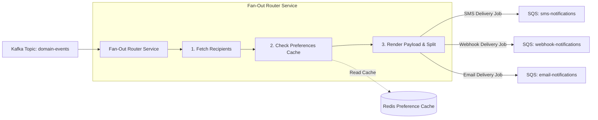

# Notification Fan-Out and Preference Routing: From Kafka Events to SQS Channels

---

### 1. 💡 The "Big Picture" (Plain English)

#### What is this in simple terms?
When an action happens in your system (e.g., `OrderPlaced`), multiple parties often need to know about it across different channels (SMS, Webhooks, Push, Email). 

The **Fan-Out and Preference Engine** acts as the central router between your system’s raw event stream (**Kafka**) and the actual channel dispatchers (**SQS**). It takes a single generic domain event, determines who needs to be notified, evaluates each recipient’s settings (opt-outs, quiet hours, channel preferences), and splits that single incoming event into tailored, channel-specific messages.

#### Real-World Analogy
Imagine a luxury apartment building’s concierge desk:
1. A delivery truck arrives with a single pallet addressed to multiple residents.
2. The concierge opens the master manifest and checks resident profiles: 
   - *Resident A* wants a text message instantly.
   - *Resident B* hates phone calls and only accepts notices in their lobby mailbox.
   - *Resident C* has a "Do Not Disturb" sign up until 8:00 AM.
3. The concierge splits the packages, applies individual delivery slips, and drops them into distinct outbound courier bins (SMS bin, Mail bin, Hold-for-later bin).

#### Why should I care?
Without this layer, your upstream services (like billing or checkout) must hardcode who gets an email, who gets an SMS, and how retries work. That couples business logic directly to external providers (Twilio, SendGrid) and causes cascading outages. 

By placing a fan-out engine between Kafka and channel-specific SQS queues, you keep upstream producers lightning-fast while ensuring notification rules are evaluated independently at scale.

---

### 2. 🛠️ How it Works (Step-by-Step)



#### Step-by-Step Flow:
1. **Consume from Kafka:** The Fan-Out consumer pulls a high-throughput domain event (e.g., `invoice.created`) from a partitioned Kafka topic.
2. **Resolve Recipients:** The service determines the audience:
   - *1-to-1:* An invoice for a single tenant.
   - *1-to-Many:* An announcement sent to all project collaborators.
3. **Preference Evaluation:** The engine queries a low-latency cache (Redis) to check user preferences:
   - Is the user unsubscribed from this event type?
   - Is the target webhook endpoint disabled or currently in a back-off state?
   - Are quiet hours currently active for the recipient's timezone?
4. **Channel Partitioning & Payload Hydration:** If a webhook and an SMS are required, the engine creates two separate, lightweight payloads containing only the data those specific channels require.
5. **Enqueue to Target SQS:** The engine pushes these tailored messages to dedicated, channel-specific SQS queues (`sqs-webhooks`, `sqs-sms`). SQS handles the buffering, rate-limiting, and per-channel delivery retries.

#### Production-Ready Python Snippet: Preference & Routing Engine

```python
import json
from dataclasses import dataclass
from typing import List, Dict, Any

@dataclass
class DeliveryJob:
    channel: str
    recipient_id: str
    payload: Dict[str, Any]

class NotificationFanOutRouter:
    def __init__(self, cache_client, sqs_client, channel_queues: Dict[str, str]):
        self.cache = cache_client
        self.sqs = sqs_client
        self.channel_queues = channel_queues

    def process_kafka_event(self, event_bytes: bytes) -> None:
        event = json.loads(event_bytes.decode('utf-8'))
        event_type = event["event_type"]
        recipients = event["recipients"] # List of user IDs

        delivery_jobs: List[DeliveryJob] = []

        for recipient_id in recipients:
            # 1. Fetch user notification preferences (Cache-aside)
            prefs = self._get_cached_preferences(recipient_id)
            
            # 2. Check global opt-out
            if not prefs.get("enabled", True):
                continue

            # 3. Check channel rules for this specific event type
            # Example prefs: {"invoice.created": ["webhook", "email"]}
            allowed_channels = prefs.get("subscriptions", {}).get(event_type, [])

            for channel in allowed_channels:
                # 4. Check channel-specific gates (e.g., missing webhook URL)
                if channel == "webhook" and not prefs.get("webhook_url"):
                    continue

                delivery_jobs.append(DeliveryJob(
                    channel=channel,
                    recipient_id=recipient_id,
                    payload={
                        "event_id": event["event_id"],
                        "event_type": event_type,
                        "data": event["data"],
                        "destination": prefs.get(f"{channel}_target") # e.g. URL or phone number
                    }
                ))

        # 5. Dispatch batch to SQS channel queues
        self._dispatch_to_sqs(delivery_jobs)

    def _get_cached_preferences(self, user_id: str) -> Dict[str, Any]:
        raw_prefs = self.cache.get(f"prefs:{user_id}")
        return json.loads(raw_prefs) if raw_prefs else {}

    def _dispatch_to_sqs(self, jobs: List[DeliveryJob]) -> None:
        for job in jobs:
            queue_url = self.channel_queues.get(job.channel)
            if queue_url:
                self.sqs.send_message(
                    QueueUrl=queue_url,
                    MessageBody=json.dumps(job.payload),
                    # Ensure deterministic deduplication downstream
                    MessageDeduplicationId=f"{job.payload['event_id']}_{job.channel}_{job.recipient_id}",
                    MessageGroupId=job.recipient_id # Retain ordering per recipient if FIFO
                )
```

---

### 3. 🧠 The "Deep Dive" (For the Interview)

#### Architectural Magic: Asymmetric Throughput Decoupling
Kafka excels at **sequential, append-only disk I/O** capable of millions of events per second, but it degrades when consumers need arbitrary, non-sequential delay mechanisms or variable-rate external calls. 

If a Kafka consumer calls a customer webhook directly, a slow customer endpoint (e.g., taking 4 seconds to respond) stalls the consumer thread. Because Kafka commits offsets linearly, that one stalled webhook blocks the processing of all other events on that partition.

```
[Kafka (High Volume / Append-Only)]
             │
             ▼
[Fan-Out Router (Stateless CPU-bound Workers)]
             │
             ▼
[Channel SQS (Independent Queues with Granular Visibility Timeouts & DLQs)]
```

By fanning out into **SQS**, we shift from an **offset-based model** to an **acknowledgment-based message-locking model** (Visibility Timeout). Each SQS message is independently acknowledged, retried, or routed to a Dead-Letter Queue (DLQ) without impeding other messages.

#### Trade-offs: Eager Hydration vs. Lazy Hydration

| Approach | How it works | Pros | Cons |
| :--- | :--- | :--- | :--- |
| **Eager Hydration** *(Chosen above)* | Fan-Out engine queries DB/Cache, renders templates, and pushes fully-formed payloads to SQS. | Downstream channel workers are ultra-lean and have zero read dependencies on core databases. | SQS payload sizes swell (SQS limit: 256KB). User state changes after fan-out aren't reflected. |
| **Lazy Hydration** | Fan-Out engine only pushes `{event_id, user_id, channel}` pointers to SQS. | Minimal SQS payload sizes; latest user preferences and data are fetched right before delivery. | Massive read amplification downstream: 50,000 workers slamming your DB to fetch user profiles at the same time. |

---

### Interviewer Probes: How to Win the Discussion

#### 1. "What happens when an event triggers a notification to 5 million users at once (Celebrity / Alert Fan-Out)?"
* **The Trap:** The candidate says, "My loop will iterate 5 million times and write to SQS."
* **The Senior Answer:**
  > "A massive fan-out inside a standard Kafka consumer will cause a consumer group rebalance because the processing time will exceed `max.poll.interval.ms`. 
  > 
  > To solve this, we implement **Two-Phase Fan-Out**. The primary consumer reads the broad event and writes 'chunk chunks' (e.g., batches of 1,000 user IDs) to an intermediate Kafka topic (`fanout-jobs`). Secondary fan-out workers consume these chunks in parallel, query the preference cache, and enqueue the actual delivery jobs into SQS. This bounds memory and execution time on any single consumer thread."

#### 2. "How do you handle 'Quiet Hours' (e.g., do not send SMS between 10 PM and 7 AM in the user's timezone)?"
* **The Senior Answer:**
  > "Do not pause the Kafka consumer or use `time.sleep()`. Calculate the delay delta:
  > $$\text{Delay} = \text{Target Send Time (7:00 AM user local)} - \text{Current UTC Time}$$
  > 
  > If the delay is within 15 minutes, use native SQS `DelaySeconds`. For delays up to days, route the message out of the real-time pipeline into a scheduled storage mechanism—such as **DynamoDB with TTL** or **AWS EventBridge Scheduler**. When the time expires, an EventBridge rule re-injects the job directly into the channel SQS queue."

#### 3. "If a user updates their notification preferences in the UI, how do you prevent stale cache reads during fan-out?"
* **The Senior Answer:**
  > "We apply a **Cache-Aside with Event-Driven Invalidation** pattern. When the user updates their preferences via the Account Service, it writes to PostgreSQL and emits a `UserPreferencesUpdated` event to Kafka. 
  > 
  > A dedicated cache-sync daemon consumes this event and evicts or updates the key `prefs:{user_id}` in Redis. In the rare event of a cache miss during fan-out, the router reads with read-through locking (or single-flight fetching) from the database to prevent cache stampedes."

---

### 4. ✅ Summary Cheat Sheet

* **3 Key Takeaways:**
  1. **Decouple Ingestion from Delivery:** Use Kafka for immutable, ordered business-event intake; use SQS for per-channel backpressure, independent retries, and variable consumer speeds.
  2. **Cache Preferences Aggressively:** The fan-out engine is read-heavy. If every event triggers a relational database query for user settings, your database will collapse during load spikes.
  3. **Isolate Channel Failures:** Never mix channels in a single downstream queue. A degraded third-party webhook receiver must never exhaust worker threads or back up critical transactional SMS messages.

* **1 Golden Rule to Remember:**
  > *"Kafka handles the velocity of your business; SQS manages the fragility of your recipients."*