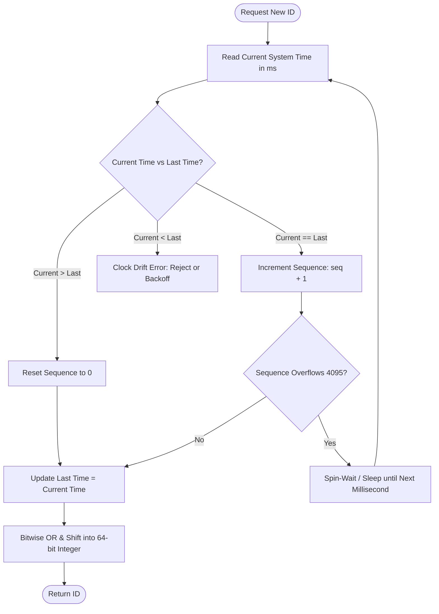

# Time-Ordered Distributed Identity: Deconstructing the 64-Bit Snowflake Architecture

---

### 1. 💡 The "Big Picture" (Plain English)

#### What is this in simple terms?
A **Snowflake ID** is a method for generating unique, roughly time-ordered, 64-bit numeric IDs across thousands of independent servers without requiring them to communicate, lock records, or coordinate with one another.

#### The Real-World Analogy
Imagine a massive music festival with **10 entrance gates**, processing 50,000 attendees simultaneously. 

* **The Naive Way (Central Database):** Every time a guard wants to admit someone, they use a walkie-talkie to radio central dispatch: *"Hey, what ticket number are we on?"* Central dispatch answers: *"Ticket 4,102."* The radio channel instantly jams, forming massive lines at every gate.
* **The Snowflake Way:** Before the festival starts, each gate is assigned a fixed gate number (0 through 9). Each guard wears a digital watch and carries a local mechanical clicker that resets to zero every second. 
When an attendee enters Gate 3 at 12:04:15 PM, and they are the 5th person this second, the guard stamps their wristband:
`[12:04:15] - [Gate 3] - [Ticket 005]`

No walkie-talkies. No central coordination. Zero chance of collisions. Every wristband is unique, and they are naturally ordered by the time people walked in.

```
Wristband: [ Timestamp ] + [ Gate ID ] + [ Sequence ]
```

#### Why should I care? What problem does it solve today?
* **Auto-Incrementing DB IDs (`SERIAL`)** create a single point of failure (SPOF) and a write bottleneck. You cannot shard easily because database instances do not know what IDs other instances are handing out.
* **UUIDv4 (128-bit random strings)** solves coordination, but it ruins database performance. UUIDs are completely random, which causes massive **B-Tree page fragmentation** and cache thrashing during indexing. They also consume twice the storage space (16 bytes vs. 8 bytes).
* **Snowflake IDs** give you the best of both worlds: decentralization (like UUID) with high-performance B-Tree index locality and compact storage (like auto-increment integers).

---

### 2. 🛠️ How it Works (Step-by-Step)

The standard Twitter Snowflake ID packs three distinct variables into a single **64-bit signed integer** (fitting directly into a standard database `BIGINT` or programming language `int64` / `long`).

```
+--------------------------------------------------------------------------+
| 1 Bit |     41 Bits     |      5 Bits     |    5 Bits     |   12 Bits    |
| Unused| Millisecond Time|  Datacenter ID  |   Worker ID   |   Sequence   |
+--------------------------------------------------------------------------+
```

1. **Sign Bit (1 bit):** Always set to `0` so the integer remains positive across languages and storage engines.
2. **Timestamp (41 bits):** Milliseconds elapsed since a **custom epoch** (e.g., your company's launch date, not the Unix Epoch of 1970). 
   * $2^{41} \text{ ms} \approx 69.7 \text{ years}$.
3. **Datacenter ID (5 bits):** Identifies the physical/cloud region ($2^5 = 32$ datacenters).
4. **Worker/Machine ID (5 bits):** Identifies the host machine inside that datacenter ($2^5 = 32$ workers per datacenter, total 1,024 nodes).
5. **Sequence Number (12 bits):** A local counter per node that resets to `0` every millisecond.
   * $2^{12} = 4,096$ unique IDs per millisecond, per worker.

#### Generation Workflow



#### Production-Grade Implementation (Java)

```java
public class SnowflakeIdGenerator {
    // Custom epoch: 2024-01-01 00:00:00 UTC (1704067200000L)
    private final long customEpoch = 1704067200000L;

    // Bit allocations
    private final long datacenterIdBits = 5L;
    private final long workerIdBits = 5L;
    private final long sequenceBits = 12L;

    // Max values via bit-masking
    private final long maxDatacenterId = ~(-1L << datacenterIdBits); // 31
    private final long maxWorkerId = ~(-1L << workerIdBits);         // 31
    private final long sequenceMask = ~(-1L << sequenceBits);       // 4095

    // Bit-shift offsets
    private final long workerIdShift = sequenceBits;                                // 12
    private final long datacenterIdShift = sequenceBits + workerIdBits;             // 17
    private final long timestampLeftShift = sequenceBits + workerIdBits + datacenterIdBits; // 22

    private final long datacenterId;
    private final long workerId;
    private long sequence = 0L;
    private long lastTimestamp = -1L;

    public SnowflakeIdGenerator(long datacenterId, long workerId) {
        if (datacenterId > maxDatacenterId || datacenterId < 0) {
            throw new IllegalArgumentException("Datacenter ID out of bounds");
        }
        if (workerId > maxWorkerId || workerId < 0) {
            throw new IllegalArgumentException("Worker ID out of bounds");
        }
        this.datacenterId = datacenterId;
        this.workerId = workerId;
    }

    // Synchronized ensures thread-safety per generator instance
    public synchronized long nextId() {
        long currentTimestamp = getCurrentTimeMillis();

        // 1. Clock moved backwards: Fail-fast on clock drift
        if (currentTimestamp < lastTimestamp) {
            long drift = lastTimestamp - currentTimestamp;
            throw new IllegalStateException("Clock moved backwards! Refusing generation for " + drift + "ms");
        }

        // 2. Same millisecond: increment sequence counter
        if (currentTimestamp == lastTimestamp) {
            sequence = (sequence + 1) & sequenceMask;
            // Overflow: reached 4096 within this single millisecond
            if (sequence == 0) {
                currentTimestamp = tilNextMillis(lastTimestamp);
            }
        } else {
            // 3. New millisecond: reset sequence counter
            sequence = 0L;
        }

        lastTimestamp = currentTimestamp;

        // 4. Bit-packing
        return ((currentTimestamp - customEpoch) << timestampLeftShift)
                | (datacenterId << datacenterIdShift)
                | (workerId << workerIdShift)
                | sequence;
    }

    private long tilNextMillis(long lastTimestamp) {
        long timestamp = getCurrentTimeMillis();
        while (timestamp <= lastTimestamp) {
            timestamp = getCurrentTimeMillis();
        }
        return timestamp;
    }

    protected long getCurrentTimeMillis() {
        return System.currentTimeMillis();
    }
}
```

---

### 3. 🧠 The "Deep Dive" (For the Interview)

#### 1. B-Tree Performance & Cache Locality
Relational databases (MySQL InnoDB, Postgres) organize data on disk using B+ Trees. 
* **UUIDv4 problem:** Random insertion points mean the engine must fetch random 16KB leaf pages from disk, modify them, and split pages frequently. This is catastrophic for disk I/O.
* **Snowflake advantage:** Snowflake IDs are **k-sortable** (roughly monotonically increasing). New records always hit the right-most edge of the index tree. Pages fill sequentially to their fill-factor (e.g., 93%), minimizing disk page splits and keeping the active write buffer hot in RAM.

#### 2. Worker ID Orchestration in Dynamic Environments
Hardcoding worker and datacenter IDs works on bare metal, but fails in Kubernetes or autoscaling groups where pods terminate and spawn dynamically.
* **The Solution:** Use an external coordinator like **etcd** or **Consul** to manage ephemeral leases.
* When a node spins up, it claims a worker slot (0–1023) with a short TTL heartbeat. If it dies, the lease expires and another node can claim the ID.
* *Alternative for Kubernetes:* Use a `StatefulSet`. The pod's ordinal index (e.g., `generator-0`, `generator-1`) maps directly to the worker ID without needing distributed consensus.

#### Trade-offs Summary
| Dimension | Pro | Con |
| :--- | :--- | :--- |
| **Ordering** | K-sortable; chronological sorting without checking a `created_at` column. | Not *strictly* monotonic across nodes due to clock skew. Node B can emit an ID with a lower timestamp than Node A. |
| **Footprint** | Compact 64-bit integer (`BIGINT`); index-friendly. | Hard ceiling on lifespan: custom epoch exhausts after ~69 years. |
| **Security** | Fast to query and parse. | **Information leakage:** Anyone can parse the ID to determine when an account was created and infer rough system transaction volume. |

---

#### 💡 Interviewer Probe Questions

##### Probe 1: "What happens if NTP adjusts the system clock backward by 50 milliseconds?"
**The Senior Answer:** 
> "Standard NTP steps can move time backwards, which risks generating duplicate IDs if the counter resets. There are three approaches to handle this:
> 1. **Fail-Fast (Default Snowflake):** Throw an exception and reject traffic until the physical clock catches up to `lastTimestamp`. Upstream load balancers route the request to a different node.
> 2. **Sleep/Wait:** If the drift is minuscule (e.g., $< 5\text{ms}$), sleep the thread for `lastTimestamp - currentTimestamp` and retry.
> 3. **NTP Slew Mode:** Configure system administrators/OS daemons to use *slewing* (e.g., `chrony` or `ntpd -x`), which adjusts time by slowing down the clock ticks gradually rather than jumping backward instantaneously."

##### Probe 2: "Can you guarantee strict global monotonicity with Snowflake?"
**The Senior Answer:**
> "No. Snowflake guarantees **uniqueness**, but only provides **k-sorting** (rough time ordering). Strict global monotonicity requires that if event $B$ occurs after event $A$ anywhere in the world, $ID_B > ID_A$. Because physical hardware clocks across nodes drift by milliseconds, Node 2's physical clock might read $T=100$ while Node 1 reads $T=103$. To achieve true strict monotonicity, you must abandon zero-coordination and use either a single-threaded sequencer, distributed consensus, or TrueTime (GPS + atomic clocks with wait-out bounds, like Google Spanner)."

##### Probe 3: "How would you handle a traffic burst that exceeds 4,096 requests in a single millisecond on a single worker?"
**The Senior Answer:**
> "The generator detects this when the sequence mask rolls back to `0`. There are two main strategies:
> 1. **Spin-wait (Blocking):** The thread busy-waits or yields until the next millisecond arrives, effectively throttling that worker to 4.096 million requests/second.
> 2. **Sequence Borrowing:** Instead of waiting, the worker increments the millisecond timestamp into the future logically. If the node stays busy, logical time slowly runs ahead of physical time. If the drift between logical time and physical time crosses a safety threshold (e.g., 50ms), the node halts and waits for physical time to catch up."

---

### 4. ✅ Summary Cheat Sheet

#### 3 Key Takeaways
1. **64 Bits of Coordination-Free Scale:** Packs timestamp, node identities, and sequence counters into an 8-byte integer to eliminate database round-trips.
2. **Index-Friendly Structure:** Placing the timestamp in the highest bits creates roughly monotonically increasing IDs, preventing B-Tree page splits.
3. **Physical Clocks are Fragile:** You must design for clock drift (NTP backward steps) and worker ID collision when pods scale dynamically.

#### 1 "Golden Rule" to Remember
> **Put time in the most significant bits for indexing, use worker IDs for isolation, and never trust the system clock blindly.**