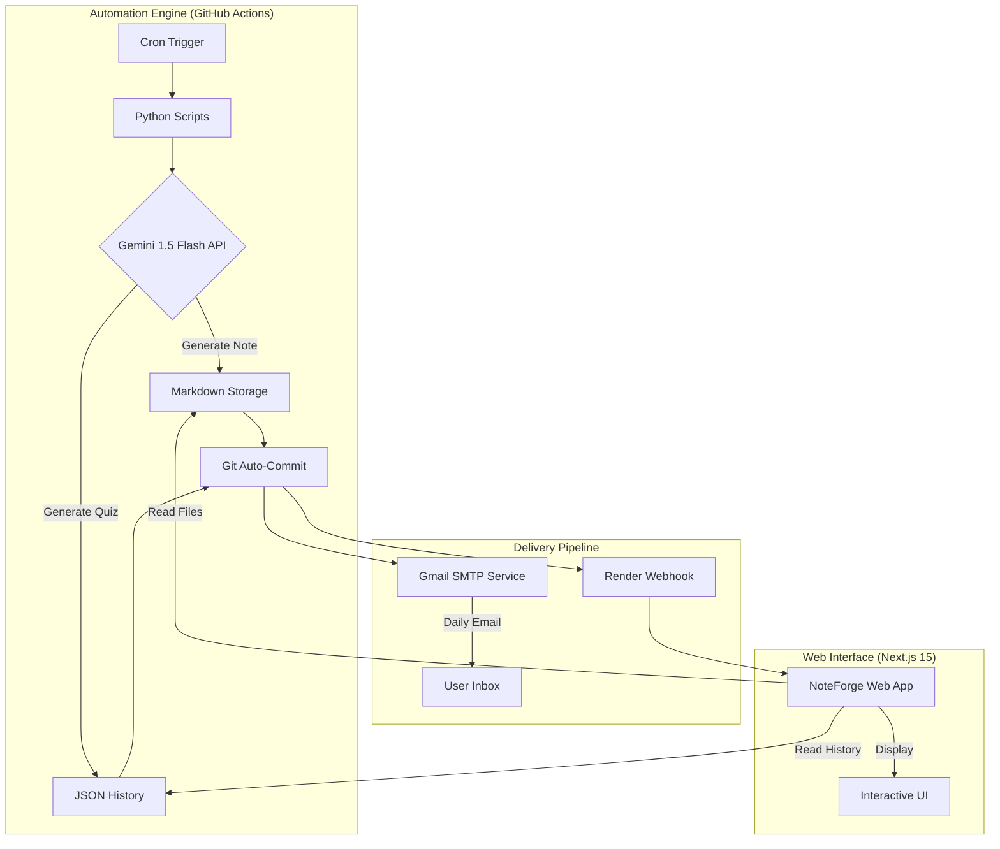

# 🚀 NoteForge: AI-Powered Technical Study Engine

**NoteForge** is a fully automated, interview-grade study system designed for FAANG preparation. It leverages Google Gemini AI and GitHub Actions to generate, publish, and deliver deeply technical study notes and interactive quizzes every single day.


[](https://noteforge.onrender.com)

---

### 🌐 [Visit Live App: noteforge.onrender.com](https://noteforge.onrender.com)

---

## 🏗️ System Architecture

NoteForge operates as a self-sustaining ecosystem with zero manual intervention required.



---

## 🌟 Key Features

### 🧠 Autonomous Note Generation
- **Topic Deduplication**: A custom tracking system (`covered_topics.json`) ensures the AI never generates the same subtopic twice, building a comprehensive knowledge base over time.
- **Deep Technicality**: Prompt engineering ensures notes include senior-level code architecture, complexity analysis (Big O), and real-world system design trade-offs.

### 📝 Spaced Repetition & Assessment
- **Automated Quizzing**: Generates scenario-based multiple-choice questions based on the morning's study material.
- **Interactive History**: A full archive of past quizzes is available on the web app with instant feedback and detailed explanations.

### 💻 Premium Web Experience
- **Real-time Search & Filter**: Search through hundreds of notes by topic, keyword, or category.
- **Progress Tracking**: Localized "Mark as Reviewed" system to track personal study progress.
- **Rich Aesthetics**: A sleek, dark-themed UI with Table of Contents navigation and one-click code copying.

---

## 🛠️ Technical Stack

| Category | Technology |
| :--- | :--- |
| **Frontend** | Next.js 15 (App Router), Tailwind CSS 4, TypeScript |
| **Backend** | Python 3.13, Node.js |
| **AI Model** | Google Gemini 1.5 Flash (Generative AI) |
| **CI/CD & Automation** | GitHub Actions (Cron Jobs) |
| **Deployment** | Render (Auto-rebuild via Webhooks) |
| **Communication** | Gmail SMTP API |

---

## 📅 The Daily Lifecycle (IST)

| Time | Event | Outcome |
| :--- | :--- | :--- |
| **09:17 AM** | **Daily Note Pulse** | New technical note generated and emailed. |
| **09:47 AM** | **Knowledge Check** | Daily quiz generated and sent to inbox. |
| **10:23 AM** | **Results Sync** | Quiz answers revealed and archived to Web App. |
| **11:13 AM** | **Specialized Deep Dive** | Java/Spring Boot specific technical note. |
| **12:13 PM** | **Architecture Hour** | System Design & Scalability technical note. |

---

## 📂 Project Structure

```text
├── .github/workflows/    # 5x Automated CI/CD pipelines
├── Generated-Notes/      # Database of AI-generated Markdown files
├── Quiz-History/         # JSON database of all past quizzes
├── notes-app/            # Next.js 15 Source Code
├── generate_note.py      # Core AI generation logic
├── utils.py              # Shared automation utilities
└── covered_topics.json   # Topic deduplication database
```

---

## ⚙️ Setup & Installation

1. **Clone the Repo**: `git clone https://github.com/Nagachaitanya007/MCA_notes.git`
2. **Web App**:
   ```bash
   cd notes-app
   npm install
   npm run dev
   ```
3. **Environment Variables**:
   Configure these in GitHub Secrets:
   - `GEMINI_API_KEY`: Google AI Studio Key.
   - `GMAIL_EMAIL`: Your automation email.
   - `GMAIL_APP_PASSWORD`: Gmail App Password.

---

**Developed by Naga Chaitanya**  
*Turning automated learning into technical mastery.*
